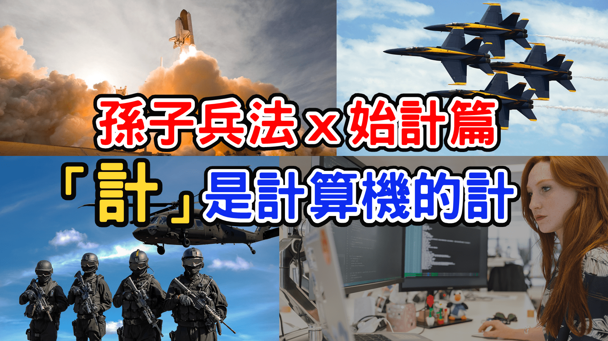

工程師職場競爭力 | 面對挑戰，除了寫程式，還可以使用兵法
======
`孫子兵法 x 始計篇`



[`Youtube : 孫子兵法 : 始計篇 | 職場 x 競爭力 | 面對挑戰 除了寫程式 還可以用兵法【Gamma Ray 軟體工作室】`](https://youtu.be/TDTFQTRxkK8)


大綱
------
+ 工程師的挑戰
+ 戰爭論 與 孫子兵法
+ 五事、七計、十二詭道
  + 五事
  + 七計
  + 十二詭道
+ 專注於你可以控制的事

<br>

工程師的挑戰
------
職場中，工程師面對的挑戰，有多少的問題，實際上與技術無關;

有時候，只是想安安靜靜的跟電腦獨處，實務面卻顯得多麽困難。

面對這種問題，我選擇去研究，人類最高衝突的指導原則 :

### 「孫子兵法」

兵法首章 始計篇的「計」

+ 不是「計謀」的「計」 
+ 是「計算」的「計」

**「計算」也是電腦所擅長的，工程師甚至可以使用程式語言來計算要計算的事情**

<br>

戰爭論語孫子兵法
------
在當代，有兩本被認為尚未過時的軍事著作: 

+ 「戰爭論」- AD 19th
+ 「孫子兵法」- BC 6th

`「孫子兵法」早了「戰爭論」2300 年`

這種千年流傳下來的古人智慧，每每讀到書籍中的思想精要時，總是會不自主的起雞皮疙瘩。

我想這也是為什麼，有許多全球頂尖的，CEO 會推薦這本書。

<br>

### 書籍的首章，就是在講「計算」!

我將以工程師的思維，探討始計篇中，提到的「五事、七計、十二詭道」。

<br>

五事、七計、十二詭道
------
### 始計篇 原文
```
孫子曰：兵者，國之大事，死生之地，存亡之道，不可不察也。

故經之以五事，校之以計，而索其情：一曰道，二曰天，三曰地，四曰將，五曰法。

道者，令民與上同意，可與之死，可與之生，而不畏危也；天者，陰陽、寒暑、時製也；地者，遠近、險易、廣狹、死生也；
將者，智、信、仁、勇、嚴也；法者，曲製、官道、主用也。凡此五者，將莫不聞，知之者勝，不知者不勝。

故校之以計，而索其情，曰：主孰有道？將孰有能？天地孰得？法令孰行？兵眾孰強？士卒孰練？賞罰孰明？吾以此知勝負矣。
將聽吾計，用之必勝，留之；將不聽吾計，用之必敗，去之。

計利以聽，乃為之勢，以佐其外。勢者，因利而製權也。兵者，詭道也。

故能而示之不能，用而示之不用，近而示之遠，遠而示之近。
利而誘之，亂而取之，實而備之，強而避之，怒而撓之，卑而驕之，佚而勞之，親而離之，攻其無備，出其不意。
此兵家之勝，不可先傳也。

夫未戰而廟算勝者，得算多也；未戰而廟算不勝者，得算少也。多算勝，少算不勝，而況無算乎！吾以此觀之，勝負見矣。
```

<br>

### 兵者，國之大事，死生之地，存亡之道，不可不察也

孫子是名軍事家，在春秋時期，面對的是，國家大事，生死存亡的問題，他不得不謹慎。

**既然是「問題」**

就可以試著套用，問題解構的黃金三分割法來解析 :

[工程師的問題解構流程 | 方格筆記本 x 思維模型架構](https://youtu.be/z81gQlGIZqA)

+ 「事實」
+ 「思考」
+ 「行動」

**總體來看**

+ 「五事」對應的是「事實」
+ 「七計」對應的是「思考」
+ 「十二詭道」對應的是「行動」

<br>

### 五事
`「事實」`

```
故經之以五事，校之以計，而索其情：一曰道，二曰天，三曰地，四曰將，五曰法。
```

**孫子認為有五件事是重要的 :**

+ **道**
+ **天**
+ **地**
+ **將**
+ **法**


下一段

```
道者，令民與上同意，可與之死，可與之生，而不畏危也；天者，陰陽、寒暑、時製也；地者，遠近、險易、廣狹、死生也；
將者，智、信、仁、勇、嚴也；法者，曲製、官道、主用也。凡此五者，將莫不聞，知之者勝，不知者不勝。
```

分別解釋什麼是「道」、「天」、「地」、「將」、「法」。

<br>

### 道
「道」感覺很抽象，但其實很簡單

```
道者，令民與上同意，
可與之死，可與之生，而不畏危也 ;
```

**道者，令民與上同意 - 人民與主君，士兵與大將，意見一致。**

就是在說「團隊合作」，最重要的因素，是擁有共同的目標。

個人的最終目標，也許與團隊不一致，但只要有部份重疊，就有合作的基礎。

    團隊合作最重要的因素 : 共同的目標

**個人也是一樣**

內心的想法必需要調整過，思維中沒有衝突的矛盾點，內部意見一致，外部動作就能協調。

<br>

### 天

「天」 除了字面意義上的天氣狀況以外

```
天者，陰陽、寒暑、時製也；
```


還有另外一層意思「時機」，在職場上你可以理解為「趨勢」。

**創業**

一定是要朝，人們有需求，但尚未被市場填補的地方走，而不是去已經有人做過，市場高度競爭的地方 。


**轉職**

都會看到，到處都在徵資料科學家，曾幾何時，是不是也跟我一樣想過，當初好像應該學一下 AI 人工智慧。

**「飛豬理論」:**

    站在風口上 豬都會飛

<br>

### 將
「將」就是將領，在公司內，就是中間主管;如果是個人，那麼那個「將」就是你。

```
將者，智、信、仁、勇、嚴也；
```

將領的要求，「智」「信」「仁」「勇」「嚴」。

+ 「智」-「才智」
+ 「信」-「威信」
+ 「仁」-「仁愛」
+ 「勇」-「英勇」
+ 「嚴」-「嚴肅」

**孫子認為，「智將」比「勇將」更重要。**

<br>

**我認為，現在的職場 :**

**「智」跟「信」是最有發揮價值的地方**

<br>

**「智」就是「才智」**

要了解自己的力量極限，衡量趨勢，還要對事情的本質，思考分析，並且在行動時，懂得變通。

**「信」則是「威信」 有兩種**

+ 賞罰分明之信
+ 默契之信

**在團隊中我認為更重要的是 「默契之信」**

    團隊精神: 

        不是先有團隊合作才有團隊精神
        而是合作愉快才會產生團隊精神


**重要性的排序**

+ 智 > 信 > 仁 > 勇 > 嚴

如果把這個人格特質的要求，顛倒過來。

+ 嚴 > 勇 > 仁 > 信 > 智

感覺會是個非常恐怖的災難。

<br>

### 法
「法」書中具體提了三點 

```
法者，曲製、官道、主用也。
```

+ 「曲製」是 組織架構 部隊編制 指揮系統
+ 「官道」是 人事制度
+ 「主用」是 物資管理 與 財務制度

<br>

**現代的管理學，就是起源於軍隊的管理**

<br>

**對於軟體:**

+ 代碼風格指南
+ 程式開發流程
+ Git 提交規範

規範的越多，越可以避免，程式非預期出現的狀況

<br>

### 七計
`「思考」`

```
故校之以計，而索其情，曰：主孰有道？將孰有能？天地孰得？法令孰行？兵眾孰強？士卒孰練？賞罰孰明？
吾以此知勝負矣。
```

**從五事延伸，有七件事情要計算 :**

+ 主孰有道？
+ 將孰有能？
+ 天地孰得？
+ 法令孰行？
+ 兵眾孰強？
+ 士卒孰練？
+ 賞罰孰明？

<br>

有了剛才五事的說明，這個看文言文，應該也能了解他的意思。

**當計算完這七件事後，大概就能知道能不能贏。**

```
將聽吾計，用之必勝，留之；將不聽吾計，用之必敗，去之。
```

+ 將領聽得進去分析，那就能贏
+ 將領聽不進去分析，那就會輸

```
計利以聽，乃為之勢，以佐其外。勢者，因利而製權也。兵者，詭道也。
```

然後，又再度地強調了，計算的重要性。

<br>

### 十二詭道
`「行動」`

**從「七計」計算完之後，有一個重要的前提是:**

+ 計算結果是贏，才會動手 
+ 計算結果是輸，絕不動手

<br>

**孫子的核心思想:**

    「先勝後戰」 

如果沒有絕對把握，絕對不會出現 「試試看」 這個選項。

<br>

    做或者不做，沒有「試試看」 
                      
                      -- 星際大戰 : 尤達大師

如果計算的結果會輸，這個時候要做的事情就是「等待」。

<br>


**所以才有了，十二條詭道 :**

```
故能而示之不能，用而示之不用，近而示之遠，遠而示之近。
利而誘之，亂而取之，實而備之，強而避之，怒而撓之，卑而驕之，佚而勞之，親而離之
```

**前四條詭道，是自己狀態 -**

+ 能而示之不能
+ 用而示之不用
+ 近而示之遠
+ 遠而示之近

各種假動作，迷惑對手，是為了不被計算出真實分數。

<br>

**後八條詭道，是敵人狀態 -**

+ 利而誘之
+ 亂而取之
+ 實而備之
+ 強而避之
+ 怒而撓之
+ 卑而驕之
+ 佚而勞之
+ 親而離之

各種干擾，誘使犯錯，是為了降低對手分數。

<br>

**這麼做的目的，是因為孫子認為:**

+ 「輸」取決於「自身」
+ 「贏」取決於「敵人」

會不會「輸」，取決於自身，分數低，不打，就不會輸。

能不能「贏」，取決於對手，如果對手做足準備，都不犯錯，十二條詭道，也沒有任何作用。

這時候就只能等，先保證自己不犯錯，不出場;才能夠等到對手犯錯時，在絕對的分數優勢下，抓準時機，一戰而定。

<br>

專注於你可以控制的事
------
現在應該理解了，面對挑戰，「計算」的重要性。

而有沒有發現，職場中有很多亂七八糟的事情，參照兵法的五事七計，現在知道原因了。

<br>

### 如果你是幫人家打工: 

**「道」「天」「地」**

    你無法控制

**「將」「法」** 

    你可以控制

**你就是那個「將」:**

「智」跟「信」是我認為現在的職場最重要的

**「法」對工程師來說 : **

就是要擁有嚴謹的編程思維

### 「專注於你可以控制的事」

從你自身做起

    「世界不會因為你說了什麼而改變，但會因為你示範了什麼而有所變化」

參考資料
------
+ 華杉講透《孫子兵法》
+ [工程師的問題解構流程 | 方格筆記本 x 思維模型架構](https://youtu.be/z81gQlGIZqA)


