如何設計軟體 ? | 領域驅動設計 : 4 層架構 + 3 類物件
======
`有想法 x 也有做法`

大綱
------
+ 前人的專案
+ 領域驅動設計
+ 理論與分層結構
+ 領域層的物件
+ 專案架構實作
+ 有想法也有做法

<br>

前人的專案
------
日常開發時，面對前人傳承下來的專案，改 A 壞 B ，改 B 壞 C，

各種系統模組瘋狂耦合與隨意分類，亂糟糟的系統架構，開發得很痛苦 !

### 已經沒救了！

基本上，專案發展到這個程度，

完全修復，不是不可能，只是成本很大 :

    修復的收成本 > 修復的收益

你我都知道，在實務上的時程安排 : 

	「有空再修」: 美麗，但不切實際的幻想

### 重新再來
也許，有機會砍掉重練;又或者，在其他的專案，有機會重頭開始 !

但當面對全新的專案時，不希望重蹈覆徹

### 卻發現 !?

    不是很確定該怎麼做 !!!

<br>

領域驅動設計
------
### 學習之路
我軟體設計的「學習之路」，是從「無瑕的程式碼 整潔的軟體設計與架構篇」，這本書開始。

部分的理解內容，闡述在「[軟體的本質]」。

[軟體的本質]:https://youtu.be/njAgG9e1Qco

### 知行合一
但當時，還有一個疑問，書本內有很多理論與重要的設計原則。

不能很好的結合在日常開發中，中間的轉換過程遇到了瓶頸。

直到在「Spring Cloud 微服務架構 開發實戰」

**提到的架構的規劃方法 :**

    領域驅動設計

補足了我實作層面遇到的問題 !

讓我可以將設計的理論原則，結合到 Java Spring 的專案中。

據此延伸，架構的規劃是沒有語言與平臺的局限性。

開發 Android 與 iOS 的 App 時，也可以完全套用這一套軟體設計的方法論。

<br>

理論與分層結構
------
### 映射現實
軟體提供的服務，一定是會對映現實世界的某件事物。但開發者與使用者，看待軟體的角度，通常是不一樣的。如何在兩者之間，使用共同的語言，溝通會是一個挑戰。

### 領域驅動設計
`Domain Driven Design  簡稱 DDD`

以領域知識為核心建立的模型，領域專家與開發人員，可以透過這個**模型**進行交流。

    確保最終設計出來的東西，是雙方共同想要達到的結果


### 分層架構
領域驅動設計的分層結構，會分成四個部份。

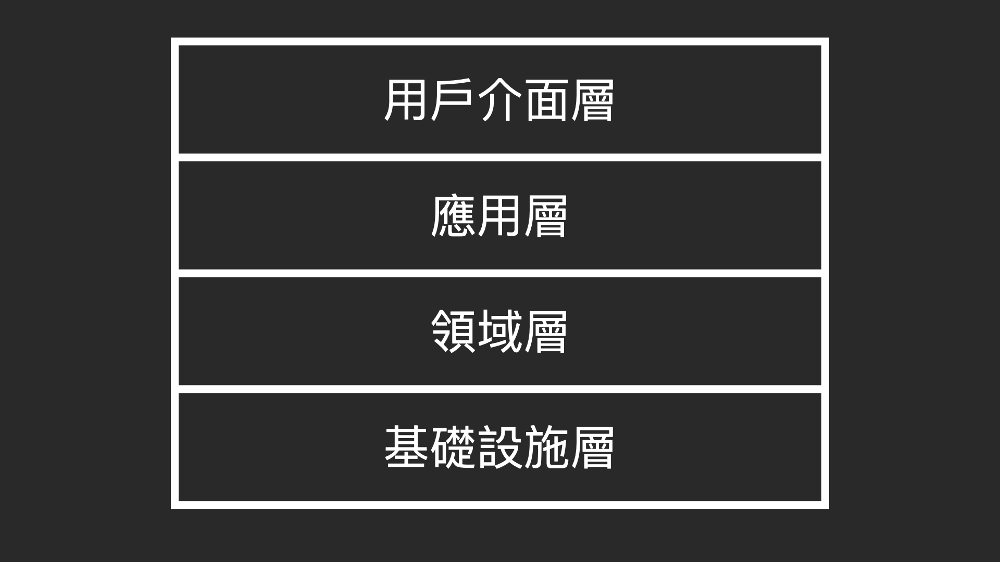


+ 用戶介面層 (User Interface)
+ 應用層 (Application Layer)
+ 領域層 (Domain Layer)
+ 基礎設施層 (Infrastructure Layer)

越往上，離使用者越接近，是客戶能夠理解的部分。

越往下，則離程式語言與平臺越接近，是開發者搭建系統的技術實作。

<br>

### 用戶介面層 (User Interface)
`用戶接口層 / 表示層（Presentaion）`

從字面意思上理解，就是 UI 介面。

這一層，負責向用戶顯示信息或解釋用戶指令。

除了給人看的介面，也有可能是給機器看的介面，使用者可能會透過另外一個系統來訪問你的系統。

**可以理解為這一層就是飛機的機場或貨輪的港口，負責國內外的進出口平台 :**

    進出的可以是人也可以是貨物


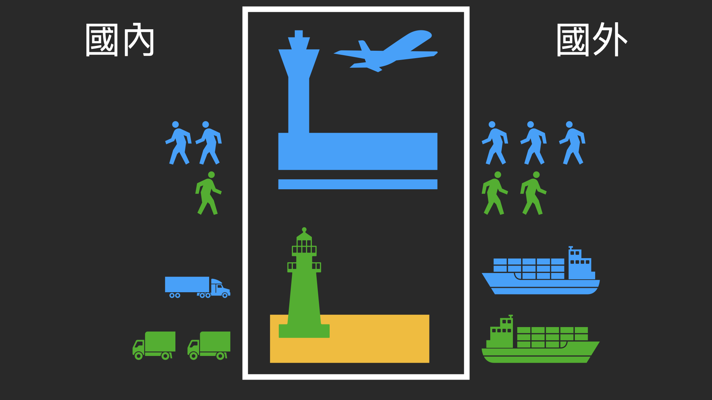    

<br>

### 應用層 (Application Layer)

    定義軟體要完成的任務，並且指揮表達領域概念的對象來解決問題。


**用機場來說明的話，就是要上飛機前的海關檢查程序。**

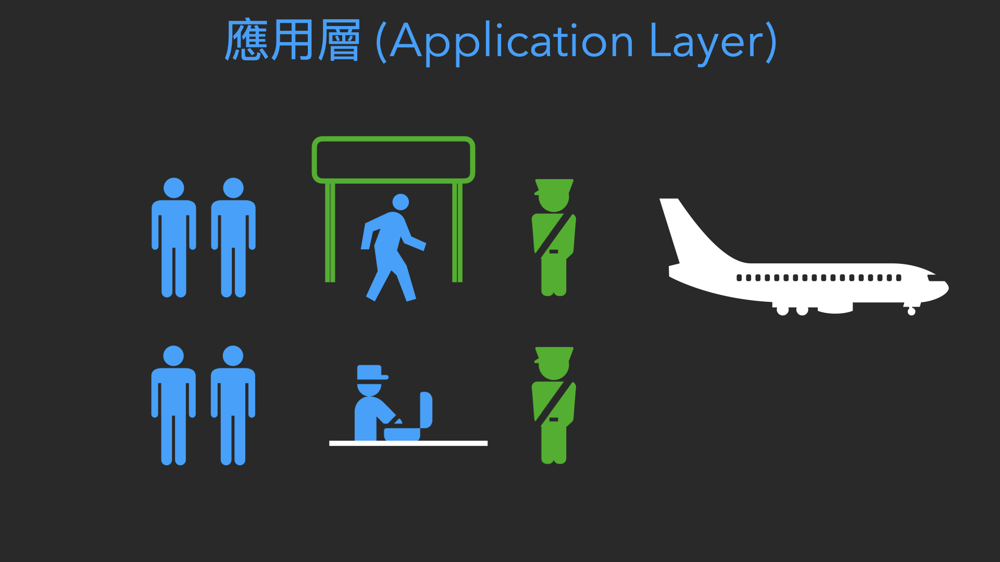

每一個站點，要調用的領域物件與服務，就是稽核人員、查核護照與檢查物品的動作。當出現異常時，依據程序，通知保安與巡警到達現場。


**整套協調任務、分配工作的流程，就是「應用」**

    應用 = 流程

**「應用」代表的是各種任務的背後的流程**

+ 用戶介面層 : 只需要知道，要完成他的工作，需要調用哪一個應用。
+ 應用層 : 只需要知道，要完成他的流程，需要調用領域層的哪個物件與服務。


    「應用層」只管流程步驟，本身並不介入任務的實際執行。


<br>

### 領域層 (Domain Layer)
`模型層(Model Layer)`

    主要負責表達業務概念、業務狀態信息及業務規則


**以海關的稽核人員來說 :**

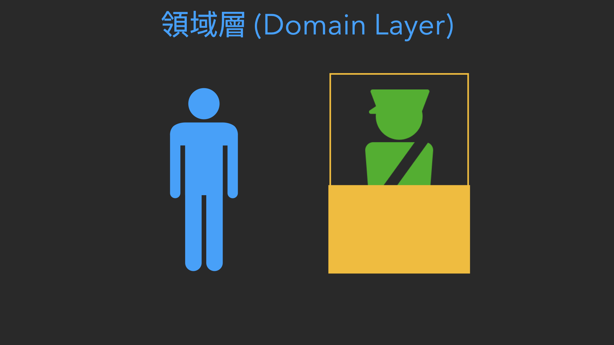

+ 業務 : 查核旅客的護照與身上的物品
+ 業務狀態訊息 : 查核哪些資訊與違禁物的清單
+ 業務規則 : 有違禁品時 要進行通報


    至於要調配哪一位，保安與巡警到達現場，則是管理中心 應用層的職責。

<br>

### 基礎設施層 (Infrastructure Layer)

    為上面各層提供通用的技術能力

**例如:**

+ **為應用層傳遞消息**
+ **為領域層提供數據訪問及持久化機制**
+ **為用戶介面層繪製屏幕組件**


**可以理解為，海關安檢時用的:**

+ X 光機
+ 金屬探測器
+ 電腦設備

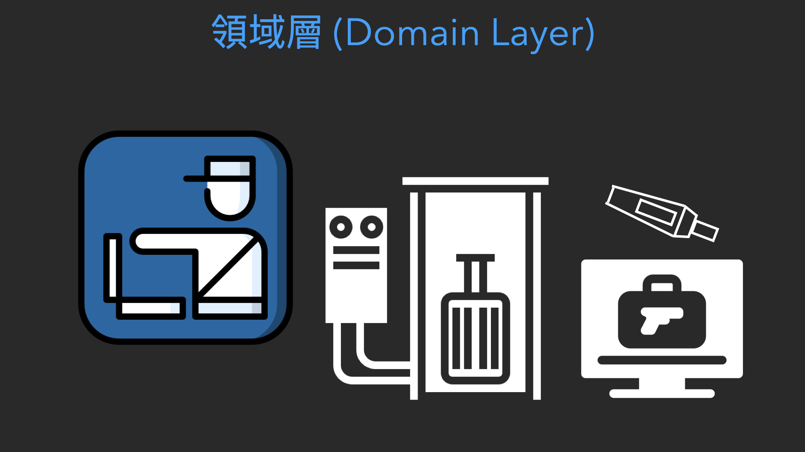

<br>

### 層級關係

    層與層之間的調用，是由上而下，並且可以跨層呼叫
    但不會出現，由下而上或者平行呼叫的情況出現

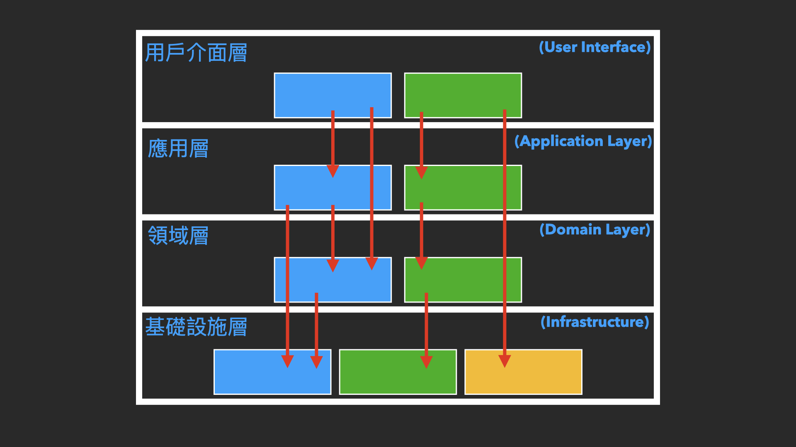

**就像是要請其他的部門協助支援:**

一定是循組織規章程序作業，遞交申請或者是向上通報，而不是直接跑到對方部門 ，在對方主管都不知情的情況下，要求同事協助幫忙。

**這個服務調用之間的順序與流程，也有一些原則可以遵循:**

    元件耦合性原則:
    ADP : 無循環依賴原則
    SDP : 穩定依賴原則
    SAP : 穩定抽象原則


這部分，是屬於「元件耦合性」的問題，後續會再獨立介紹。

<br>

領域層的物件
------
**領域驅動設計，可以理解為，以領域層為核心，驅動整個系統的設計方法。**

在跟領域專家討論與建構模型的順序: 

1. 領域層
2. 應用層
3. 用戶界面層

(領域專家不需要去管技術實作)

### 描述模型
領域層的模型建立，還缺了三個東西，用來描述這個模型 :

+ **實體**
+ **值對象**
+ **服務**

### 實體(Entity)

物件導向概念中的**「物件」**，並且帶有**「標示符」**的對象。

**POJO 物件**

```java
public class AppInfo {
    private Long id;
    private String name;
    private String version;

    public Long getId() {
        return id;
    }

    public void setId(Long id) {
        this.id = id;
    }

    public String getName() {
        return name;
    }

    public void setName(String name) {
        this.name = name;
    }

    public String getVersion() {
        return version;
    }

    public void setVersion(String version) {
        this.version = version;
    }
}
```

**「標示符」**

    指的是當中的屬性有唯一識別碼，在經過軟體的各個分層結構時，仍然保持一致。

**例如:**

+ 人的身份字號
+ 資料庫產生的流水號主鍵


### 值對象(Value Object)
相似於實體(Entity)，兩者的差異在於值對象，沒有「標示符」。


**POJO 物件**

```java
public class AppInfo {
    private String name;
    private String version;

    public String getName() {
        return name;
    }

    public void setName(String name) {
        this.name = name;
    }

    public String getVersion() {
        return version;
    }

    public void setVersion(String version) {
        this.version = version;
    }
}
```

**為什麼沒有標示符 ?**

    因為有時候
    人們對於某個對象是什麼並不感興趣，只關心他所擁有的屬性
    能夠描述領域的特殊方面，即可完成任務


### 服務(Service)
跟實體與值對象不太一樣，在與領域專家規劃模型時，會發現領域中有些方面是很難映射成對象，尤其是領域中的動作，不屬於任何對象。

卻代表了一個重要行為，此種行為通常會跨越若干的對象，將此行為加入到任一對象中會破壞對象。


    對象 = 物件 = 實體 / 值對象

**最佳實做的方式是將它當成一個服務(Service)**

<br>

**可以簡單地理解:**

    實體與值對象 -> 名詞
    服務 -> 動詞

**兩者互相搭配，描述了領域中的一項任務。**

<br>

專案架構實作
------
### 改造目標
`Java 最常見的 Spring 框架示範如何調整`

一般 Spring 框架，書籍中的範例，通常會切分成三個階層 : 

+ Controller : @Controller 的分一個資料夾放
+ Service : @Service 也分一個資料夾來放
+ DAO : 所有有關資料庫存取的服務與對象也分一個資料夾放

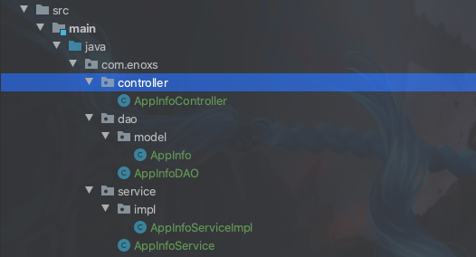

**優勢**  

+ 簡單
+ 快速實現

**缺點**

+ 服務多的時候會變得複雜
+ Service 與 DAO 深度耦合
+ Service 不能進行單元測試

<br> 

### 領域分層
`套用領域驅動設計的四個分層`

**用戶界面層 (User Interface)**

對應的是 Controller 保持不變

<br>
 
**應用層 與 領域層 對應的是 Service**

拆分成兩個 : 

+ 應用服務層 (Application Service) 
+ 領域服務層 (Domain Service)

<br>

**基礎設施層，對應的是 DAO**

DAO 該算是基礎設施層的一個子項模組

所以在基礎設施層，劃分一個數據庫的區塊存放

    Infrastructure/repository

<br>

**基礎設施層，細節部分**

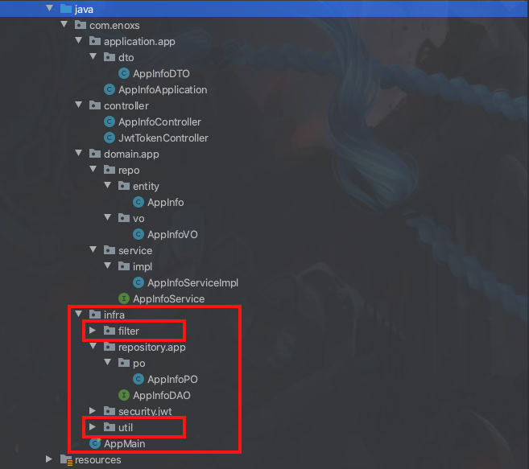

+ util/ : 共用元件的資料夾 
+ filter/ : Spring 設定

<br>

**領域層，細節的部分:**

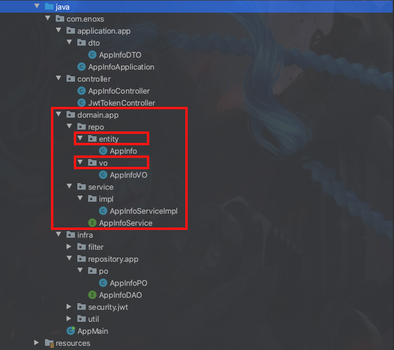

會在切分 實體 Entity 資料夾 與 值對象 Value Object 資料夾

**此部分可以分類的更細**

    元件內聚性原則:
    REP : 再使用性 - 發佈等價原則
    CCP : 共同封閉原則
    CRP : 共同重複使用原則


這部分，是屬於「元件內聚性」的問題，後續會再獨立介紹。

<br>

**應用層，細節的部分:**

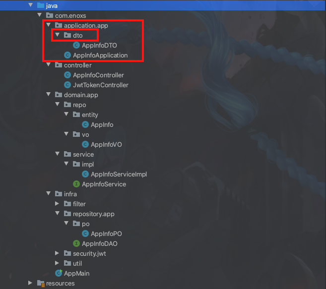

由於應用層，代表的是一連串動作的最終結果，返回的結果，可能包含了很多，實體與值對象的內容。

所以，會在應用層內，劃分一個 DTO 資料夾

    DTO 代表的是 Data Transfer Object，資料傳輸物件


資料傳輸物件，用於應用層的服務，資料物件的輸入與輸出。

**通常，會以領域層的實體或值對象繼承實作:**

```java
public class AppInfoDTO extends AppInfo {
    private String groupId;
    private String groupName;
    private String groupDescription;

    public String getGroupId() {
        return groupId;
    }

    public void setGroupId(String groupId) {
        this.groupId = groupId;
    }

    public String getGroupName() {
        return groupName;
    }

    public void setGroupName(String groupName) {
        this.groupName = groupName;
    }

    public String getGroupDescription() {
        return groupDescription;
    }

    public void setGroupDescription(String groupDescription) {
        this.groupDescription = groupDescription;
    }
}
```

除了，直接擴展，省去了重新建構的時間以外，兩者之間也建立了強關聯，

一眼就可以看出這個傳輸物件，是屬於哪一類的領域項目。

<br>

**資料訪問服務，細節部分:**

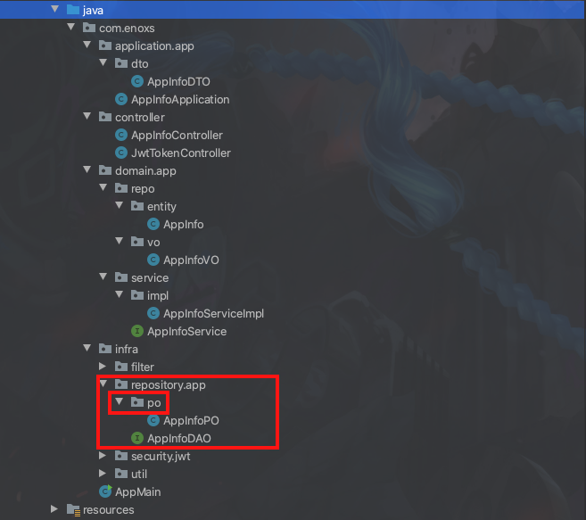

若持久化框架，映射的「持久化物件」允許繼承(ORM 框架 : MyBatis )

     持久化物件: 
     PO , Persistent Object

同樣會讓該物件繼承領域層的實體或值對象

```java
public class AppInfoPO extends AppInfo {
    public String createUser;
    public String createTime;
    public String modifyUser;
    public String modifyTime;

    public String getCreateUser() {
        return createUser;
    }

    public void setCreateUser(String createUser) {
        this.createUser = createUser;
    }

    public String getCreateTime() {
        return createTime;
    }

    public void setCreateTime(String createTime) {
        this.createTime = createTime;
    }

    public String getModifyUser() {
        return modifyUser;
    }

    public void setModifyUser(String modifyUser) {
        this.modifyUser = modifyUser;
    }

    public String getModifyTime() {
        return modifyTime;
    }

    public void setModifyTime(String modifyTime) {
        this.modifyTime = modifyTime;
    }
}
```

擴增的部分，通常是資料庫資料表才會特別紀錄的數據:

+ 新增使用者
+ 修改使用者
+ 新增時間
+ 修改時間

<br>

### 單元測試
以上的安排規劃，使得領域層的服務，只會依賴於同層的領域物件;

不需要，基礎設施層的支持，就可以單獨的進行單元測試。

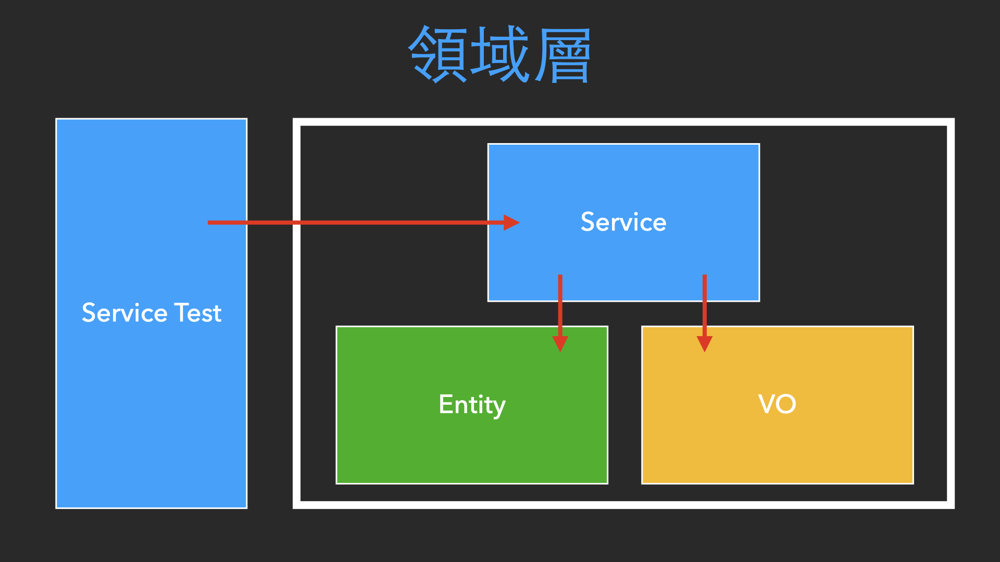

### 架構無國界
並且這種安排規劃，也可以套用在其他種程式語言與平台上

**Android**

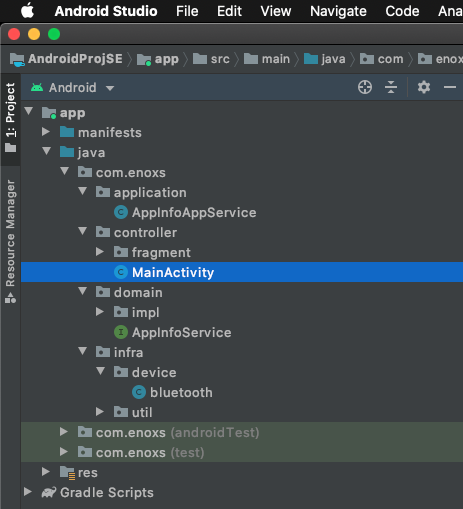

+ Android 的 Activity 就是 使用者介面層
+ Android SDK 提供的各種服務 就是基礎設施層
+ 應用層與領域層甚至連改都不用改

**iOS**

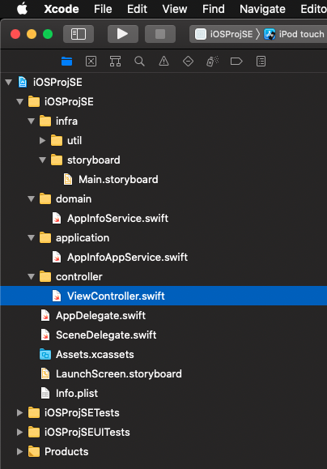

+ iOS 的 Controller 與 SDK 也是同樣道理

<br>

有想法也有做法
------
伊隆 • 馬斯克 : 
```
如果你就讀工程科系，並且對設計東西很有想法的話
自己創業，是個相對簡單的事情。

你需要的就只是找幾個和你理念相同的夥伴。

-- Youtube : 伊隆‧瑪斯克對學生和大學畢業生的終極建議 - 如何擁有成功人生
```

你如果對設計有想法的話，現在更有了作法，起碼明天上班時，就可以試著去優化你的系統。

我這個結合了書籍知識以及個人經驗的，專案結構的規劃方案，也是經過了一段時間的討論，

才被團隊逐漸認可，並且套用到下一個新的專案項目中。

    事情並非一簇可幾，但起碼有了方向。


並且我認為軟體設計的思維模式，也是一種大局觀的思考方式。

    如果你可以組織映射現實的軟體架構，那麼你當然也可以組織現實的實際事物。

**未來的各種挑戰 說不定哪時候就可以派上用場**

<br>

參考資料
------
+ Clean Architecture 整潔的軟體設計與架構篇
+ Spring Cloud 微服務架構 開發實戰
+ [伊隆‧瑪斯克對學生和大學畢業生的終極建議 - 如何擁有成功人生]

[伊隆‧瑪斯克對學生和大學畢業生的終極建議 - 如何擁有成功人生]:https://youtu.be/iuNJLtj10Lg
