元件如何正確使用 ? | 元件耦合性 : 3 大原則
======
`最少改動 x 最大收益`

[`Youtube : 元件耦合性 | 3 大原則   | 最少改動 x 最大收益`](https://youtu.be/cSQY0rA7FPU)

大綱
------
+ 簡單的任務 ?
+ 神奇的軟體
+ 耦合性三大原則
	+ ADP , 無環依賴原則
	+ SDP , 穩定依賴原則
	+ SAP , 穩定抽象原則
+ 領域驅動設計細節
+ 最少改動，最大收益

 

簡單的任務 ?
------
有一個任務，要調整介面上的表格數據: 
+ 客戶覺得:「應該很簡單」
+ PM 覺得:「半小時搞定」

### 打開程式
你發現有太多的其他功能，都要使用到這個數據。

	這裡一改動，就代表了全部都要一起改。

+ 你只覺得: **血壓好像有點微微的增高。**

 

### 功能模組，使用了其他功能
兩者建立了依賴關係，這種行為在軟體中也會稱為:

    「耦合」

### 理想中的目標

    高內聚 低耦合

+ 高內聚 : 分類分得越精準越好。
+ 低耦合 : 建立的關係越少越好。

**要怎麼達成 ?**

	耦合性三大原則

可以先幫你實現低耦合的目標。

 

神奇的軟體
------
「軟體」是一種很神奇的東西，看似很自由，可以隨意添加新的功能。

### 如果真的這麼隨意
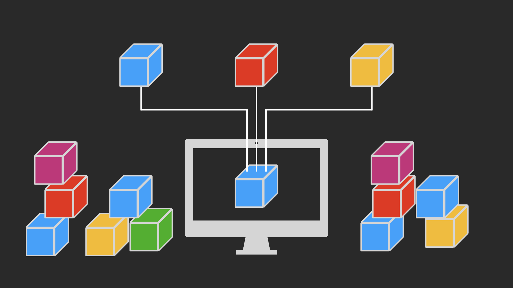

	自由的空間，反而會越來越少 (越來越難改動)

### 依循一些原則，規範開發的方向
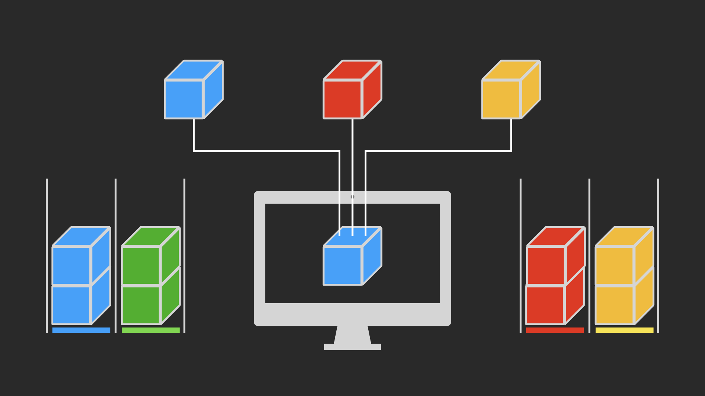

	看似多了限制，卻反而能使得，未來的擴展空間 大大的增加。

### 軟體的特性，也是一種「違反直覺」的力量

 

**「違反直覺」延伸閱讀 :**
+ [`YouTube: 測試驅動開發 | 3 大法則 + 5 大好處 | 撰寫 單元測試 速度更快 !`](https://youtu.be/HFVjTFy42hI)

 

### Clean Architecture 無瑕的程式碼
`整潔的軟體設計與架構篇`

除了「物件導向的五大設計原則」以外，還有「元件的內聚性原則」與「元件的耦合性原則」。

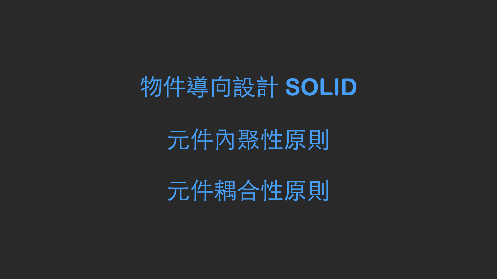

 

### 先後順序
實際上的順序，應該是要:

	內聚性先，而耦合性後

因為我個人認為「耦合性」的概念，比較好懂; 原則的部分，也相對容易，應用於開發上。

**這次，會先說明耦合性的部分**

`下一篇章，會接著繼續說明內聚性的部分`

 

耦合性三大原則
------
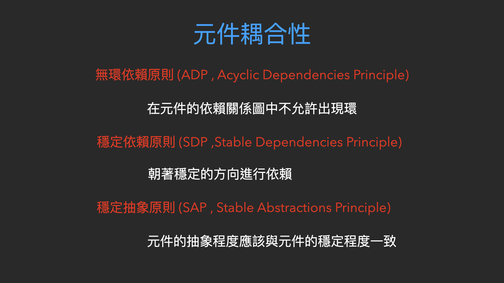

### ADP 無環依賴原則
`在元件的依賴關係圖中不允許出現環`

### SDP 穩定依賴原則
`朝著穩定方向進行依賴`

### SAP 穩定抽象原則
`元件的抽象程度應該與元件的穩定程度一致`

 

ADP , 無環依賴原則
------
`Acyclic Dependencies Principle`

    在元件的依賴關係圖中不允許出現環
    
從字面上來理解，就是元件在需要其他的元件工作時，之間構成的依賴關係，不可以是環狀循環。

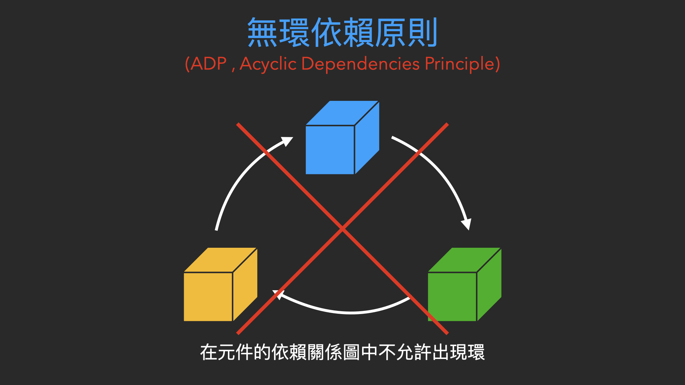

 

### 為什麼 ?
因為依賴於其他元件，目的是為了

	「減輕工作量」

別的元件有做過的事情，就不要重新再做一次。

如果元件的依賴會互相參照，代表 :

+ 我的元件調整後，可能會影響到要依賴的元件
+ 依賴的元件被影響後，又有可能回頭影響到我的元件

就好像構成了 一個短路循環 ，直到系統**「過載」**

 

**從「減輕工作量」這個角度來看，「循環依賴」更像是一個工作製造機**

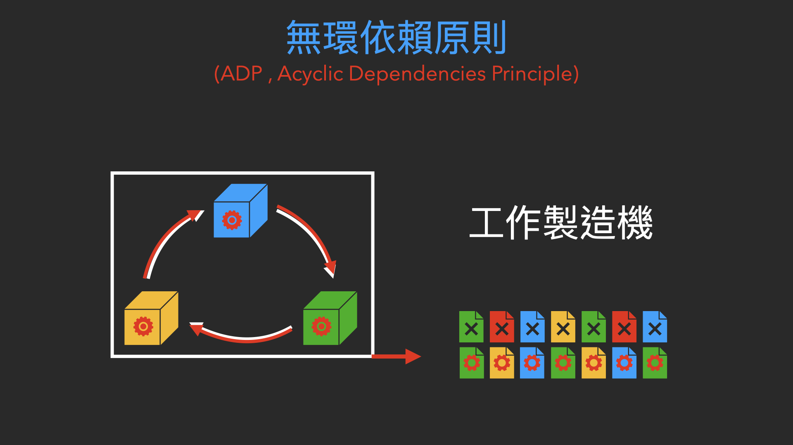

    可以源源不絕的，讓你有做不完的工作。(不會失業 XD)

 

SDP , 穩定依賴原則
------
`Stable Dependencies Principle`

	朝著穩定方向進行依賴

延續無環依賴原則的思路，除了依賴不能造成循環，依賴還是最好有個方向。

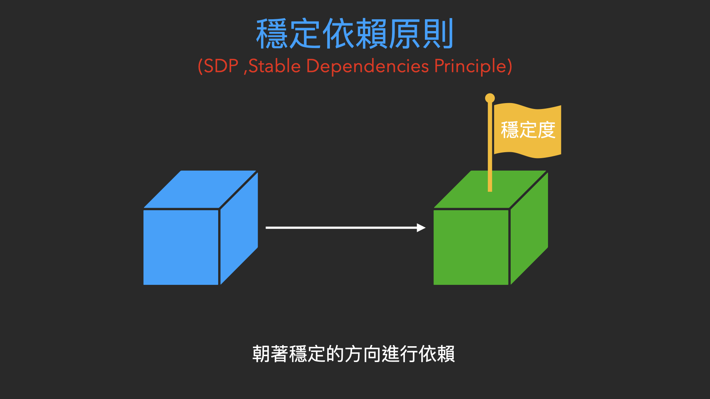

`這個方向的路標，就是「穩定度」`

 

### 穩定度 ?

	也是以「工作量」的多寡來決定

 

### 穩定的元件 ?
元件被很多的功能依賴，但本身沒有去依賴任何東西

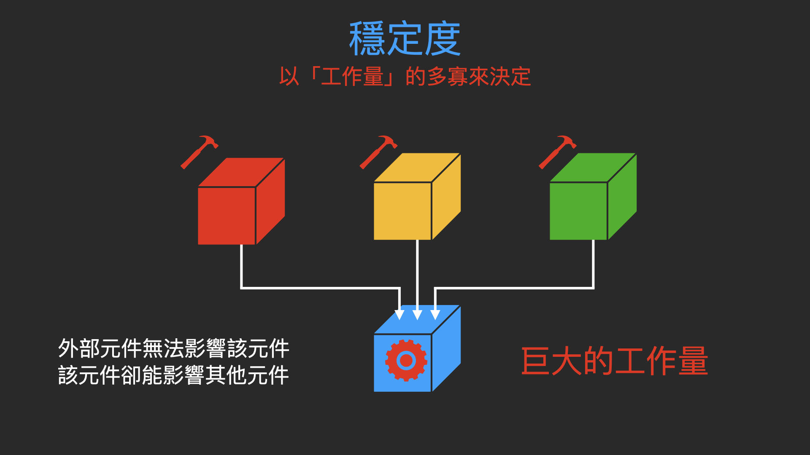

+ 不會有外部的元件，影響到它
+ 但它卻能夠影響到，很多元件

**改了它，就代表了巨大的「工作量」**

	所以這個元件是「穩定」的

 

### 不穩定的元件 ?

如果這個元件，沒有功能依賴它，但它依賴了很多外部的元件

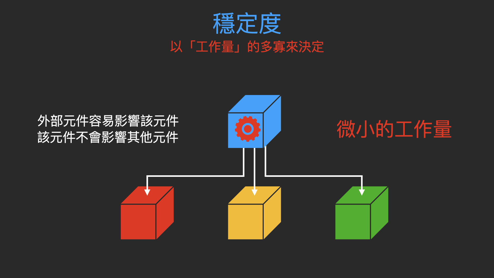

+ 外部的元件更動，它都有可能受到影響
+ 但它本身自行改動 卻不會影響到其他元件

**修改它的「工作量」非常的低**
	
	所以這個元件是「不穩定」的

 

### 穩定度計算公式

藉由依賴的關係數量，這裡就會有一個的公式，可以計算元件的穩定度

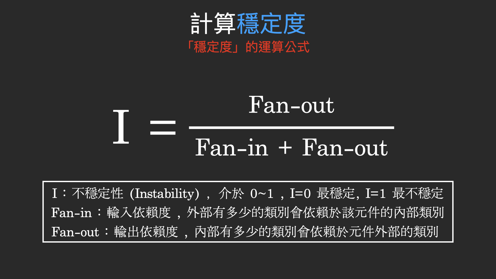

`理想的狀況，就是由不穩定的元件，朝向穩定的元件，建立依賴關係`

 

SAP , 穩定抽象原則
------
`Stable Abstractions Principle`

    元件的抽象程度 應該與元件的穩定程度一致
    
+ 「穩定」: 在上一個原則 已經知道什麼意思
+ 「抽象」: 則代表的是 只表達「概念」但並不「實作」

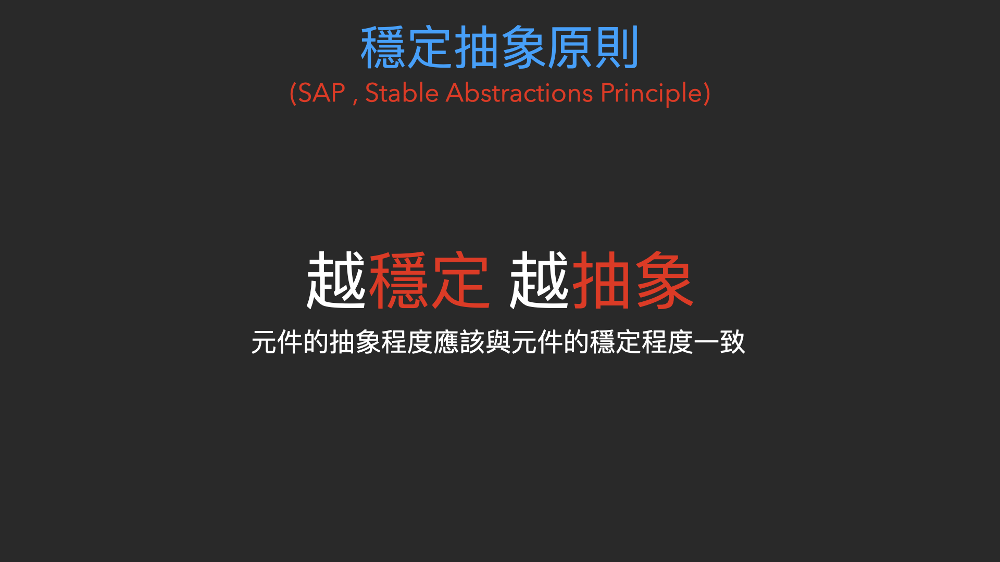

也就是**越重要的元件，應該越只表達純粹的「概念」**

 

### 為什麼 ?
穩定的核心元件，雖然穩定，但失去彈性不能擴增，並不是軟體設計想要看到的情況。

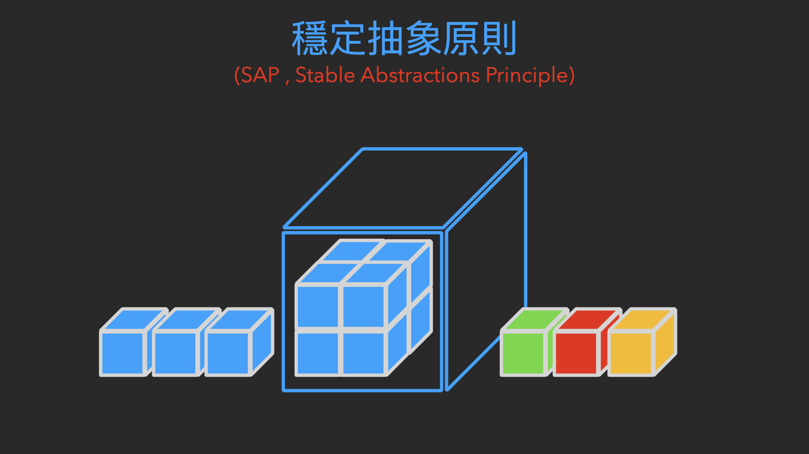

 

### 舉個例子
以**餐廳**來說，**廚師**就是穩定的核心元件

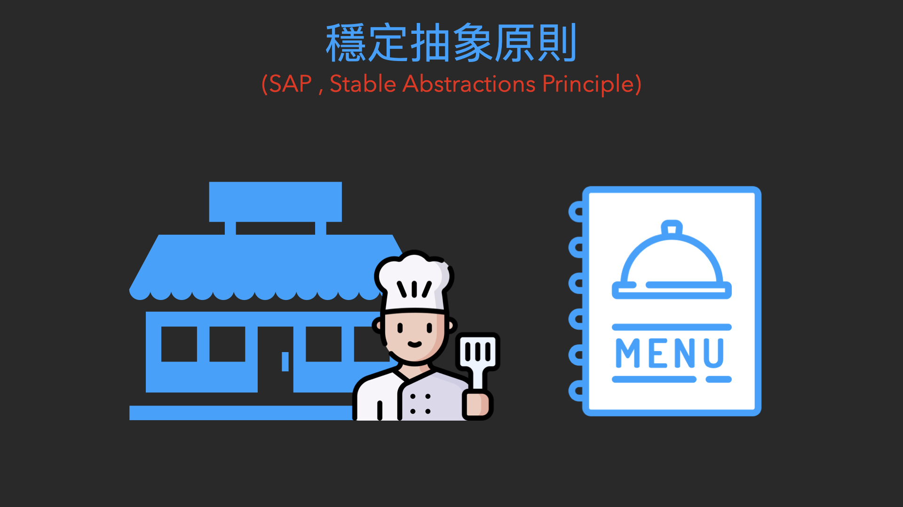

**由廚師本身會煮什麼菜，來決定餐廳會有什麼樣的菜單**

`對於，有點規模的餐聽，這並不是一個好的情況`

 

這邊的原則，就是將表達**「概念」**的**「菜單」**，當成是最穩定的核心元件

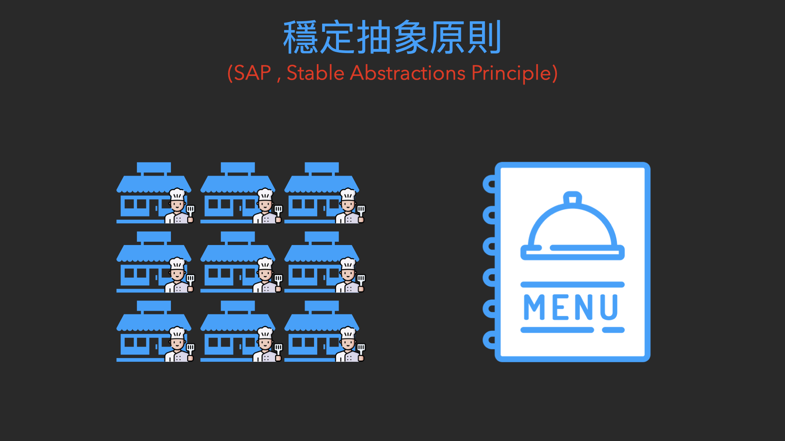

如此，就不會受到限制。各個連鎖店的廚師，也能根據菜單的菜譜，快速增加新的菜色。

 

領域驅動設計細節
------
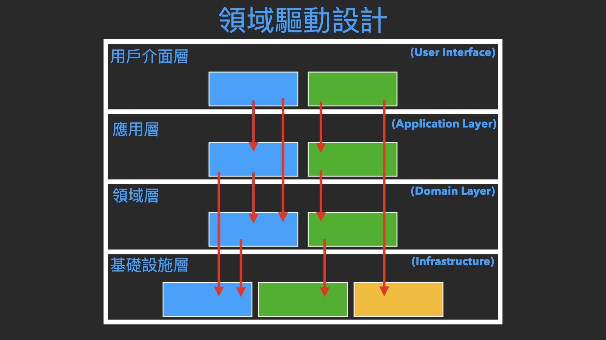
+ [`YouTube:領域驅動設計 | 4 層架構 + 3 類物件 | 有想法 x 也有做法`](https://youtu.be/mducM_tUUEY)

依據耦合性的原則，領域驅動設計的概念，補充實作部份的三個細節:
+ Domain 層
+ Application 層
+ Infrastructure 層 

 

### Domain 層
通常就是系統的核心，所以 Domain 的 Service 通常會宣告成 Interface 的介面

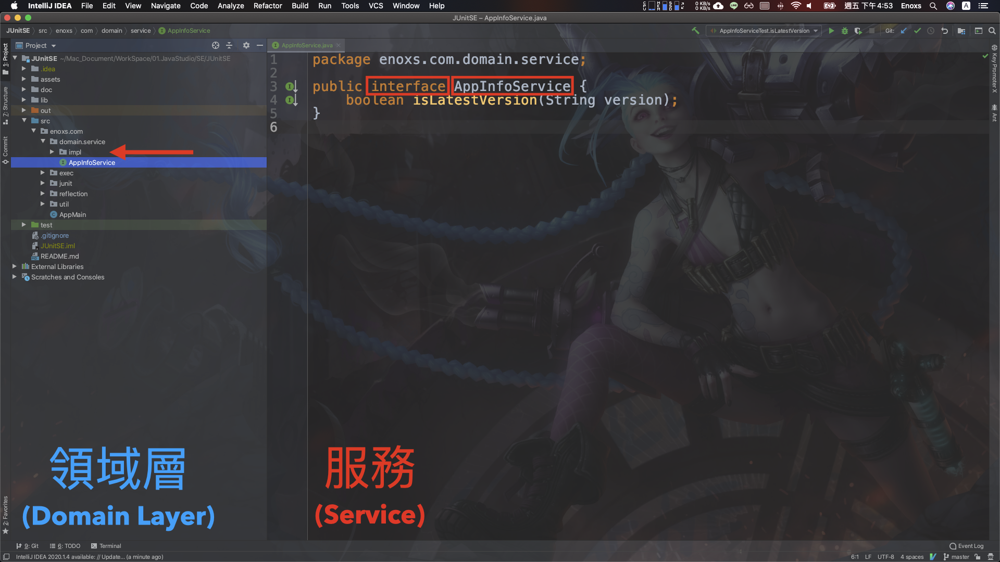

`名稱結尾為 Service`

 

然後，在同目錄的 impl/ 資料夾，創建新的類別實作(implements) 該 Service 的介面

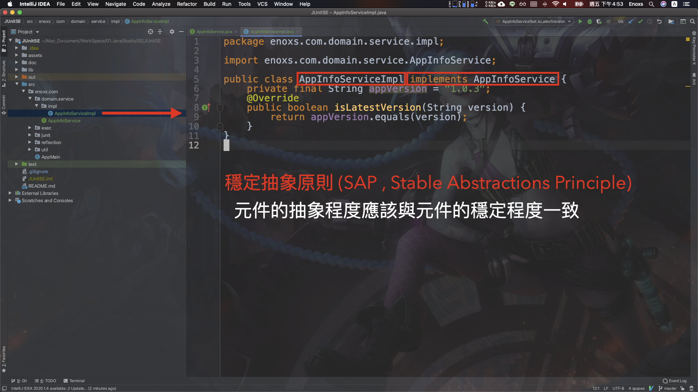

`名稱結尾為 ServiceImpl`

	這裡是借鑒了 「SAP 穩定抽象原則」，越穩定的元件應該越抽象。

 

### Application 層 
負責的是流程作業，相比於 Domain 層變動性是比較大的，雖然說同樣有 Service 的類別，但不再創建 Interface 的介面

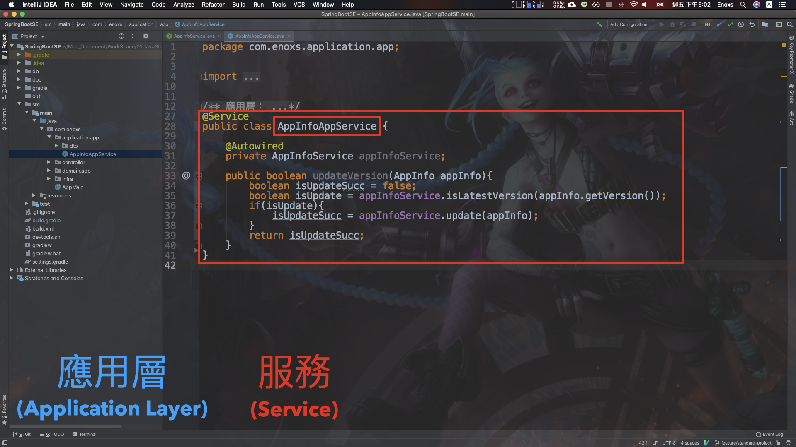

`結尾的名稱命名 使用 AppService`

    這裡是借鑒了 「SDP 穩定依賴原則」，把容易變動的東西，變得更加容易改動。

 

### Infrastructure 層 
提供所有的技術支援，從 DDD 的架構分層可以很明顯地看到，它是個自上而下的依賴關係

    但對於與 Domain 層的關係，我認為不應該被領域層的元件所依賴

 

### 有兩個部分可以具體說明: 

+ DAO 資料持久化 
+ Util 共用工具

 

### 第一個 : DAO 資料持久化的部分
`DAO , Data Access Object) `

領域層(Domain Layer)的服務(Service) ，不應該直接 調用 DAO 來完成資料保存的任務

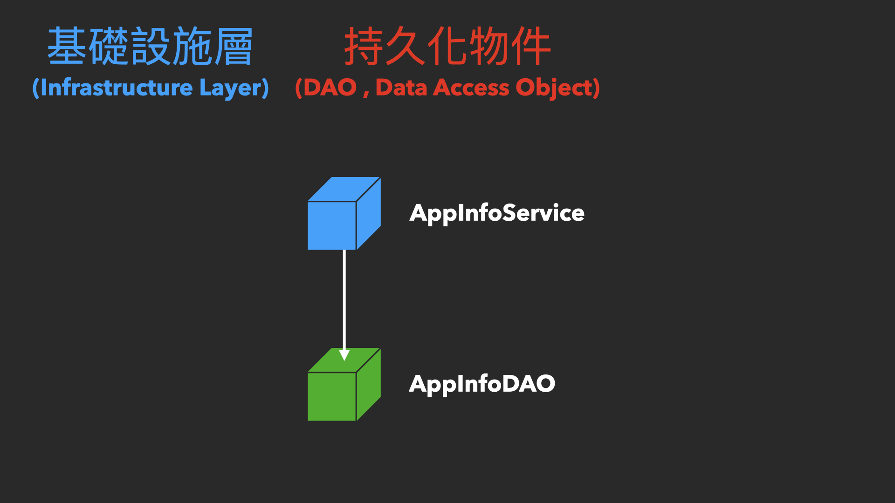

而是應該提升一個層級，交由應用層(Application) 來執行這項任務

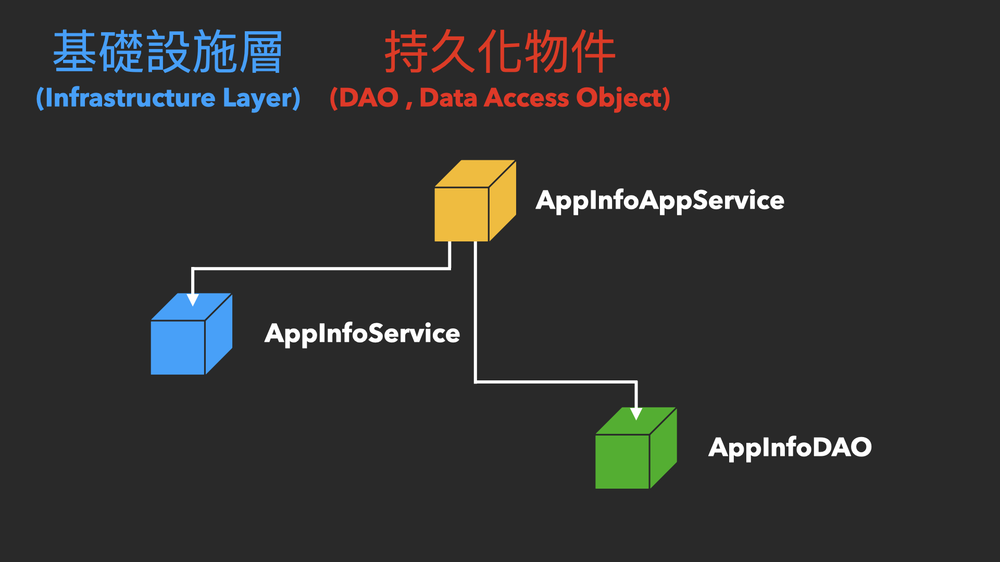

避免資料庫的變動會影響到領域層(Domain Layer)的功能

 

### 第二個 : Util 工具的使用

util 工具，通常會是各種第三方的框架，封裝而來

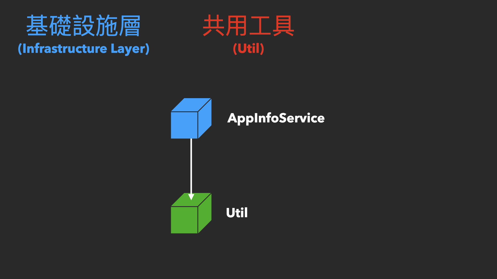

如果，第三方的框架:
+ 有重大的 bug 
+ 有更好的框架可以更換

	調整 util 元件，就會影響到 領域層(Domain Layer) 的功能

 

**這種情況...**

不如就由領域層(Domain Layer) 提供 :

+ 抽象方法的類別(abstract)
+ 抽象型別的介面(interface)

然後由，基礎設施層來實作功能。

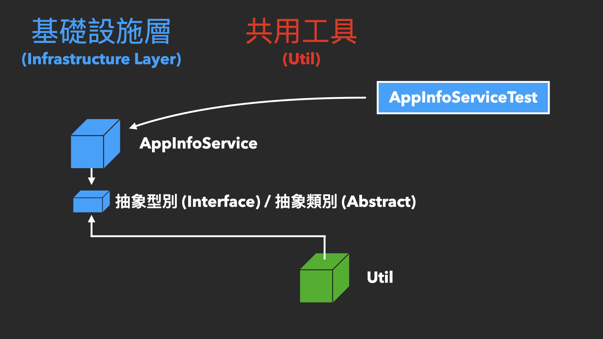

不管最後是使用什麼樣的技術實作，只要能夠通過，領域層的單元測試，就可以確保系統的正確性。

 

### 違反直覺

這部分，可能一時之間無法轉換過來，不過這裡要表達的就是:

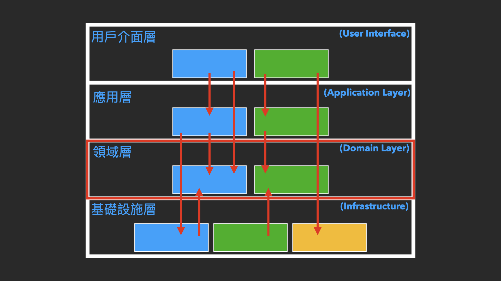

Domain 層 是穩定的核心元件，不應該去依賴其他層級的元件。

 

最少改動，最大收益
------
依據上述耦合性的三大原則，有沒有發現一件事情:

**「穩定」與「不穩定」**並不是一個「好」與「壞」的關係

	而是這個「穩定度」與元件的「特性」是否是相符合。

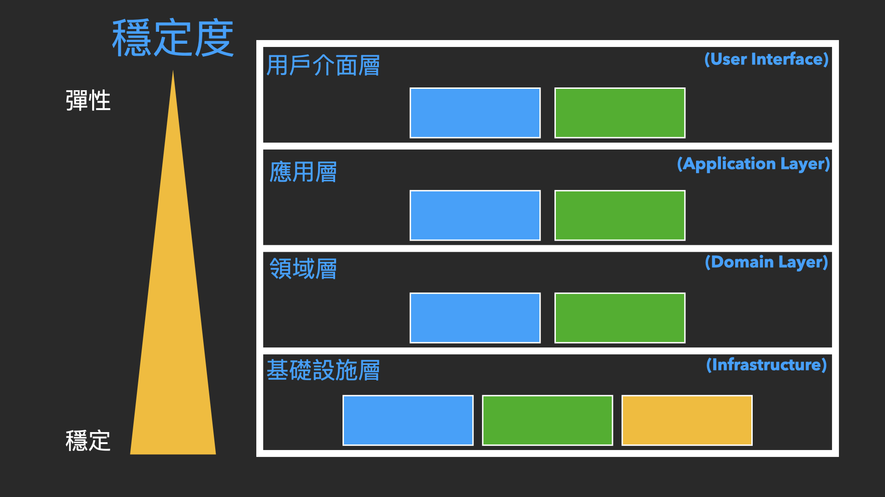

最容易變動的「使用者介面層」、「應用層」，**就是放在上兩層，向下依賴**

 

+ 耦合性的「無環依賴」與「穩定依賴」，基本上已經大部份的符合
+ 領域層的部分，添加了三個細節，讓它看起來更加核心，也符合了「穩定抽象的原則」

 

### 完美的「設計」?

不敢說是最好的「設計」，但我知道 :

**建立關係**
	
	不應該是那麼的隨心所欲

 

朝著正確的方向**不斷精進**，也許哪一天也可以觸碰到傳說中:

	「最少改動，最大收益」 

軟體開發的天堂之境

 

語錄
-----
### 工程師OS

    只有資深工程師才有資格跟工程師說:「應該很簡單」
    	
         -- Gamma Ray Studio

參考資料
------
+ Clean Architecture 整潔的軟體設計與架構篇
+ [維基百科-耦合性](https://zh.wikipedia.org/wiki/%E8%80%A6%E5%90%88%E6%80%A7_(%E8%A8%88%E7%AE%97%E6%A9%9F%E7%A7%91%E5%AD%B8)
+ [細談元件耦合性](https://www.jyt0532.com/2020/03/27/coupling/)
+ [那些他們無法當面說的｜要成為好PM，先聽聽工程師的內心話](https://betweengos.com/career-what-makes-you-a-good-pm-by-programmers/)

