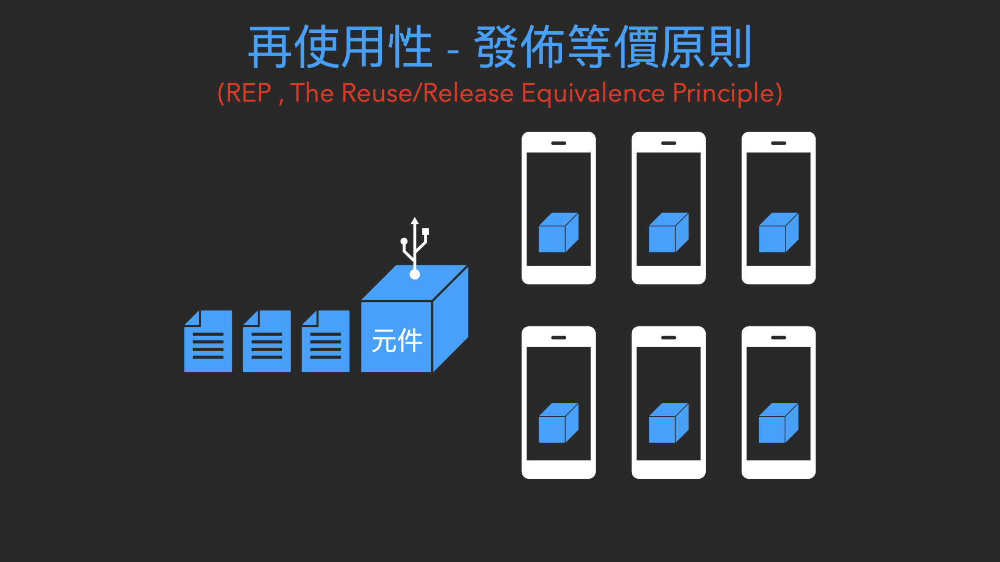
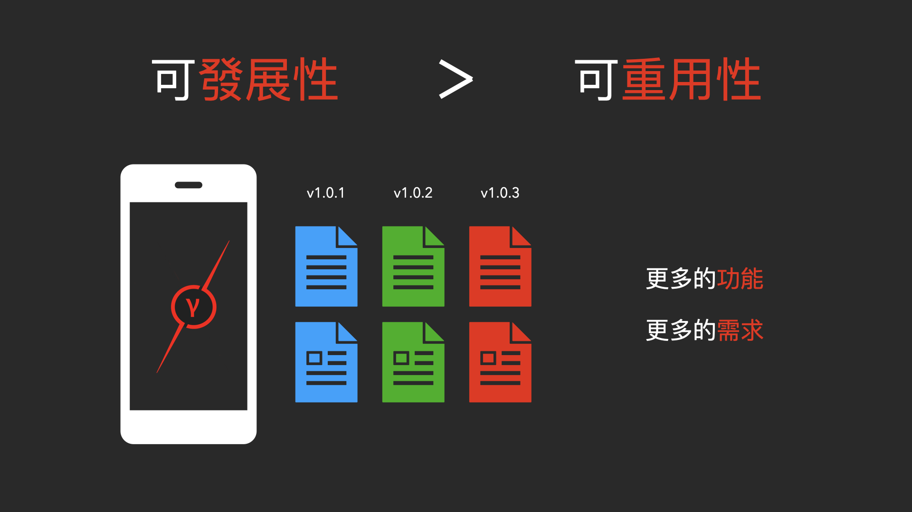

元件如何正確歸類 ? | 元件內聚性三大原則 : REP、CCP、CRP
======
`適當時機 x 適當分類`

[`Youtube : 元件內聚性 | 3 大原則 | 適當時機 x 適當分類`](https://youtu.be/wRyzCktcbNQ)

大綱
------
+ 全新的專案
+ 高內聚就能低耦合
+ 內聚性三大原則
	+ REP , 再使用性 - 發佈等價原則
	+ CCP , 共同封閉原則
	+ CRP , 共同重複使用原則
+ 內聚性張力圖
+ 適當的時機，適當的分類

 

全新的專案
------
全新的專案，從無到有的開發

### 過往的經驗
打算把很多重複的功能，都聚集成 一個獨立的元件

### 類別分類
要將哪個類別歸類到哪個元件，是個重大的決定!

    但大部分的時候，卻都是憑感覺分類。
    
 

### 內聚性三大原則 
就是在告訴你 :

    分類時，可以依據類別的什麼特性，來歸類成同一個元件。
    
除此之外 : 

**它甚至告訴你，現在就將類別，抽成共用元件，並不是恰當的「時機點」。**

 

高內聚就能低耦合
------
延續元件耦合性的部分

+ [`Youtube : 元件耦合性 | 3 大原則   | 最少改動 x 最大收益`](https://youtu.be/cSQY0rA7FPU)

 

在上一篇章中，已經知道: 

    元件之間建立關係，不應該是那麼的「隨心所欲」

 

### 高內聚，低耦合
高內聚在前，除了類別要先內聚成大顆粒的元件，才能互相依賴以外。從元件內部來看，如果都是相似且恰當的類別，
**那麼元件在要使用特定功能時，要依賴的元件，就不會是分佈於程式各處，而會相對集中。**

元件只會依賴必要的元件，整體系統的參照數量，就會降低。

    同時也達成「低耦合」的目標

 

內聚性三大原則
------

### REP 再使用性 - 發佈等價原則
`再使用性的細緻度就是發佈的細緻度`

### CCP 共同封閉原則

    將那些會因著相同理由、再相同時間發生變化的類別，收集到相同的元件之中。
    將那些在不同時間、因著不同理由發生變化的類別，分割到不同的元件之中。

### CRP - 共同重複使用原則
`不要強迫元件的使用者依賴他們不需要使用的東西`

 

REP , 再使用性 - 發佈等價原則
------
`The Reuse/Release Equivalemce Principle`

    再使用性的細緻度就是發佈的細緻度

這個原則是再說明，真正可以「再使用」的「元件」，必須是像發佈應用程式一樣；

擁有獨立的版本號與說明文件能夠「追蹤」與「紀錄」每一個時期，程式的變化，才是符合「再使用」的元件特性。

也就是

    再使用的「元件」，必須是已經「發佈」過的元件

 

### 為什麼 ?
這麼做的目的，是不希望當要使用現成的程式功能時，只是純粹的程式碼「複製」、「貼上」

後續如果那段程式被更動了，追蹤與管理都會是一個大問題。

 

### 再使用性
更嚴謹的做法，就是將要「重用」的程式，獨立成一個可以任意部屬的元件。
在其他應用程式中，只需要知道外部的接口，而不需要知道原始的程式碼。

    能夠方便的使用，也是「再使用性」的特徵

 

CCP , 共同封閉原則
------
`The Common Closure Principle`

    將那些會因著相同理由、再相同時間發生變化的類別，收集到相同的元件之中。
    將那些在不同時間、因著不同理由發生變化的類別，分割到不同的元件之中。

### 延續「共同封閉原則」
上一個 REP 原則，說明 要「再使用」的元件，必須要像應用程式一樣發佈

因此，元件內部的類別組成，就必須要能夠實際的解決:

+ 特定的主題
+ 特殊的目的

    也就是「內聚性」必須要強

但該原則並沒有具體的說明，怎樣才算是「內聚性」強

**「CCP 共同封閉原則」與 「CRP 共同重複使用原則」就是用來補充 REP 原則，未具體說明的部分。**

 

從描述上來看，可以很明顯地知道。分類的依據就是根據「變化」的可能性進行分類

 

### 為什麼 ?

因為軟體雖然是可變的，但還是希望「最少改動，最大收益」。

如果程式需要被更改，那麼當然希望更改的地方，都集中在同一個元件，而不是分散開來，到處都是。

 

CRP , 共同重複使用原則
------
`The Common Reuse Principle`

    不要強迫元件的使用者依賴他們不需要使用的東西

### 延續「CCP 共同封閉原則」
 
使用「變化」的可能性，進行分類後。

這個原則，則是要將分類好的元件內部，在做一個更細緻的分類。

 

### 為什麼 ?
因為一個元件中，使用者有可能只用了這個元件的很小一部分，其他的部分並不是使用者所需要的。

 

但依賴的關係仍然是建立，這個元件其他部分更動了，還是必須要重新編譯、驗證、佈署。

如果有更精簡的元件可以使用，就沒有理由非得要選擇你的元件

 

所以，為了更強的內聚性，就是以使用者的角度，將元件進行分割

### 目標

    元件內的類別，都是使用者剛好要使用到的部分 (元件不要依賴不需要的東西)
    

 

內聚性張力圖
------
依據上述的三個原則，可以發現每個原則，所關注的重點都不太一樣 :

### REP 再使用性 - 發佈等價原則
`目標: 讓元件更好的被使用`

    關注的是「重用性」
    
#### CCP 共同封閉原則
`目標: 讓元件更好的被維護`

    關注的是「發展性」
    
### CRP 共同重複使用原則
`目標: 讓元件更精準的定位`

    關注的是「精確性」
    
 

**這三個原則，彼此之間會互相拉扯，太多的關注某些原則，就會導致另外一個原則無法被確切的符合。**

 

這種情況，可以描述成一個張力圖:

當開發者只關注其中的兩個頂點，而放棄另外一個頂點的原則時，程式必須要付出的代價。

 

### 只關注 CCP、CRP 原則，不在乎 REP 再使用性 - 發佈等價原則

    元件就會很難被重用

 

### 只關注 REP、CRP 原則，不在乎 CCP 共同封閉原則

 

    修改時就會有太多的元件要被更動

 

### 只關注 REP、CCP 原則，不在乎 CRP 共同重複使用原則

 

    造成太多不必要的版本發佈

 

### 第四維度
因此在軟體設計中，還有一個必須要考慮的因素:

    時間維度
    
對於大多數的應用程式，由於想要 : 
+ 增加「更多的功能」
+ 滿足「更多的需求」

 

    「可發展性」的重要程度通常會大於「可重用性」

 

也就是說，在專案開發初期: 

    CCP 原則的重要性會大於 REP原則(可發展比重複使用更重要)
    
所以這時，第一個應該要思考的是

    如何恰當的「分類」，而不是思考未來該如何「重用」。

 

    

 

### 聚合原則重要性演變

重用的部分，必須加入了 CRP 原則，更精簡後，依循 REP 原則正式發佈:

 

此時，你的元件才會真正意義上的，具有「高內聚」的特性。

 

適當的時機，適當的分類
------
回頭來看 DDD 領域驅動設計

 

+ [`Youtube : 領域驅動設計 | 4 層架構 + 3 類物件 | 有想法 x 也有做法`](https://youtu.be/mducM_tUUEY)

四個分層，其實就是 CCP 原則的概略呈現。

 

而在每一層中，我通常的做法，都會在更細緻的依據業務情境，進行分類:

### Domain 層

 

每個業務情境都會有各自的 Service Entity 與 vo

 

### Application 層

每個業務流程也都會有各自的 Service 與 DTO

 

這種細緻化的方式，也是 CCP 原則 與 CRP 原則的綜合應用。

 

### REP 原則，具體的呈現
就像是我的 :

**JavaProjUtil**

 

**iOSProjUtil**

 

各種 Util 結尾的專案，可以獨立的發佈版本與提供說明文件。

+ [`Youtube : 如何快速學習新技能 ? | 軟技能 x 十步學習法 | 學習「怎樣學習」`](https://youtu.be/Ya7XE47gPBo)

 

### 動態的軟體，動態的原則
軟體是一個動態的東西，設計軟體元件內部的內聚性原則也是動態的。

身為優秀的軟體工程師，可能就會意識到，這個就是:

    「軟體的本質」 與 「軟體的特性」
  
+ [`Youtube : 軟體是什麼? | 軟體的本質又是什麼 ? | 軟體工程師深度思考的問題`](https://youtu.be/njAgG9e1Qco)

 

掌握了這些原則，你就能: 

    在適當的時機點，出現適當的東西。
    
軟體的天堂之境:「最少改動，最大收益」，已經出現在不遠處。

 

 

語錄
-----
### 工程師紀錄

    有想法的人很多，有作法的人很少
    	
                -- 我以前的組長

參考資料
------
+ Clean Architecture 整潔的軟體設計與架構篇
+ [維基百科-內聚性](https://zh.m.wikipedia.org/zh-tw/%E5%85%A7%E8%81%9A%E6%80%A7_(%E8%A8%88%E7%AE%97%E6%A9%9F%E7%A7%91%E5%AD%B8)
+ [細談元件內聚性](https://www.jyt0532.com/2020/03/26/cohesion/)
+ [元件內聚性 Component Cohesion](https://medium.com/@f40507777/%E5%85%83%E4%BB%B6%E5%85%A7%E8%81%9A%E6%80%A7-1a1c334fc3f7)

