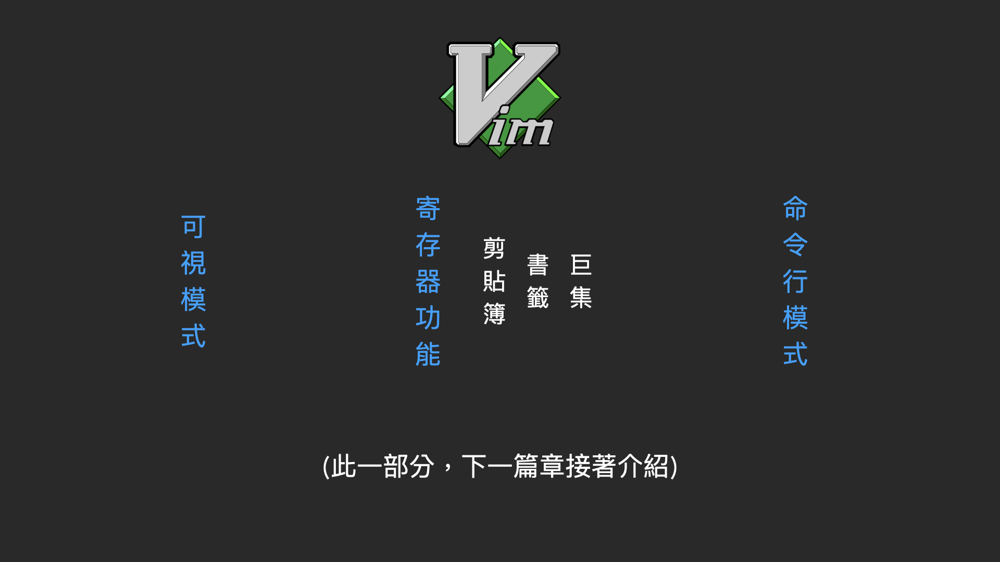

Vim 編輯器 入門指南 (上) 
======
`用思維的速度寫程式`

[`Youtube: Vim 編輯器 入門指南 (上) : 用思維的速度寫程式 | 開發 x 編程 | 思考速度多快 寫程式速度就多快【Gamma Ray 軟體工作室】`](https://youtu.be/Yk4s-WLjxug)

目錄
------
+ 前言
+ 什麼是 Vim ?
+ 三點好處與壞處
+ 安裝 Vim 插件
+ 簡單的文本編寫
+ 分頁與導航
+ 光標移動與定位
+ 插入模式指令
+ 普通模式指令
+ 前置條件

 

前言
------
Vim 編輯器的內容，多到可以獨立的出一本書來說明。

例如我看過的 「Vim 實用技巧」一書，影片內的部分知識就是取自於此。

這次除了 編輯器的好壞處比較以外，後面指令說明的部分，只會就簡單的文本編寫動作的延伸介紹。

其他的可視模式、命令行模式、剪貼簿、書籤、巨集的功能部分

在 **Vim 編輯器 入門指南 (下)** 會繼續說明。

 

什麼是 Vim ?
------
通常想要提升開發速度的開發者，都會熟記 IDE 的快捷鍵，以減少手部離開鍵盤操控滑鼠的時間。

### Vim 就是一種：

    不使用「滑鼠」，只使用「鍵盤」的文字編輯器

鍵盤上的每一個按鍵，都代表了一種指令 ; 這些指令，就像是語言一樣，有自己的語法與邏輯。

### 熟練地掌握

    可以讓你用最少的動作 完成最多的事情

 

三點好處與壞處
------
依據我這些年使用的開發經驗，個人認為 Vim 的編輯器有「三點好處」與「三點壞處」

### 三點好處

**好處一:  速度快**

+ 開啟檔案快
+ 編輯速度也快

    也就是開發速度快

如果是一個非常小的修改任務

**使用終端機:** `找到目標 ->  開啟檔案 -> 編輯 -> 修改 -> 完成`

這一套流程，可能 IDE 才剛跑完 啟動的畫面

 

**好處二 : 精準**

我希望 : 

+ 游標移動到，開頭數過來的第三個變數

或者

+ 選取 以雙引號為分界的文字字串

    大腦想要的編輯動作 -> 鍵盤精準達成
    (不需要滑鼠手眼協調才能大致定位)

 

**好處三 : 酷**

身為專業的開發者，肯定是希望「快捷鍵」高速連按。如此才能滿足想像中「駭客」的模樣 : 

    對著黑屏白字的「終端機」，鍵盤高速連打。

 

### 三點壞處
**壞處一 : 中文輸入不方便**

所有的編輯指令，都必須在英文的輸入法下才能作用。

如果編輯的文件中有中文的部分，就必須要常常進行輸入法的切換。

**造成影響**
+ 在 Mac 平台 : 覺得還好 -> 因為輸入法的切換，幾乎沒有停頓
+ 在 Windows 平台 : 會被放大 -> 因為切換時，必須要有個明顯的停頓點，系統才會順利的切換

    有時候，
    指令如果下得太快，沒有切換成功，
    就會在中英文的交界處，發生嚴重堵塞。
    (此時你可能就會開始思考人生的意義)

 

**壞處二 : 不適用 Windowns 平台**

就使用經驗而言 Vim 在 Windows 平台不太好用，除了剛才的輸入法問題以外 

想要使用 Vim ，雖然有 GVim 圖形介面可以安裝，但相比於 Mac 與 Linux 終端機的各種操作與指令工具，兩者還是有很大的差異。

所以我在 Windowns 的平臺，不會硬要用終端機來作業

    只會在 IDE 安裝相關插件

 

**壞處三: 學習曲線高**

Vim 的指令與指令之間，可以互相的組合與搭配

彼此的關係並不是，一對一 或者 一對多，而是 多對多的狀態

要了解這些指令執行後 ，會做了些什麼樣的動作，然後前方與後方可以再搭配什麼樣的指令

**方能在編輯時：**

    選擇最佳的組合 -> 精準且快速的完成目標

 

安裝 Vim 插件
------
要使用 Vim 的編輯器，如果是 Mac 或 Linux 系統，開啟終端機可能就有。

但如果是 Windows 的系統，個人建議可以使用 ，上一部影片介紹的 IntelliJ 安裝 Vim 插件 :

1. 在設定 > 插件 的地方，搜尋 IdeaVim 
2. 安裝該插件 以及擴充 IdeaVimExtension

+ [`Youtube: IntelliJ IDEA 入門指南:Java 開發者的神兵利器 | 開發 x 編程 | 天下武功 唯快不破【Gamma Ray 軟體工作室】`](https://youtu.be/FkL17L_gokc)

### 系出同源
+ Android Studio : Android 開發
+ PyCharm : Python 開發

`同樣可以安裝`

 

### 設定插件快捷鍵

將 vim 插件的快捷鍵，設定成: cmd + opt + 1

初期開發時，遇到不熟悉的指令，可以先切回來，用原本的方式完成任務。

 

簡單的文本編寫
------

### 指令流程
`指令操作的部分，建議看影片會比較容易了解`

1. 開啟 終端機
2. 指令 vim VimSE.txt (檔案名稱)
3. i 插入模式 
4. 輸入一些文字 : Hello World
5. ESC 退出
6. :w 儲存
7. :q 結束

 

### Vim 指令
`vim {檔案名稱}`

    ex: vim VimSE.txt 

使用 vim 的編輯器開啟 VimSE.txt 檔案

**開啟時，會有兩種情況 :**

+ 檔案已經存在 -> 直接開啟
+ 檔案尚未存在 -> 儲存後，檔案建立 

 

### 普通模式
vim 指令輸入後的畫面，是 Vim 的「普通模式」， 也是編輯器的預設模式

方向鍵上下左右，可以移動光標。

但與多數的編輯器不同輸入任一按鍵並不會出現文字。這個是 Vim 獨特的地方，它具有多種模式

    各種強大的編輯指令都是藉由此模式(普通模式)的狀態，進行指令下達

 

### 插入模式
一般常用的文字編輯狀態，在 Vim 中稱之為「插入模式」

按鍵 i 進入該模式，進入後左下角的部分，會出現了 INSERT 的 文字

輸入完想要輸入的文字以後，按鍵 ESC 就可以退出這個模式，回到的地方就是預設的普通模式

 

### 命令行模式
編輯完成了，輸入 冒號 (:) 左下角的部分， 也出現了一個冒號

這個是 Vim 的「命令行模式」， 可以像終端機一樣輸入指令

**:w**

w 代表的是 存檔(write)

**:q** 

q 代表的是 離開(quit)

**:wq**

兩者可以結合起來，代表存檔後離開

 

### 延伸功能
到了這一步驟，已經可以安全地從編輯器離開

未來如果在一個不得不使用 vim 的情況下，例如: 
+ 連線進 linux 主機 編輯配置檔案

    你已經掌握最少可以行動的知識

**但我想你要的不僅僅是可以動就好。**

 

### 說好的快跟精準呢 ?
簡單的編輯一個檔案，還要經過三個模式，有夠麻煩。

接下來就會說明剛才流程中，還可以使用的其他進階功能。

 

分頁與導航
------
`如果對 vim 的操作沒有概念的話，同樣建議看影片會比較容易了解`

### Vim 指令
+ vim {檔案名稱}
+ vim . `清單列表`

### 開啟其他檔案指令
+ : e {檔案名稱}
+ : e . `清單列表`

### 分頁指令
+ : tabe {檔案名稱}
+ : tabe . `清單列表`

### 切換分頁指令
+ 下一頁 : g t
+ 上一頁 : g T

### 關閉分頁指令
`兩者皆可`
+ : close
+ : clos

 

光標移動與定位
------
`普通模式下使用`

### 基本的光標移動
光標的移動，除了方向鍵還可以使用小寫 h j k l 移動

+ h 與 l 分佈在兩側， 分別是 左 與 右
+ j 跟 k 則是 下與上 

**方便的記法**

    j 看起來 像是箭頭 下， 所以 j 是 方向鍵 下， k 則是 方向鍵 上

 

### 善用普通模式的方向鍵

可以讓你的雙手，隨時保持在鍵盤的中央，而不會歪斜在右下角。

    當然一切還是以你的習慣為基準，不要為了用而用， 
    偶而使用方向鍵，也不是什麼大不了的事。
    (書籍 : Vim 實用技巧 建議)

**也聽說過有人把，方向鍵改成 wsad 第一人稱遊戲的移動方式**

 

### 基本的光標移動 + 數字
通常 vim 的指令，前方都可以加上數字來指定執行的次數

hjkl 就是光標移動的指令，所以也可以加上數字來搭配使用

**例如**

+ 10j 向下移動 10 行
+ 10k 向上移動 10 行
+ 5l 向右移動 5 個字元
+ 5h 向左移動 5 個字元

    個人是常常使用 11j 22j 33j 或者 11k 22k 33k
    重複的兩個數字加上方向，用來當作翻頁的功能

 

### 光標垂直移動與定位
當然 vim 編輯器，並不是主要以這種方式移動，也有一些指令可以讓你一步到位

**頁面定位**
+ 頁面底端 : G
+ 頁面頂端 : gg

**翻頁指令**
+ 向下半頁 : control + d
+ 向上半頁 : control + u 
+ 向下整頁 : control + f
+ 向上整頁 : control + b
+ 向下一行 : control + e
+ 向上一行 : control + y

**光標定位**
+ 置中 : zz
+ 行首 : zt
+ 行尾 : zb
+ 畫面頂行 : H
+ 畫面尾行 : L

**跳轉行數**
+ : {行數}
+ {行數} G

為什麼會有兩種方式 ? 

    個人認為
    冒號加數字是普通模式下，一般操作比較直覺好用
    數字加G則是使用在錄製巨集時，為了輸入的連貫性避免進入到其他模式，造成操作的混亂情況

**查找指令**
+ / {查找文字}
+ 下一個 : n
+ 上一個 : N

 

### 光標水平移動與定位
假設已經找到目標行數了，接下來就是要使用光標的水平移動指令

**水平移動指令**
+ 移動到最後 : $
+ 移動到最前 : 0
+ 移動到最後(忽略空格符號) : ^ 
+ 移動到最前(忽略空格符號) : g_ 
+ 單字開頭 : w
+ 單字結尾 : e
+ 上一個單字開頭 : b
+ 單字開頭(以空格符號為基準) : W
+ 單字結尾(以空格符號為基準) : E
+ 上一個單字開頭(以空格符號為基準) : B

**字符查找指令**
+ 移動到字符 : f
+ 移動到字符前一格 : t
+ 反向移動到字符 : F
+ 反向移動到字符後一格 : T
+ 重複上一次的查找指令 : ;

example:
+ 3w -> 移動三個單詞
+ 3fa -> 移動到第三個 a 的字符

    至此光標垂直與水平移動的指令，已經可以絕大多數的取代滑鼠的功能(起碼可以比滾輪的作用更加精準)

 

插入模式指令
------
要像滑鼠點擊哪裡，就可以從哪裡開始編輯一樣直覺。

光標移動指令加上插入模式 i 指令，兩個以上的組合指令，並不是一個直覺的方法。

除了 i 指令， 可以進入該模式以外，還有以下可以指定進入模式的方法

**進入插入模式指令**
+ 光標位置 : i (insert)
+ 光標後方 : a (append)
+ 光標下方 : o (open)
+ 取代字符 : s (substitute)
+ 取代文字 : c (change)

取代文字 example: 
+ cw -> 替換一個單詞
+ c$ -> 替換到結尾的文字
+ cf" -> 替換到第一個引號

**大寫的指令**
+ 當前的行首 : I
+ 當前的行尾 : A
+ 當前的上一行 : O
+ 取代整行文字 : S
+ 取代到行尾 : C ( 等同於 c$ )

**退出插入模式**
+ ESC
+ control + [

 

普通模式指令
------
普通模式要延伸補充的，是尚未歸類到上方的分類，但又不得不提非常有用的指令。

+ 刪除字元 : x
+ 刪除前一個字元 : X (普通模式的退格鍵)
+ 取代字元 : r (replace)
+ 取代模式 : R
+ 刪除單行文字 : dd
+ 拷貝單行文字 : yy
+ 貼上文字 : p
+ 光標的上方貼上文字 : P
+ 縮排 : > >
+ 反向縮排 : < <
+ 重複上一次的指令動作 : .
+ 恢復 : u (undo)
+ 重做 : control + r (redo)
+ 一次性恢復單行指令 : U

**數字遞增與遞減**
+ 遞增 : control + a
+ 遞減 : control + x

 

前置條件
------
此篇先只著重在簡單的文本編寫相關功能的延伸上，後續的可視模式、命令行模式
以及跟寄存器功能相關的剪貼簿、書籤、巨集，會在下一篇章中接著介紹。

我覺得光是前面說明的指令部分，應該就需要花一些時間消化吸收。

 

在更近一步說明之前，關於發揮 Vim 編輯器的威力，

**還有一個更重要的前置條件必須要具備 :**

    那就是「盲打的能力」，也就是打字的時候不用看著鍵盤

假設輸入 Vim 的指令時，視線還要來回於鍵盤和螢幕之間，即便 指令背的在熟，速度也快不起來。

 

提供一個， 我剛開始練習時 找到的簡單方法 :

    打開編輯器，鍵盤 a 到 z 的順序，以百次為單位練習， 
    每天練習 3 ~ 5 次，剛開始速度不用快，
    先追求每次的正確性，逐漸熟悉後，速度自然就會起來。

	
一個禮拜的練習，應該就能很快看到效果。

 

參考資料
------
### 官方教程 
+ 指令: vimtutor

### 維基百科
<https://zh.wikipedia.org/wiki/Vim>

### 簡明 Vim 文字編輯器操作入門教學
<https://blog.techbridge.cc/2020/04/06/how-to-use-vim-as-an-editor-tutorial/>

### 簡明VIM 練級攻略
<https://coolshell.cn/articles/5426.html>

### 書籍
+ Vim 實用技巧

