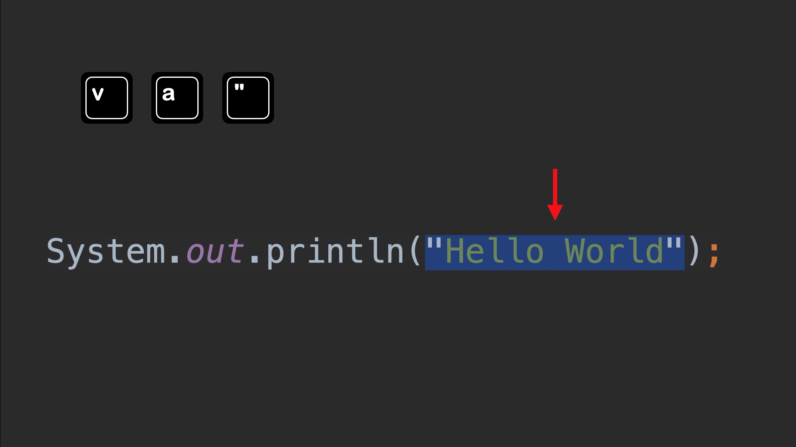
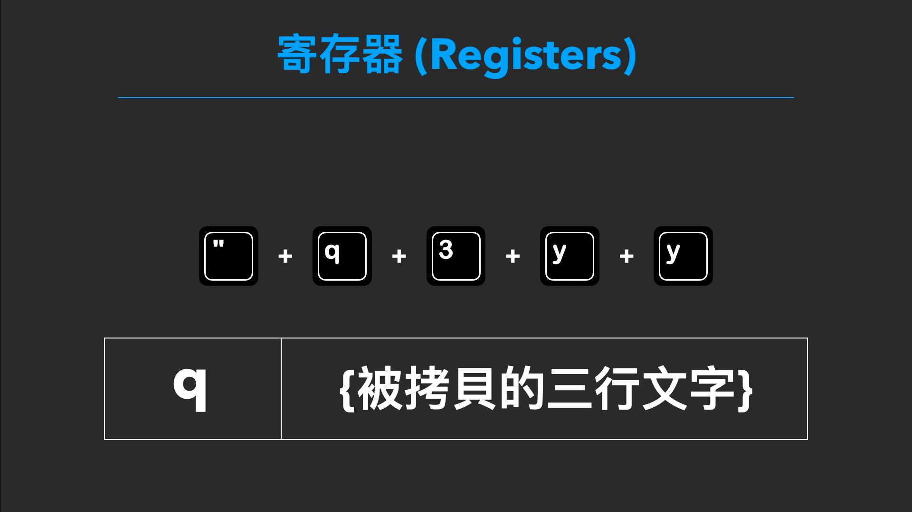
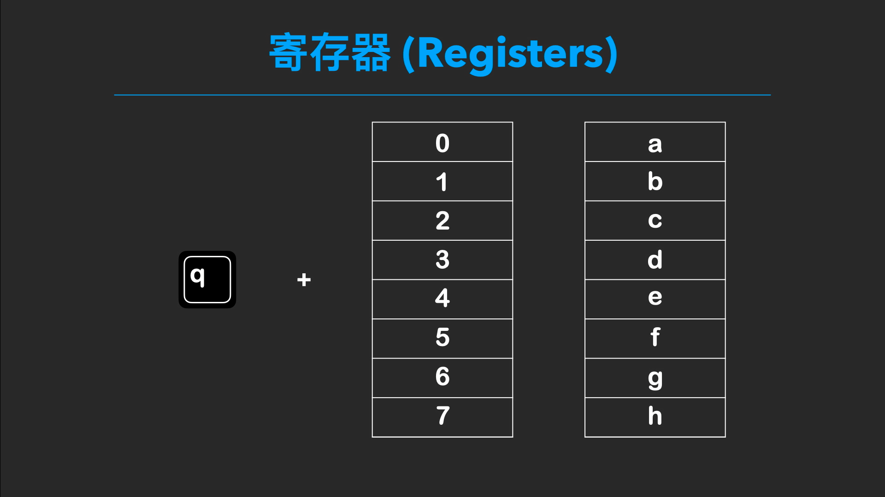

Vim 編輯器 入門指南 (下) 
======
`用程式來寫程式`


[`Youtube: Vim 編輯器 入門指南 (下) : 用程式來寫程式 | 開發 x 編程 | 巨集 x 寄存器 x 命令行模式【Gamma Ray 軟體工作室】`](https://youtu.be/Yk4s-WLjxug)


目錄
------
+ 前言
+ 可視模式
+ 剪貼簿指令
+ 書籤指令
+ 巨集指令
+ 命令行模式
+ 終端機

<br>

前言
------
延續 Vim 編輯器 入門指南 (上) : <https://youtu.be/Yk4s-WLjxug>

**接著說明 Vim 編輯器 :**

+ 可視模式 (選取功能)
+ 剪貼簿指令
+ 書籤指令
+ 巨集指令
+ 命令行模式 

其中搭配「寄存器」一起使用的「巨集」功能，以及命令行模式的指令工具。


    可以讓程式來幫你寫程式，有效的提高開發效率。


<br>

可視模式
------
滑鼠，除了垂直移動、水平移動與定位編輯的功能以外，還有一個最常使用的功能是「文字的選取」。

按鍵 v 指令 左下方出現 VISUAL，代表的是「可視模式」或者「視覺模式」


在這個模式中，方向鍵上下左右，可以擴大選擇的範圍

<br>

### 可以搭配使用，先前光標水平與垂直移動的方法
+ vw : 向後選取一個單字
+ vt" : 向後選取到 引號的前一格位置

不過這種方式，對於 :

    光標的初始位置有精準的要求

**日常開發中 使用上不是那麼的方便。**

<br>

### vi / va 指令
這種情況可以使用

**「 viw 」指令**

+ v 是 選擇模式
+ i 是 inner 內部
+ w 是 word 單詞

三者構成的意思 :

    就是選取一個單詞，不管光標是在單詞的哪一個位置。


**「 vaw 」指令**

+ v 是 選擇模式
+ a 是 「 a 」 一個
+ w 是 word 單詞

三者構成的意思 :

	也是選取一個單詞，不管的光標的位置，
	只不過這個指令，會再多選取包含空格的部分。

以 vaw 的指令來看，適用的場景並不是很多，但可以將 va 與 vi 當成一組獨立的指令。

**文字被符號包覆**


`小括號 () 中括號 [] 大括號 {} 單引號 ' 雙引號 "`

### vi)  -> 選取括號內的文字


### va" -> 選取包含引號的文字


**「 i 與 a 指令」之前，加上數字** 

    「 v2i) 」 -> 選擇第二層的小括號範圍

**「 vit / vat 」指令**
`t 代表的是 tag`

網頁 html 文件中的 xml 標籤格式:

    「 vit 」-> 兩個標籤中的文字
    「 vat 」-> 包含標籤的整個元素

<br>

### 選擇模式「三種狀態」

**小寫 v 指令** 

    選取以字元為單位

**大寫 V 指令**

以行為單位，左下方出現的是 VISUAL LINE


選取方式，僅可以使用垂直的移動指令。

例如:

    「 V3j 」-> 向下選擇 3 行 
    「 ggVG」-> 全部選取

<br>

**control + v 指令**

    垂直的方向進行選取

個人是認為這個指令使用起來並不是那麼的直覺，如果是在 IDE 中，我通常會用 IDE 的游標擴展功能。

<br>

例如 : 

IntelliJ 的 opt 兩次 + 方向會較為直覺並且容易使用


+ [`Youtube: IntelliJ IDEA 入門指南:Java 開發者的神兵利器 | 開發 x 編程 | 天下武功 唯快不破【Gamma Ray 軟體工作室】`](https://youtu.be/FkL17L_gokc)

<br>

剪貼簿指令
------
選取文字後，常見的編輯指令

+ 「 c 指令 」 取代
+ 「 d 指令 」 刪除
+ 「 y 指令 」 拷貝
+ 「 p 指令 」 覆蓋

其中的「 d y p 」剪貼簿指令，普通模式延伸 : 
+ 「 dd 指令 」-> 可以刪除單行文字
+ 「 yy 指令 」-> 可以拷貝單行文字
+ 「 小寫 p 與 大寫 P 指令 」-> 在不同的位置貼上

### 搭配光標的移動指令組合使用
+ 「 de 指令 」 -> 刪除一個單字
+ 「 y$ 指令 」 -> 拷貝到結尾的文字
+ 「 yt" 指令 」 -> 拷貝到引號前一格的字元

<br>

### 寄存器
`registers`

**使用的方法:**

	剪貼指令前方再加上「引號」與 「任一 a 到 z 的小寫字母」或者 「數字 0 ~ 9」


例如 :

    "q3yy -> 將拷貝的 3 行文字內容，保存到 q 的寄存器位置




**取用寄存器方法**

	"qp -> 貼上 剛才拷貝的 3 行文字


**大寫的英文代號**

	"Qyy -> 追加寄存器代號 q 的內容
	"qp -> 貼上的除了原始的三行文字還多了剛才拷貝的文字


<br>

書籤指令
------
`就像閱讀書籍的書籤一樣，可以先在特定的位置做上標記後，使用指令快速到達定位`


這個功能必須搭配，方才說到的寄存器一起使用:

    「 m 指令 」代表的是 mark，然後在加上任一 「 a 到 z 的小寫字母 」或者「 數字 0 ~ 9 」


例如 :

    「 mq 指令 」 -> 當前的光標位置，紀錄在 q 的寄存器中


移動到其他的位置，想要快速地跳回剛才的地方

    「 `q 指令 」-> 跳回剛才的位置 (間格號「 ` 」 : 鍵盤左上，Esc 下方)

<br>

### 跨檔案標記
小寫字母的標記僅限於該檔案，如果要跨檔案的標記定位，則可以使用「大寫的字母」

例如 :

    「 mQ 指令 」-> 當前的文檔的光標位置，紀錄在 Q 的寄存器中

切換到其他的檔案時 :

    「 `Q 指令 」-> 跨檔案的移動到剛才的位置

<br>

### 回到上一個位置
如果移動後發現位置不對，想要回到剛才的編輯位置

    「 `` 指令 」-> 剛才的位置與跳轉的位置進行快速切換

<br>

### 個人習慣

    「 `T 指令 」-> 定位在代辦清單，列表中的當天日期 (T - todo,list)
    「 `N 指令 」-> 定位在最近作業的文件中 ( N - recent)

<br>

**鍵盤上總共有 26 個字母加上 10 個數字**


日常開發，數量絕對夠用

	編排一下就會獲得在專案文件中瞬間移動的能力!


<br>

巨集指令
------
`錄製編輯指令，批次執行的編輯動作`

    「 q 指令 」後方加上「任一 a 到 z 的小寫字母」或者「數字 0 ~ 9」




例如 「 qq 指令 」，下方出現「 recording @q 」代表開始紀錄指令的執行動作 


**在錄製時，開頭與結尾的位置是特別需要注意 :**

    開頭「 數字 0 指令 」 -> 移動到最前，預先做一個位置校正的動作。
    結尾「 0j 指令 」 -> 移動到下一行的開頭，為了下一個指令的執行。（執行巨集時才能指定執行的次數)

**完成指令的輸入以後，再使用一次 「 q 指令 」 結束巨集的錄製。**

<br>

### 執行寄存器內的巨集

    「 @q 指令 」 -> 可以執行一次
    「 @@ 指令 」 -> 重複上一次的巨集動作

<br>

### 追加指令錄製
使用按鍵 q 指令 加上大寫 Q 就可以補上方才缺少的指令

	「 qQ 指令 」 -> 追加代號 q 的巨集指令


	如果錄製時忘記加上逗號或者忘記換行，此時就不用重新錄製一遍。


	


<br>

命令行模式
------
`補充 5 個 常用的指令`


### 01. 文字的替代功能

**將當前行中第一個舊的文字取代成新的文字**

    :s/{舊的文字}/{新的文字}

+ s 代表 substitute

**將取代文字的動作，作用於整行文字**

    :s/{舊的文字}/{新的文字}/g

+ g 代表當前一整行的範圍

**將取代文字的動作作，用於整份文件**

    :%s/{舊的文字}/{新的文字}/g

+ % 表示當前的檔案 

**搭配 大寫 V 行的選取模式**

	選取後 輸入冒號 (:)，下方出現這組符號 「 :'<,'> 」輸入相同的指令 「 : s/oldText/newText/g 」

**替換的文字就只會作用在選取的範圍上**

<br>

### 02. 提取文件內容的功能

    :r {檔案路徑} 

<br>

例如 : 

同目錄的 Parameter.txt 文件

    「 :r Parameter.txt 」-> 不需要切換文本編輯器，就可以繼續編輯。

<br>

**Vim - Live Template**

搭配上一個「 文字替代指令 」(:s) ，就可以當成是 vim 編輯器的 Live Template

預先寫好許多常用的模板 :
+ r 指令 導入
+ s 指令 取代

<br>

### 03. 複製指定行數

兩種情況: 

    「 :{行數}t. 」 -> 複製單行的情況
    「 :{起始行數},{結束行數}t. 」複製多行的情況

<br>

例如 :

    「 :6t. 」 -> 複製第 6 行的文字內容
    「 :6,8t. 」 -> 複製從第 6 到第 8 行的文字內容

使用這個指令

    可以讓拷貝的動作更加精準，而且也不用光標來回移動，減少多餘且繁瑣的作業。

<br>

### 04. 移動指定行數
相似於第三個，指令格式完全相同，「 t 指令 」換成「 m 指令 」

	「 :6m. 」 -> 移動第 6 行的文字內容
	「 :6,8t. 」 -> 移動從第 6 到第 8 行的文字內容

<br>

### 05. 查找檔案開啟
`搜尋當前目錄底下的檔案`

    :find {檔案名稱}

指令直接執行無法使用 : 

    因為搜索的路徑並沒有向下定位

<br>

**路徑指令**

	「 :set path 」指令 -> 預設的路徑 「 path=.,/usr/include,, 」

重新設定這個指令，在原始的路徑後方加上 「 ** 」

	「 :set path=.,/usr/include,,** 」

再使用 find 指令，就可以找到子資料夾的文件。

<br>

**配置檔案**

set path 指令，在退出 vim 編輯器後會被重置，
想要這個指令持續的生效，可以在 「 `~/.vimrc`」 的文件中加入。

    set path=.,/usr/include,,**

如果不想要修改配置檔，折衷方案 :

	:find **/{檔案名稱}
	:e **/{檔案名稱} 

也可以發揮相同效果。


<br>

終端機
------
從上集的簡單的文本編寫開始，一直到方才說明的命令行模式，應該已經知道 Vim 編輯器的威力。

不過在日常開發時，我通常還是 以 IDE 加上 Vim 的插件，作為主要的開發環境。


 
    
    因為 IDE 提供的文件導航、自動補全與環境配置，對於開發者來說仍是不可或缺的工具。

但若環境許可，初期要熟悉 Vim 的指令與功能，建議還是可以先使用終端機來學習。

<br>

### 三個原因
1. 終端機上的 Vim 功能肯定是最齊全
2. 可以克服對終端機黑底白字的恐懼
	+ 現在的 IDE 通常都可以在編輯器中開啟終端機
	+ 不會使用這個工具的話，也等於放棄很多電腦可以幫你迅速做到的事情
3. 終端機的指令其實超好用
	+ Vim 編輯器可以透過命令行模式加上驚嘆號 (`:!`)
	+ 調用外部 Python 函式，進行 JSON 文字的格式化排版
	+ 為了更方便的使用，還可以在 vim 的配置檔中映設成內部指令

**調用 python 函式，進行 JSON 文字的格式化**

    %!python -m json.tool


**~/.vimrc 配置內部指令**

```
command! JSONFormat :execute '%!python -m json.tool'
\ | :execute '%!python -c "import re,sys;chr=__builtins__.__dict__.get(\"unichr\", chr);sys.stdout.write(re.sub(r\"\\\\u[0-9a-f]{4}\", lambda x: chr(int(\"0x\" + x.group(0)[2:], 16)).encode(\"utf-8\"), sys.stdin.read()))"'
\ | :set ft=javascript
\ | :1
```


<br>

**也就是說:**

    系統中所有的指令工具，都可以成為 vim 的擴充功能，更甚者還可以用熟悉的程式語言撰寫自己想要的功能腳本。


	這麼做的好處，就是可以比巨集功能，更像是用程式來寫程式的方法。
	而且如果能夠流暢地在終端機下作業，肯定是會更加理解程式語言背後運作的底層原理。

**以技術層面來看:**

    程式的功力，就會再更進一步的提升。


<br>

補充資料
------
### Markdown + Vim 絕搭
```
巨集 @x : 固定配置代辦清單的勾選
巨集 @z : 固定配置代辦清單的取消
(一不小心就會寫出很多 markdown 的筆記)
```

+ [`Youtube: [ Markdown 教學 ] Markdown 是什麼 ?｜ 如何用它來寫文件 ?  | 學習軟體工程師的數位筆記方案`](https://youtu.be/osPzqfqwmLA)

<br>

參考資料
------
### 官方教程 
+ 指令: vimtutor

### 維基百科
<https://zh.wikipedia.org/wiki/Vim>

### 簡明 Vim 文字編輯器操作入門教學
<https://blog.techbridge.cc/2020/04/06/how-to-use-vim-as-an-editor-tutorial/>

### 簡明VIM 練級攻略
<https://coolshell.cn/articles/5426.html>

### 書籍
+ Vim 實用技巧


