XCode 使用技巧
======
`官方工具 x 你所不知道的開發功能`

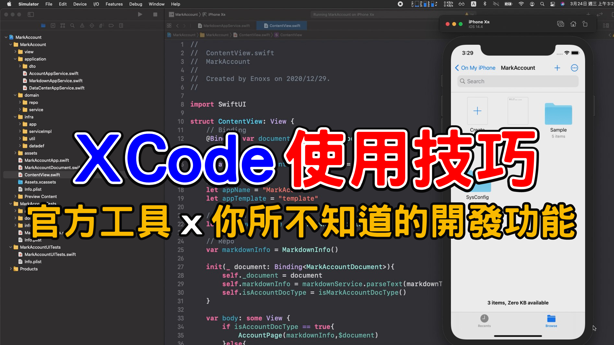

[`Youtube: XCode 使用技巧 : 官方工具 你所不知道的開發功能 | iOS x 開發 | XCode x Swift x SwiftUI【Gamma Ray 軟體工作室】`](https://youtu.be/um5OgZpGC-U)


目錄
------
+ 前言 : 何時才能愉快的寫 Code ?
+ 源起 XVim2 插件
+ 開發環境
+ 面板
+ 檔案導航
+ 分頁與視窗
+ 代碼導航
+ 編輯
+ 執行與除錯
+ 自定義
+ 結尾 : 時間與耐心

<br>

前言 : 何時才能愉快的寫 Code ?
------
學習 iOS 的開發有不少的門檻， 除了必須先有一台 Mac 電腦，還要熟悉 Swift 語法 與 iOS SDK。

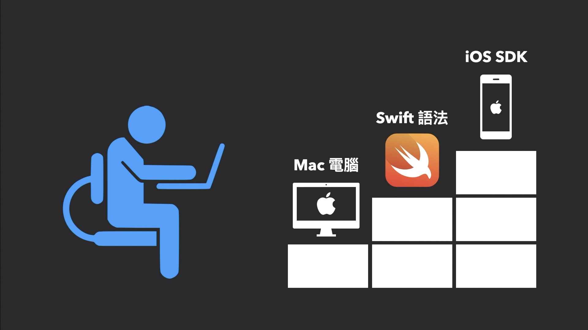

**好不容易入手了 Mac，第一個遇到的困難點，就是陌生的開發工具 XCode。**

<br>

```
還好 不像學習「程式語言」，需要許多的「時間」與「耐心」，開發工具的使用是可以速成的。
而且 XCode 除了免費之外，還是 Apple 官方的開發工具，本身也是個具有特色且功能強大的軟體 !

這次的教程直接看影片會比較快了解功能作用，
此篇文章除了必要的說明外，只會簡單列表影片中出現的快捷鍵，以供後續遺忘時可以快速回顧。
```


<br>

源起 XVim2 插件
------
這次的 XCode 開發指南，起源於我在 XCode 安裝 Vim 的插件 「 XVim2 」

### XVim2
<https://github.com/XVimProject/XVim2>

安裝時，必要的「證書簽入」動作與 MacOS 最新版本的 Big Sur 安全機制衝突，**導致發生開發者帳號無法登入，也無法安裝到實體手機的狀況發生。**

### 安全機制衝突
<https://github.com/XVimProject/XVim2/issues/340>


不得已只能重新安裝，並且在不熟悉工具的情況下，進行開發。

<br>

### 替代方案
在尋找的過程中，我發現部分的 XCode 快捷鍵模式是屬於 **emacs** 類型

例如:
+ 方向鍵上下左右 是 control + P/N/B/F
+ 光標移動到行首是 control + A
+ 刪除字符到行尾是 control + K
+ **組合使用 control + AKK 就代表刪除單行文字**

```
最大限度熟悉 XCode 的功能與快捷鍵也成為選項之一。
```

<br>

### 指南內容
集合網路上搜集到的各種 **XCode 使用技巧**與對映我使用 **IntelliJ** 與 **Vim** 的經驗，**整理從面板、導航一直到執行、除錯與自定義快捷鍵的各項功能。**

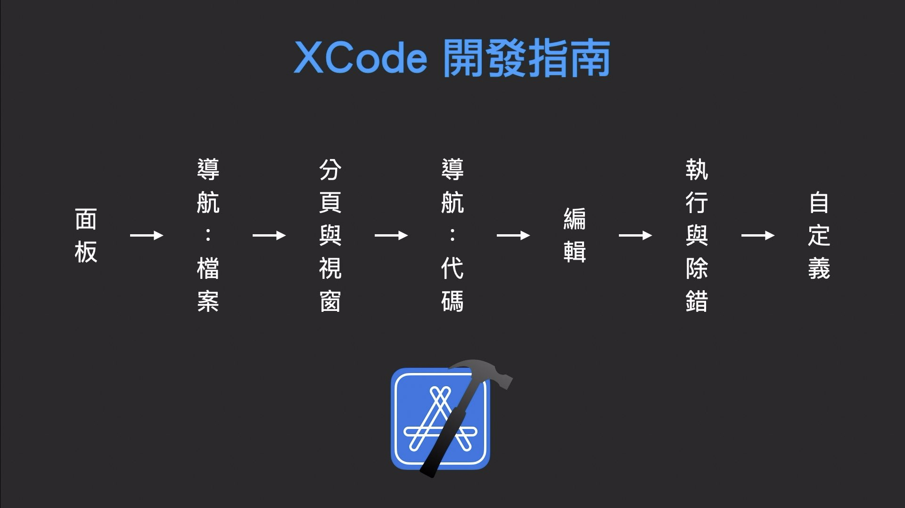

我認為熟悉這個工具的使用，對於開發者來說會是個合理且划算的投資

    (Apple 系列產品 : macOS、iOS、iPadOS、WatchOS、tvOS)


<br>

開發環境
------
### 作業系統
`macOS Big Sur 11.2 版本`

### 開發者工具
`XCode  12.4 版本`

### 近期開發的 Side Project
+ Swift 語法
+ SwiftUI 框架

```
所以只會針對這個語法與框架的專案，介紹相關的功能與快捷鍵操作，
如果沒有看到 Storyboard 的設計介面與 Object-C 語法的相關操作是正常的情況，這些部分這次就不會介紹。
```

<br>

面板
------
### 功能面板
+ cmd + 0 : 導航欄
+ cmd + opt + 0 : 檢視器
+ cmd + shift + y : 除錯區

### 功能面板 : 導航細節
+ cmd + 1 : Project
+ cmd + 2 : Source Control
+ cmd + 3 : Symbols
+ cmd + 4 : Find
+ cmd + 5 : Issues
+ cmd + 6 : Tests
+ cmd + 7 : Debug
+ cmd + 8 : Breakpoints
+ cmd + 9 : Report

### 功能面板 : 檢視器細節
+ cmd + opt + 1 : File
+ cmd + opt + 2 : History
+ cmd + opt + 3 : Quick Help
+ cmd + opt + 4 : Attributes

### 功能面板 : 控制區細節
+ cmd + shift + C : 控制臺
+ cmd + shift + Y : 除錯區

```
(除錯區右下方的兩個圖示按鈕，可以決定哪一項的功能完整顯示)
```

### SwiftUI 框架 : 預覽視窗
+ cmd + opt + enter : 畫布

### 編輯器 : 輔助視窗
+ cmd + enter : 只顯示編輯器

```
一次性的關閉當前所有的輔助功能
(右上角列表圖示，開啟的輔助功能都一併關閉)
```

<br>

檔案導航
------
+ cmd + shift + J : 在導航欄聚焦檔案
+ cmd + opt + J : 聚焦導航過濾器
+ cmd + shift + O : 快速開啟

補充 :
```
cmd + shift + J :
此快捷鍵要在有開啟檔案的情況下才能作用，
因為該功能其實是在導航列中聚焦當前檔案，如果面板中沒有檔案的話只能用 cmd + 1。
```

<br>

### 編輯區塊 :
編輯區塊的左上角，四個方格的圖示 : 

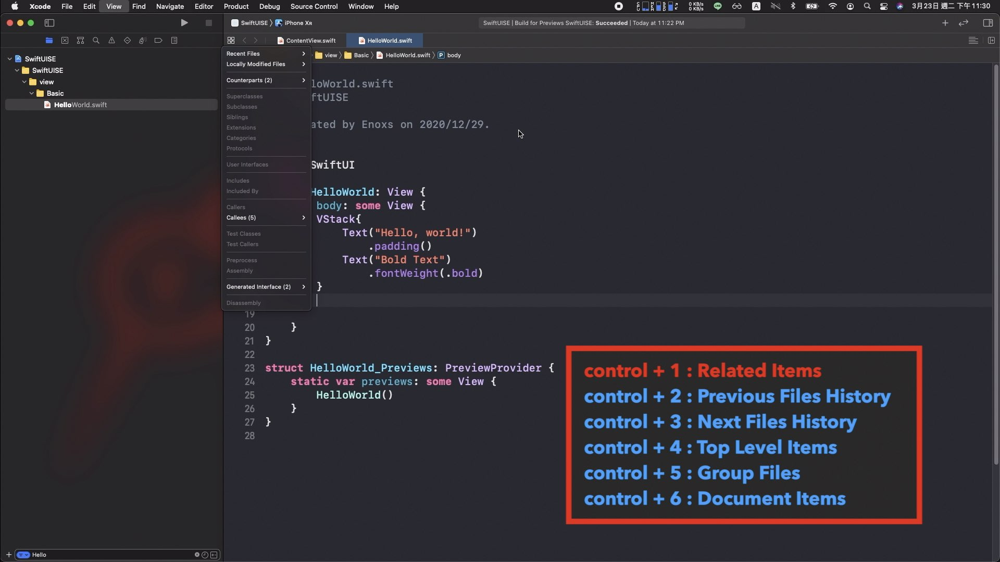

此部分的快捷鍵功能 : 
+ control + 1 : Related Items
+ control + 2 : Previous Files History `之前歷史`
+ control + 3 : Next Files History `之後歷史`
+ control + 4 : Top Level Items `頂層的目錄向下尋找`
+ control + 5 : Group Files `同層級目錄`
+ control + 6 : Document Items `函式結構`


<br>

分頁與視窗
------
`個人覺得是個非常具有特色的功能`

### 分頁
```
左側列表選擇檔案後，不像其他編輯器只是單純聚焦或者開啟分頁，而是會隨著選擇變換分頁中的內容，
要滑鼠點擊兩次才會加入到分頁上。

分頁的名稱上，有的文字是傾斜，有的文字是正常，傾斜文字就是會隨著選擇而變動的分頁。
```

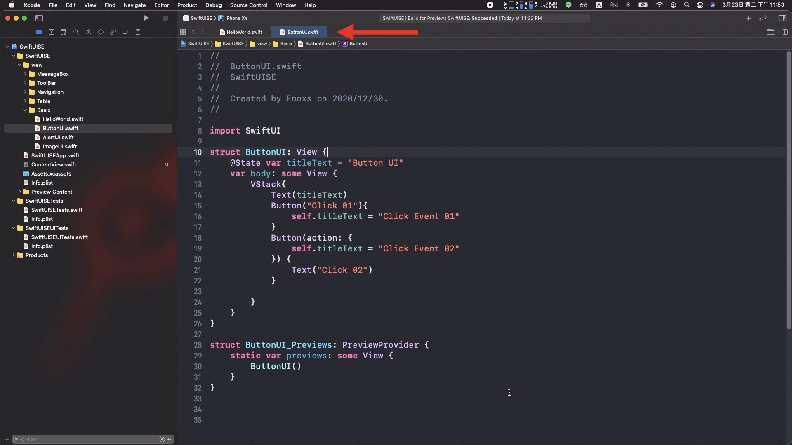

**可以理解為:**

這個是文檔的快速預覽功能，需要再多一個動作`(點擊兩下)`才會真正加入到分頁上。

+ cmd + shift + J : 跳到列表
+ cmd + opt + O : 開啟在分頁上

<br>

**分頁操作**

	• control + ` : 聚焦回編輯區塊
	• cmd + shift + [ : 分頁向左切換
	• cmd + shift + ] : 分頁向右切換
	• cmd + w : 關閉當前分頁
	• cmd + opt + w : 關閉其他分頁

	(關閉全部分頁 : cmd + shift + w 已經有其他功能使用，替代分案 : 組合使用 cmd + opt + w , cmd + w)

<br>

### 輔助編輯器
+ cmd + control + T : 開啟輔助編輯器

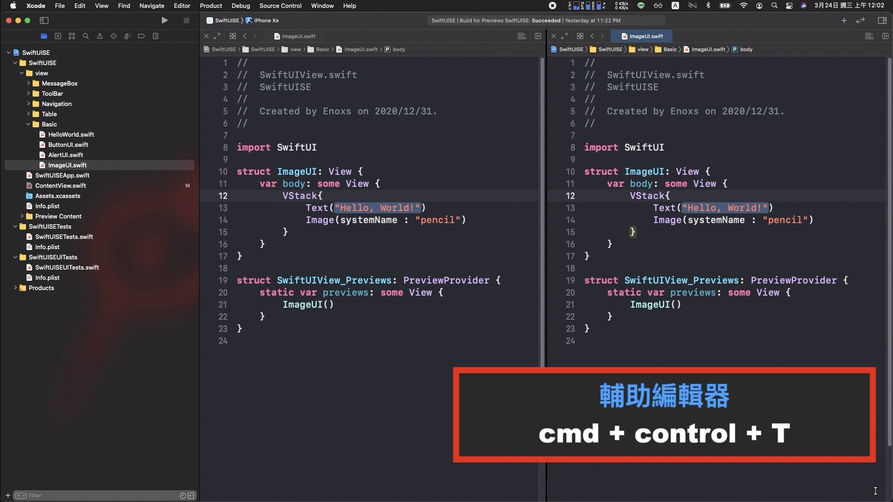

**開啟在輔助編輯器**

```
• 滑鼠操作 : opt + 點擊
• 鍵盤操作 : cmd + opt + ,
• cmd + opt + shift + , : 選擇位置開啟

按住 opt 後 Enter 開啟 : 
    - cmd + shift + O : Open Quickly
    - control + 1 : Related Items
	- control + 2 : Previous Files History
	- control + 3 : Next Files History
	- control + 4 : Top Level Items
	- control + 5 : Group Files
```

<br>

**輔助編輯器操作**		
	
	編輯區塊切換 : 
		- control + ` : 編輯視窗順序切換
		- cmd + opt + ` : 功能區塊順序切換
		- cmd + J : 選擇編輯區塊

	聚焦於當前編輯區塊 : 
		- cmd + control + shift + enter
		(暫時隱藏原先的視窗狀態並不會關閉，左上角的傾斜的雙箭頭圖示顯示狀態)

	關閉輔助編輯器 : 
		- cmd + control + shift + W

<br>

### 視窗分頁

**cmd + T : 開啟視窗分頁**

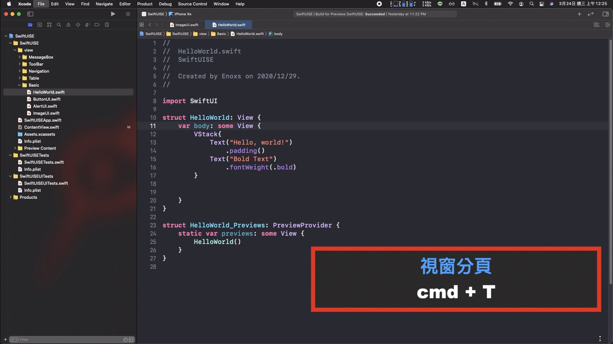

這個分頁拉出來也是一個獨立的編輯器，可以這樣理解: 

    這個分頁就是另外一個獨立的工作區，不會去共用側邊欄的導覽 或者 近期檔案的導航功能

<br>

**視窗分頁操作**

```
視窗分頁切換 :
	- control + tab : 順序切換
	- control + shift + tab : 反向切換

重新命名視窗分頁 : 
	- cmd + opt + shift + T
	(可以一次性的使用 3 ~ 5 個分頁搭配重新命名，可以更好的組織邏輯與思緒)

關閉視窗分頁 : 
	- cmd + shift + W
```

<br>

代碼導航
------
### 開頭時曾介紹過的 emacs 類型快捷鍵 : 
+ control + P : 向上
+ control + N : 向下
+ control + B : 向左
+ control + F : 向右
+ control + A : 到行首
+ control + E : 到行尾

###  Mac 電腦通用的光標移動功能 : 
+ cmd + ↑ : 頁面頂端
+ cmd + ↓ : 頁面底端
+ cmd + ← : 文字開頭
+ cmd + → : 文字結尾
+ opt + ← : 單字左側
+ opt + → : 單字右側
+ opt + ↑ : 上一段落 (不常用)
+ opt + ↓ : 下一段落 (不常用)

<br>

### 大範圍的移動
+ cmd + L : 行數跳轉
+ cmd + opt + L : 跳轉到光標處
+ cmd + control + J : 跳轉到定義處

**文件項目 : 過濾器**

+ control + 6 -> 輸入函式名稱

**關聯項目 : Callers & Callees**
+ Callers : 哪些類別與方法調用此類別
+ Callees : 哪些類別與方法被此類別調用

<br>

### 特殊情況

**特殊情況 01 : 版本控制的狀態**

點擊右上角的雙向箭頭圖示，會在當前畫面中呈現版本比對的訊息 :
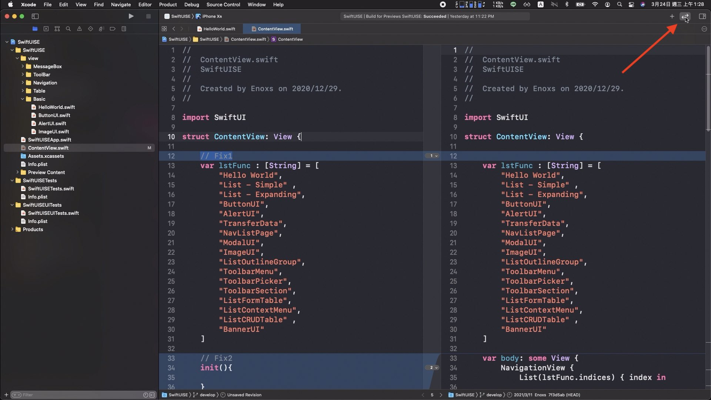

+ control + \ : 可以修改區塊進行快速跳轉

```
(版本比對要關閉，不然快捷鍵無法生效)
```
<br>

**特殊情況 02 : 編譯錯誤的狀態**
+ cmd + ' : 順序跳轉到下一個錯誤位置
+ cmd + shift + ' : 反向跳轉到上一個錯誤位置


<br>

### 查詢與替代功能
+ cmd + F : 開啟查詢面板
+ cmd + opt + F : 開啟替代面板
+ cmd + E : 填入搜尋框
+ cmd + shift + E : 填入替代框
+ cmd + G : 下一筆結果
+ cmd + shift + G : 上一筆結果 

**使用選取文字搜尋**

+ cmd + opt + E : 下一筆
+ cmd + opt + shift + E : 上一筆

**以專案為範圍**

+ cmd + shift + f : 搜尋
+ cmd + opt + shift + f : 替代

```
同樣可以使用填入文字的快捷鍵 :
	- cmd + E : 搜尋框
	- cmd + shift + E : 替代框
```

<br>

編輯
------
### 基礎編輯
+ control + i : 選取代碼排版
+ cmd + / : 光標代碼註解

**排版補充**
+ cmd + ] : 向右縮排
+ cmd + [ : 向左縮排
+ cmd + opt + ] : 向上移動文字
+ cmd + opt + [ : 向下移動文字

**註解補充**
+ cmd + opt + / : 添加文檔註解

<br>

### 代碼編輯 emacs 類型
+ control + D : 反向刪除字元
+ control + K : 刪除到結尾文字
+ control + T : 交換光標兩側文字

```
目前查到 XCode 中，已知的 emacs 類型 :

• control + P : 向上
• control + N : 向下
• control + B : 向左
• control + F : 向右
• control + A : 到行首
• control + E : 到行尾
• control + L : 跳轉到光標處
• control + D : 反向刪除字元
• control + K : 刪除到結尾文字
• control + T : 交換光標兩側文字

(之後若有發現更多的功能，會在此部分補充)
```

<br>

### 批量修改變數名稱
`三種操作`

**01. 滑鼠操作** 
+ 右鍵 > refactor > rename

**02. 鍵盤操作**
+ cmd + shift + A > rename

**03. 在範圍中編輯全部**
+ cmd + control + E

```
該功能僅適用於單一檔案快速修改，若已經被外部參照，要使用 rename 才會連動修改
```

<br>

### XCode 智能補全

**初始化方法補全**
+ 選單 : Editor > Refactor > Generate Memberwise Initializer

```
(光標要定位於類別名稱)
```

**方法補全**
+ ESC : 手動顯示提示選單
+ control + . : 順序切換
+ control + shift + . : 反向切換
+ control + / : 選擇確認

**修正連續技**

+ cmd + ' : 跳轉到錯誤位置
+ cmd + opt + control + F : 編輯器補全修正

<br>

### 多行編輯功能
`三種操作`

1. opt 按住 + 滑鼠拖移
2. control + shift + ↑ / ↓
3. control + shift + 滑鼠點擊

<br>

執行與除錯
------
### 執行
+ cmd + R : 執行程式
+ cmd + B : 編譯程式
+ cmd + . : 停止程式
+ cmd + shift + K : 清除系統資源

### 除錯
+ cmd + \ : 設置中斷點
+ cmd + Y : 開關除錯模式

<br>

```
Debug 模式的部份，我使用的機率沒有很高，那為什麼要說明這兩項功能 ?

因為我查到的資料中有些開發者，由於 XCode 沒有書籤功能，所以會使用這個中斷點來替代使用
我個人是覺得如果能夠熟練的使用「分頁與視窗」功能，使用中斷點來替代，看起來就沒有那麼的必要。
```
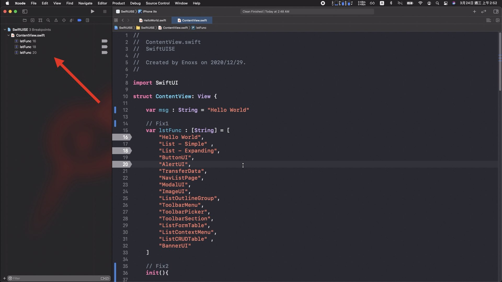

<br>

自定義
------
`按鍵「 cmd + , 」打開設置後 「 Key bindings 」`

個人配置了**6 + 1** 的快捷鍵，來輔助開發。

<br>

### 「六項」已經有的功能，沒有預設成快捷鍵 `6`

**頁面上下移動**

+ control + U : 頁面向上
+ control + J : 頁面向下


**區塊選取文字**

+ 選取單字 : control + C
+ 選取單行 : cmd + shift + 

**重新命名**
+ cmd + opt + 6

**刪除單行**
+ control + S 

<br>

### 「一項」沒有的功能，修改配置擴增快捷鍵 `+1`

**XCode 配置檔路徑**

```
/Applications/Xcode.app/Contents/Frameworks/IDEKit.framework/Resources/IDETextKeyBindingSet.plist
```

**權限調整指令**

```
sudo chmod 666 /Applications/Xcode.app/Contents/Frameworks/IDEKit.framework/Resources/IDETextKeyBindingSet.plist
sudo chmod 777 /Applications/Xcode.app/Contents/Frameworks/IDEKit.framework/Resources/
```

**編輯配置檔**
```
vim /Applications/Xcode.app/Contents/Frameworks/IDEKit.framework/Resources/IDETextKeyBindingSet.plist

(也可以使用 open 指令，用 XCode 介面編輯，或者直接進入到檔案目錄用其他編輯器修改)
```

**複製指令**
```
selectLine:, copy:, moveToEndOfLine:, insertNewline:, paste:, deleteBackward: 
```

**修改後的配置內容**
```xml
<key>EnoxsIDE</key>
<dict>
    <key>Duplicate Line</key>
	<string>selectLine:, copy:, moveToEndOfLine:, insertNewline:, paste:, deleteBackward:</string>
</dict>
```

**重啟後，設置**
+ cmd + D : 複製單行

```
原本的預設中也有一個 Duplicate 的功能「cmd + D」
只是在編輯器中試不出來，所以只好把這個快捷鍵，移到新配置的 Duplicate Line
```

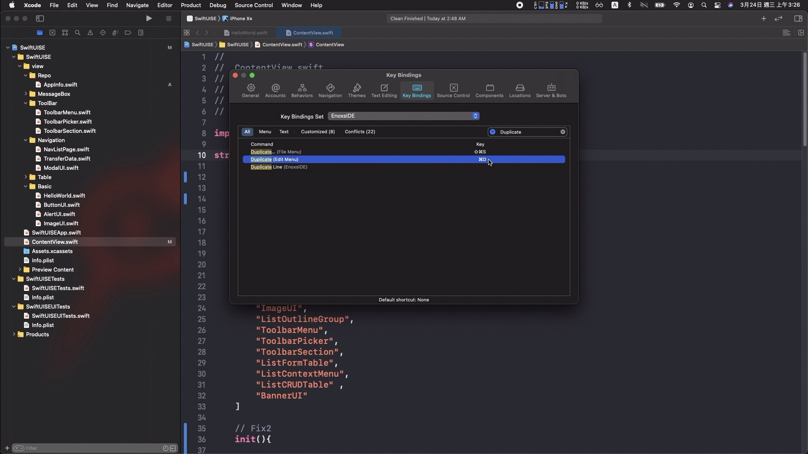

<br>

結尾 : 時間與耐心
------
上述從基礎面板、檔案導航、分頁視窗、代碼導航、代碼編輯、執行除錯以及最後的自定義功能。

你應該已經知道 XCode 可以做的事情 遠比想像中的多更多。

不過熟悉開發工具的使用是開發中**「可選」的條件，卻並不是「必要」的條件**。

<br>

### 例如 : 我最近正在開發的 iOS App `Side Project`

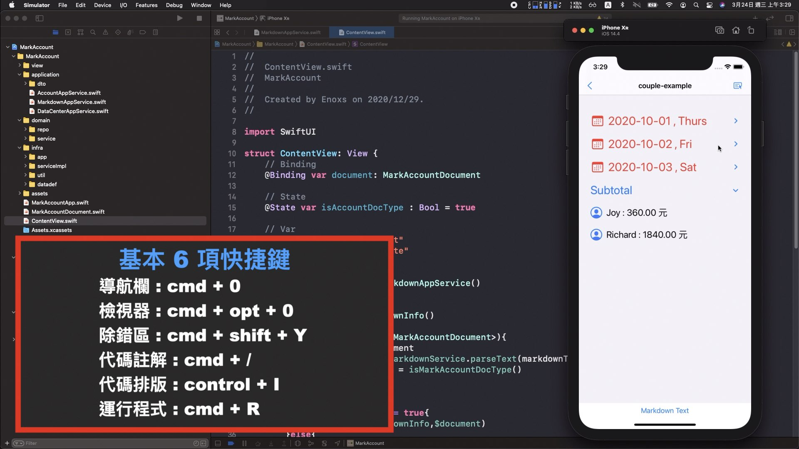

在 XVim2 的插件發生問題以後，只知曉左右側與下方面板開關以及註解、排版、執行，

這六個快捷鍵的情況下，就已經陸續的完成將近七至八成的內容。


要完整的開發一個 iOS App 熟悉工具的使用只能錦上添花，但並不能完全替代所有必備的知識。


**這些就只能透過足夠多的「時間」與「耐心」以及「正確的方法」(Gamma Ray 軟體工作室) 逐步累積知識。**

**我相信，最終肯定可以到達 愉快寫 Code 的程度 !**


<br>


參考資料
------
### 像使用Vim 一樣使用Xcode 
<https://juejin.cn/post/6844903565614383118>

### Xcode常用快捷键小结
<https://www.jianshu.com/p/3d7cc7eaeb1e>

### Xcode 快捷鍵整理
<https://medium.com/@stephyang/xcode-%E5%BF%AB%E6%8D%B7%E9%8D%B5%E6%95%B4%E7%90%86-ba653d0eff7e>

### iOS 開發者 13 倍速技巧 
<https://www.notion.so/iOS-13-af1abc1bd9b440f5a67fdc1c70d529ab>

### 13 種實用 Xcode Shortcuts （快捷鍵）
<https://www.appcoda.com.tw/xcode-shortcuts/>


