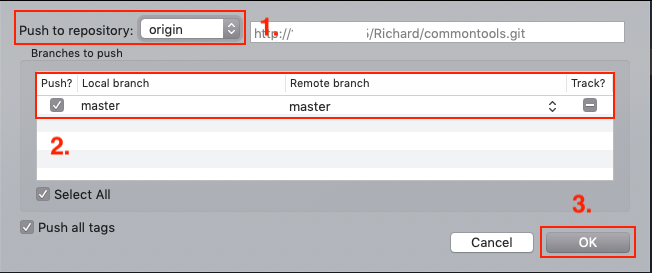

Git Basic Operation , Part I
======
`Git 基礎操作`

Contents
------
+ 初始化
  + 準備軟體
  + 創建專案
+ 基礎介紹
  + Clone 操作
  + Sourcetree 介面
  + Commit 操作
  + Push 操作
  + Pull 操作

初始化
======
`前期作業`

1.準備軟體
------
### 下載與安裝
+ Git : <https://git-scm.com/downloads>
+ Sourcetree : <https://www.sourcetreeapp.com/>

2.創建專案
------
### 方法一：GitLab 網站
`註冊登入後，創建新專案`

+ <https://gitlab.com/>

### 方法二：本地端數據庫
`安裝完 git 後，執行下方指令，創建本地端數據庫`

```
git init --bare git-local-repo.git 
mkdir MyProjSE 
cd MyProjSE 
echo "# MyProjSE" >> README.md 
git init 
git add .  
git commit -m "initial commit" 
git remote add local ../git-local-repo.git
git push local master
```

+ `git init --bare git-local-repo.git ` :  初始化本地端數據庫
+ `mkdir MyProjSE ` : 創建資料夾
+ `cd MyProjSE ` : 進入資料夾
+ `echo "# MyProjSE" >> README.md ` : 建立檔案
+ `git init ` : 初始化為 git 專案
+ `git add . ` : 將所有差異檔案加入暫存區
+ `git commit -m "initial commit" ` : 提交差異檔案，版控紀錄
+ `git remote add local ../git-local-repo.git` : 新增遠端數據庫名稱與路徑
+ `git push local master` : 推送版本控制紀錄


基礎介紹
======
`版本控制控操作`

1.Clone 操作
------
`將遠端數據庫的專案克隆下來`

### 複製專案路徑

**Gitlab**


**Local**

```
cd git-local-repo.git
pwd | pbcopy
```

+ pwd : 顯示當前目錄絕對路徑
+ pbcopy : 將印出來的文字複製到剪貼簿中

### 從路徑克隆專案

**Sourcetree**

`New -> Clone From URL`


**Command Line**

```
git clone /Users/DevAuth/WorkSpace/git-local-repo.git
```

2.Sourcetree 介面
------
`介面功能`


### 區塊 A
+ Commit : 提交程式碼
+ Pull : 拉取程式碼
+ Push : 推送提交

### 區塊 B
+ View Remote : 訪問遠端的網頁 `GitHub / GitLab`
+ Show in Finder : 使用檔案瀏覽器開啟
+ Terminal : 使用命令提示字元開啟

### 區塊 C
+ WORKSPACE : 版本控制工作區
  + File Statue : 本地端未提交到版控的檔案狀態
  + History : 已提交與推送的版控歷史紀錄
  + Search : 搜尋介面
+ BRANCHES : 本地端分支
  + master : 主分支，專案創建時預設
+ TAGS : 標籤，相依於提交(Commit)紀錄上
+ REMOTES : 遠端分支
+ STASHES : 緩存檔案
+ SUBMODULESA : `進階，暫不說明`
+ SUBTREES : `進階，暫不說明`

### 區塊 D
`已進行版控的紀錄，以每次提交為一單位，分支(branch)與標籤(tag)相依於提交(commit)之上`

### 區塊 E
`提交紀錄，上半部為提交檔案，下半部為提交檔案訊息`

### 區塊 F
`提交檔案，差異部分。只顯示與之前版本不同之處，綠色框為新增內容，紅色框為刪除內容`

3.Commit 操作
------
`提交檔案，加入版控`

Git 為分散式的版本控制系統，
代表除了遠端的數據庫外，每一個專案成員的電腦中都有一份本地端的數據庫。

這裡提交 (commit) 的動作，就是將要版本控制的檔案，紀錄在本地端的數據庫中。

### 工作目錄區
`新增或編輯過的檔案，自動顯示於此區域`


**顏色區塊與按鈕功能**


+ 紅色區塊：本次修改後被刪除的
+ 綠色區塊：本次修改後被新增的
+ Stage hunk : 將這隻改動過的程式碼放入到「暫存區域」
+ Discard hunk : 取消這次改動，還原到上次提交的狀態

**選取區塊，單行調整**


+ 反灰區塊：選取調整範圍
+ Stage lines : 將這隻改動過的「單行」程式碼放入到「暫存區」
+ Discard lines : 取消「單行」改動，還原到上次提交的狀態

### 提交流程
`git add -> git commit`

1. 將工作目錄區選中的檔案放置到暫存區域，代表為要提交的檔案 `git add`
2. 暫存區域的檔案在提交前，慣例會撰寫本次提交訊息。 `git commit -m`


+ -m : 提交訊息 `${commit message}`

### 完成提交
`確認提交的檔案與提交的訊息都編輯完畢後，點擊下方的 commit 就會提交訊息到本地端數據庫中`


### Command Line
```
git add . 
git commit -m "initial commit"
```

+ git add `.` : 代表將所有差異檔案放入暫存區域
+ git commit -m "initial commit" : 提交版控並且提交訊息為「initial commit」

4.Push 操作
------
`推送版本控制資訊給遠端數據庫`

上一步驟中的提交(commit)，僅僅只是將版本控制的資訊紀錄於本機端數據庫，

此步驟的推送，則是將本地端版控的資訊，更新於遠端數據庫。

    這也是分散式版本控制系統與其他系統的差異之處，必須兩步驟操作，
    看似繁瑣，但在實際的開發情況下，反而能提供更多的彈性與細節操作，
    提交時，左下方的 push changes immediately 勾取，可合併為一個動作完成。


### 遠端數據庫對話視窗
`點擊推送(Push)時，會顯示推送視窗，若不同的遠端數據庫，可以在此控制`




1. 遠端數據庫
2. 分支選擇
3. 確認
    
### Git 推送成功後，GitLab 畫面顯示


### Command Line
```
git push local master
```

+ local : 遠端數據庫名稱
+ master : 分支名稱


5.Pull 操作
------
`拉取遠端數據庫版本控制資訊`

若專案為多人協作，他人推送的版本控制資訊，可使用拉取 (pull) ，
更新本地端數據庫與遠端數據庫進度合併。

拉取時，僅拉取前分支進度。


+ gitlab/master : 遠端的 master 分支
+ gitlab/develop : 遠端的 develop 分支
+ master : 本地端的 master 分支
+ develop : 本地端的 develop 分支

### Command Line
```
git pull local master
```

+ local : 遠端數據庫名稱
+ master : 分支名稱


