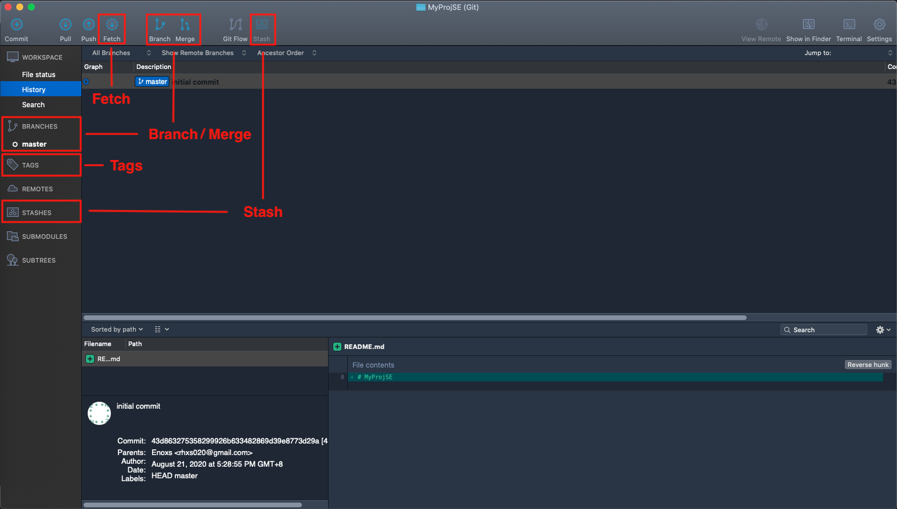

Git Basic Operation , Part II
======
`延續 Part I 部分，畫面上尚未提到的功能`

Contents
------
+ Operating
  + Fetch
  + Stash
  + Tags
  + Branch
  + Merge



1.Fetch
------
`取得遠端數據庫的歷史記錄`

Part I 中最後提到的拉取(pull) ，會自動將遠端數據庫的資料內容自動合併於本地端數據庫，

但在有些時候，僅想查看遠端數據的內容並不想合併，使用取得(Fetch)，取得遠端數據庫的歷史紀錄，

確認是否為需要的資料才決定是否拉取(pull)資料。

+ pull = fetch + merge

### Command Line
```
git fetch
```

2.Stash
------
`暫時儲存工作目錄區的差異檔案並回復成修改之前的狀態`

+ 狀況1：手中的工作做到一半，臨時要切換到別的任務
+ 狀況2：要打包版本，有正式機、測試機、還有本地端的開發環境


+ 將工作區的代碼更動先暫存起來

### Stash Button


### Stash Message


### Stash List


+ Apply Stash : 回復暫存
+ Delete Stash ： 刪除暫存

### Command Line
```
git stash save tmp
git stash list
git stash apply 0
git stash drop 0
git stash pop 0
git stash clear
```
+ `git stash save tmp` : 暫存檔案狀態，tmp 為描述訊息
+ `git stash list` : 顯示暫存清單
  + show => stash@{0}: On master: tmp
+ `git stash apply 0` : 恢復暫存，0 為清單中的 Stash ID
+ `git stash drop 0` : 刪除暫存，0 為清單中的 Stash ID
+ `git stash pop 0` : 恢復暫時時同時刪除項目，0 為清單中的 Stash ID
+ `git stash clear` : 刪除所有的暫存

3.Tags
------
`為提交的歷史紀錄上面增加標籤`

標籤依附於提交紀錄上，提供原本更多提交訊息無法提供的資訊，
標籤具有唯一值特性，一個專案中僅有一個不會重複。

用途廣泛，常見用法: 版本標示、功能說明、CI/CD 觸發事件，

### 添加標籤
`於歷史列表 -> 右鍵 -> Tag ...`


### 標籤名稱


### 標籤狀態


### Command Line
```
git tag init
git tag
git tag -d init
```
+ `git tag init` : 加上標籤，名稱為 `init` 
+ `git tag` : 查看標籤狀態
+ `git tag -d init` : 刪除名稱為 `init` 標籤

**標籤中包含註解**
```
git tag -a init
git tab -n
```

+ `git tag -a init` : 創建標籤時，添增註解說明 `vim 編輯`
+ `git tab -n` : 查看標前時，同時顯示註解

4.Branch
------
`建立不同目的版本控制分支`

分支(branch) 與標籤(tag) 相同，同樣依附於提交(commit)紀錄上，主要功能是依據任務的進程，
標註任務的最新進度。

每個初始化的 git 專案，都會有一個 master 為主要分支，依據任務需求會在切分 develop 分支，
專為開發任務使用。

在開發中又可以細分 feature / release / hotfix 等任務類型，每個任務類型又可再細分任務項目。 `git flow`

**Git Flow**

`後續章節，詳細介紹`

+ master : 主分支
+ develop : 開發分支
+ feature : 新功能分支
+ release : 發佈分支
+ hofix : 熱修復分支

### 創建流程

1. 歷史紀錄 -> 選取提交(commit) -> 右鍵 -> branch
2. 上方的 Branch 按鈕。


### 分支名稱


### 創建結果
`像是在提交(commit) 貼了標籤一樣，標注這是不同任務的版控紀錄`


### Command Line
**顯示分支**
```
git branch
git branch -r
git branch -a
```
+ `git branch` : 顯示本地端分支清單
+ `git branch -r` : 顯示遠端分支清單
+ `git branch -a` : 顯示全部分支清單

**分支操作**
```
git branch feature
git branch -m feature release
git branch -d release
```
+ `git branch feature` : 創建 `feature` 分支
+ `git branch -m feature release` : 修改 `feature` 分支名稱為 `release`
+ `git branch -d release` : 刪除 `release` 分支

**切換分支**
```
git checkout master
git checkout -b hotfix
```
+ `git checkout master` : 切換 `master` 分支
+ `git checkout -b hotfix` : 創建 `hotfix` 分支，同時切換到新創建的 `hotfix` 分支


5.Merge
------
`完成各任務事件後，合併分支`

當分支代表的任務事件完成後，依據開發的流程合併分支，代表任務完成。

**開發流程**

`git flow 流程`

+ feature : develop -> feature -> develop
+ release : develop -> release -> develop & master
+ hotfix : master -> hotfix -> develop & master

### 原始分支
`develop 分支落後 master 分支一個提交`

+ 目前分支為 `develop`
+ 要將 `develop` 分支的進度與 `master` 同步


### 分支按鈕
1. Branch 按鈕
2. 在要合併的分支上 -> 右鍵 -> Merge


**1. Branch 按鈕**

`選擇要合併的分支 -> OK`


**2. 在要合併的分支上 -> 右鍵 -> Merge**

`勾選合併時同時提交(commit) -> OK`


### 合併結果
`master 與 develop 分支在相同的提交紀錄上`


### Command Line
```
git merge master
```

+ `git merge master` : 將當前的分支與 master 分支合併 。


