Git Basic Operation , Part III
======
`延續 Part II 部分，常用的一些細節操作`

Contents
------
+ Operating Detail
  + Checkout
  + Reset File
  + Reset Branch
  + Reset Commit
  + History Log

1.Checkout
------
`切換檔案到特定提交`

1. 歷史紀錄列表，點擊兩次左鍵
2. 右鍵 -> `Checkout...`

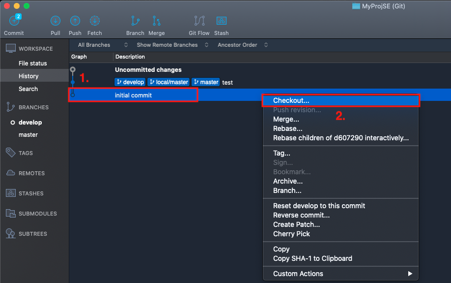

### 切換完成
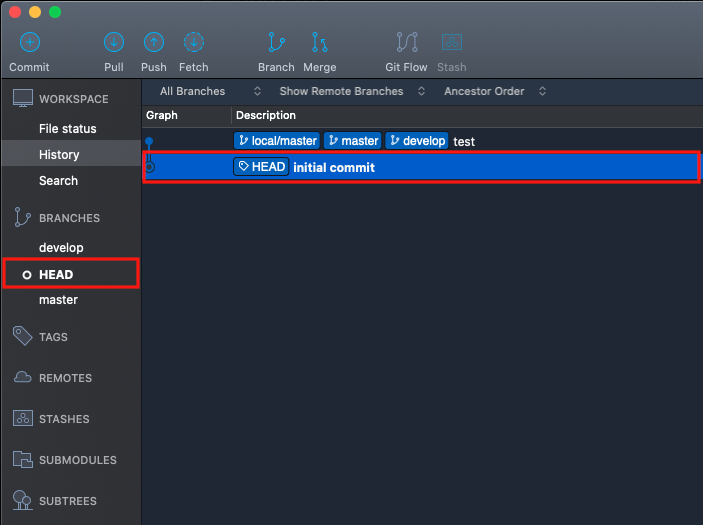

**切換後，若切換的提交(commit)上面沒有分支的話，會使用 `HEAD` 標示目前切換狀態**

### Command Line
```
git checkout develop
git checkout d60729
```

+ `git checkout develop` : 切換到 `develop` 分支
+ `git checkout d60729` : 切換到編碼為`d60729` 的提交(commit)

2.Reset File
-----
`重置檔案為之前的狀態`

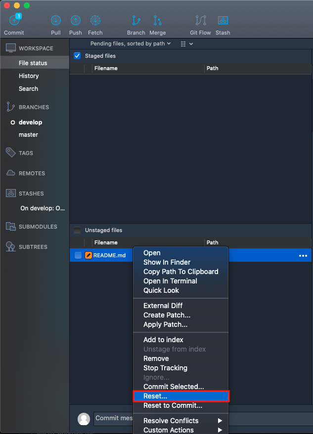

**工作目錄區 -> 檔案 -> 右鍵 -> `Reset...`**

### Command Line
```
git checkout -- README.md
```
+ `git checkout -- README.md` : 將單一檔案 `README.md` 還原成修改前的內容

3.Reset Branch
------
`重置選定的分支到特定狀態`

1. 當前分支為 `develop`
2. 跟 `master` 分支為相同紀錄狀態
3. 重置 `develop` 到下方的提交 (commit) 狀態

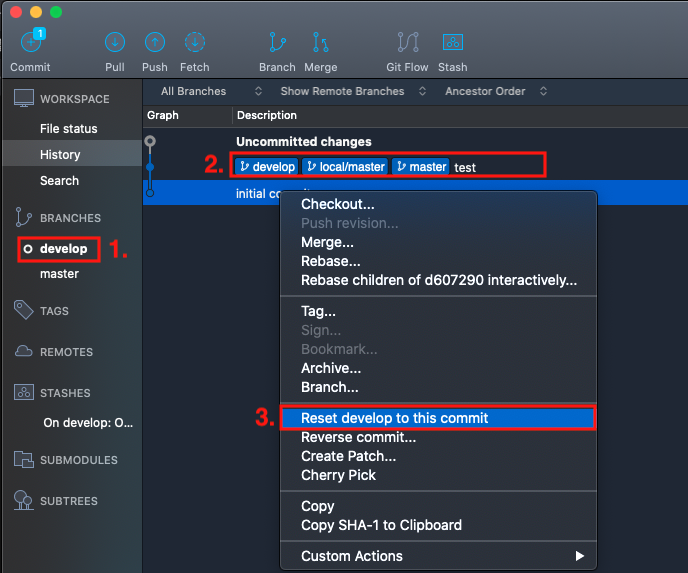

**選取重置的目標提交(commit) -> 右鍵 -> `Reset develop to this commit`**

### 重置模式選擇
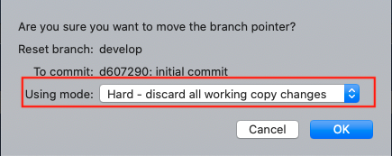

**重置模式**

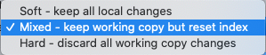

+ mixed : 重置時保留工作目錄檔案 `default`
+ soft : 重置時，保留所有檔案，工作目錄區與暫存區
+ hard : 重置時，不保留檔案，工作目錄與暫存區域的檔案皆會清空

### 重置完成

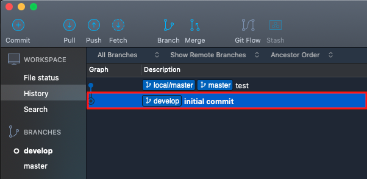

**`develop` 分支以切換到下方提交(commit)紀錄上**

### Command Line

```
git reset d60729 --mixed
git reset master --soft
git reset d69729 --hard
```

+ `git reset d60729 --mixed` : 使用 mixed 模式，重置當前分支到編碼`d60729` 的提交(commit)
+ `git reset master --soft` : 使用 soft 模式，重置當前分支到 master 分支狀態 的提交(commit)
+ `git reset d69729 --hard` : 使用 hard 模式，重置當前分支到編碼`d60729` 的提交(commit)

4.Replace Commit
------
`追加修改已經提交的歷史紀錄`

+ 狀況1：Commit 訊息覺得不夠完整，修改訊息
+ 狀況2：Commit 檔案發現有遺漏，追加檔案

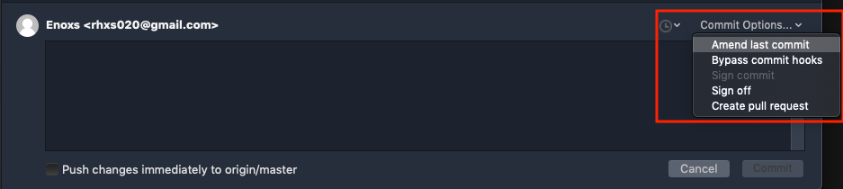

**Commit Options -> Amend last commit**


### Command Line
```
git commit --amend --no-edit
```
### Notice

追加已經修改的提交紀錄，適用情況為僅提交到本地端數據庫，尚未提交到遠端數據庫的情況。

雖然可以使用強制推送的方式來修改，但通常建議在推送一次重置過的檔案，使用新的檔案來覆蓋

5.History Log
------
`查看單一檔案的變動的歷史紀錄`

+ ~~狀況：抓戰犯，Bug 作者~~
+ 查看過去修改時做了什麼

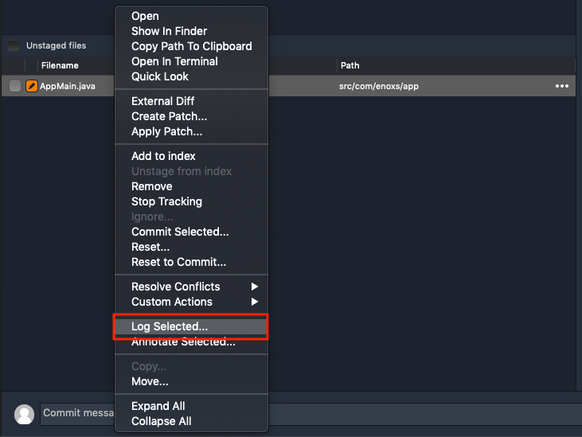

**檔案 > 右鍵 > Log Selected**

### 單一檔案的提交歷史紀錄

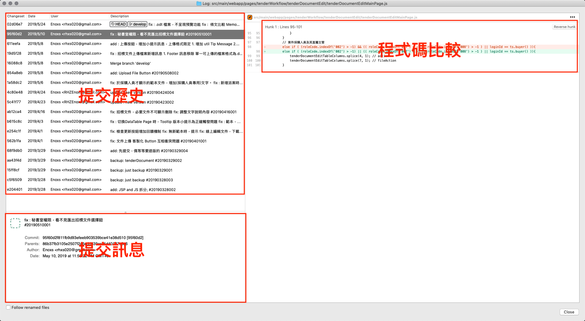

### 選擇檔案，可以單獨重置檔案到選擇的歷史提交

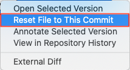

**檔案 -> 右鍵 -> Reset File to This Commit**


