Git Flow 
======
`git 版控流程`

Contents
------
+ Git Flow 分支介紹
+ 初始化 git flow 功能
+ 使用 git flow 分支

Git Flow 分支介紹
------
`五種分支: master 、develop 、feature、release、hotfix`

### 長期分支
+ master : 主分支
+ develop : 開發分支

### 任務分支
+ feature : 新功能分支
+ release : 發佈分支
+ hofix : 熱修復分支

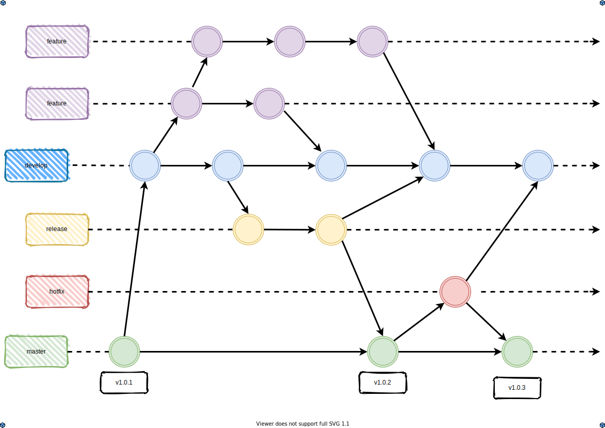

### master 分支
```
git 專案初始化時的預設分支，在 git flow 中被定義為穩定的線上版本，
主要的任務是紀錄與追蹤正式釋出的版本狀態，因此 tag 的版本號也會紀錄在此分支的 commit 上。
```

### develop 分支
```
來源從 master 的最初提交開始，在 git flow 中被定義為主要開發分支
該分支作為所有開發的基礎，由此擴增新功能，也由此進行新版本的發佈。
```

### feature 分支

+ develop -> feature -> develop

```
來源從 develop 分支開始，在 git flow 中被定義為新功能分支
該分支作為 develop 的子項任務分支，從 develop 開始，發展在 feature ，最終結束於 develop

feature 分支依據任務的不同，在同一時間可能會多組進行，而 feature 中的子項任務
同樣歸類於 feature 分支。
```


### release 分支

+ develop -> release -> master / develop

```
來源從 develop 分支開始，在 git flow 中被定義為發佈分支，
該分支作為上線前的測試分支，會在 release 分支上進行最終測試。

測試時，若發現有問題則在此分支上立即修復，
當驗證一切功能正常後，除了合併到 master 分支作為正式版本發佈外，
還會合併到 develop 分支，同步修正的程式。
```

### hotfix 分支

+ master -> hotfix -> master / develop

```
來源從 master 分支開始，在 git flow 中被定義為熱修復分支，
該分支作為線上產品發生問題時緊急修復的分支，會從紀錄正式版本的 master 分支切出，
待 hotfix 的修復任務完成後，除了合併回 master 分支，也會合併到 develop 分支，同步修正的程式。
```


**為什麼要合併回 develop 分支？**

同步修正的程式，避免線上版本與開發版本出現不同步的情況

**那為什麼不從 develop 分支切出來修？**

develop 屬於開發分支，當中可能包含許多已經開發尚未發佈或者正在開發尚未完成的功能，

專注於 master 上，可以避免問題發散，以及發佈時 develop 分支本身就存在的衍生問題。


初始化 git flow 功能
------
`Sourcetree 內建`

### 1.git flow 初始化
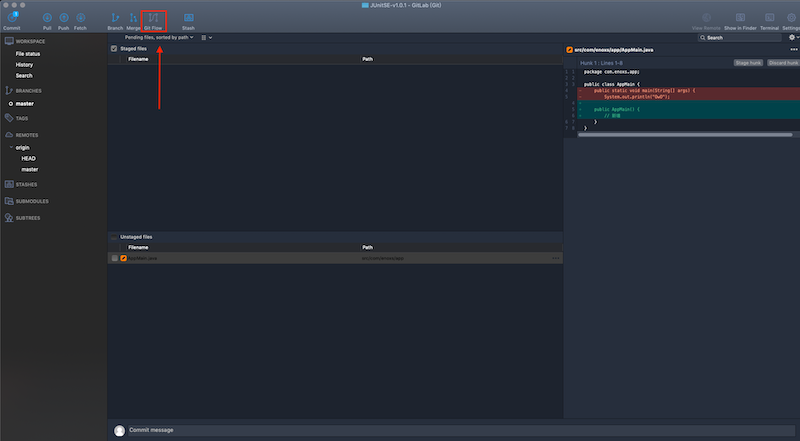

### 2.設定分支         
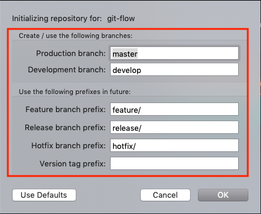

+ 無特別需求，使用預設值
        
### git flow 初始化成功後，會出現 develop 長期分支


#### git flow 初始化時，工作區必須清空，否則會出現下方錯誤

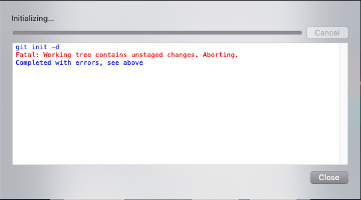

使用 git flow 分支
------
### 點擊「Git Flow」按鈕


### 選擇 git flow 動作

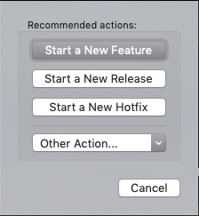

+ start a New Feature
+ start a New Release
+ start a New Hotfix

**範例：新增 MyBatisUtil 功能**

`這邊使用 Feature 來示範，另外兩個分支的操作基本一樣`

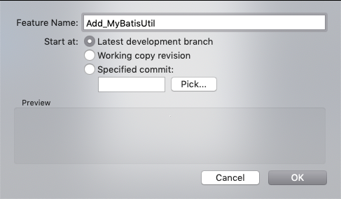

### Feature 分支

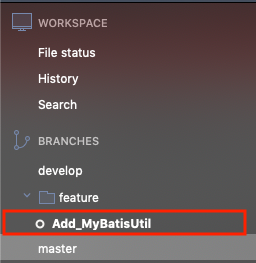

### 程式開發


### 完成
**再次點擊「Git Flow」**


**確認分支完成視窗**

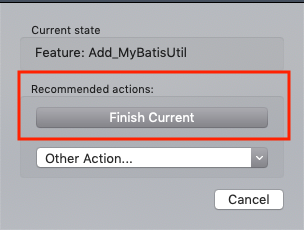

**是否保留分支**

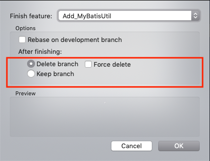

### 保留分支的狀態
`觀察分支合併狀態`

**feature : keep branch**

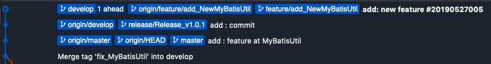

**release : keep branch**

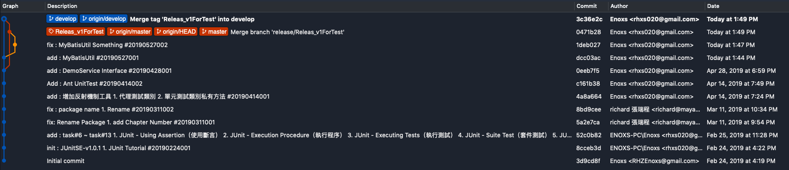

+ 從 develop 分支開始，完成功能時會自動合併回 develop 與 master。
+ master 分支會以 releas 分支名稱打上標籤(tag)
        
**hotfix : keep branch**

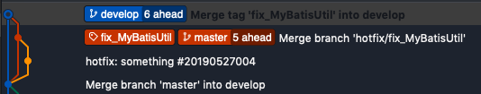

+ 從 master 分支開始，完成功能時會自動合併回 develop 與 master
+ master 分支會以 hotfix 分支名稱打上標籤(tag)
        
        
### issue : 合併過的分支要不要留著？

**分支(branch)**

+ 標籤，40 個字元的檔案，標記出它目前指向哪一個 Commit
+ 刪除分支就跟撕掉貼紙一樣，實際上提交的檔案並不會因此消失
        
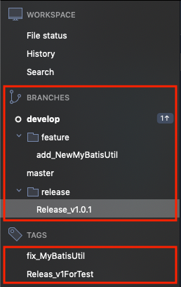

+ 建議刪除：資訊太多，造成注意力匱乏
        
        
Reference
------
+ <https://gitbook.tw/chapters/branch/about-merged-branch.html>
+ <https://gitbook.tw/chapters/gitflow/using-git-flow.html>


