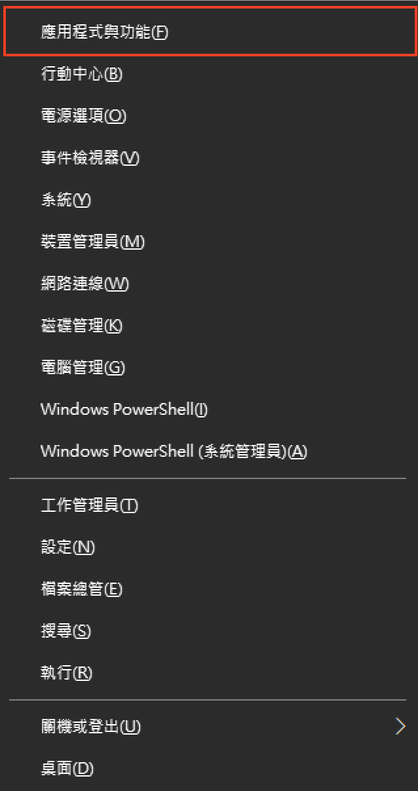

使用 Windows 10 虛擬機 Hyper-V 創建機器
======

一、開啟 Windows Hyper - V 功能
------
### 1. [開始鍵]+[滑鼠右鍵] or [開始鍵] + [x] 

### 2. 選單選擇 「應用程式與功能」

### 3. 右側「程式和功能」

### 4. 選擇「開啟或關閉 Windows 功能」

### 5. 開啟「Hyper - V 」

### 6. 重新開機

二、配置 Hyper - V 網路
------
### 1. 開啟 Hyper-V 管理員 

    
    開始 > Windows 系統管理員 > Hyper-V 管理員 

### 2. 開啟虛擬交換器管理員

### 3. 建立虛擬交換器

### 4. 外部網路                                  

### 5. 內部網路                                  

### 6. 私人網路                                  

三、安裝 OS
------
### 1. 建立虛擬機

### 2. 新增虛擬機器精靈

### 3. 虛擬機名稱

### 4. 虛擬機世代

### 5. 記憶體                                      

 
### 6. 網路設定                                      

### 7. 虛擬硬碟                                      

### 8. 安裝選項                                      

### 9. 完成                                      

### 10. 確認狀態

### 11. 虛擬機設定

### 12. CPU 設定

### 13. 虛擬機連線

### 14. 啟動虛擬機                                 

