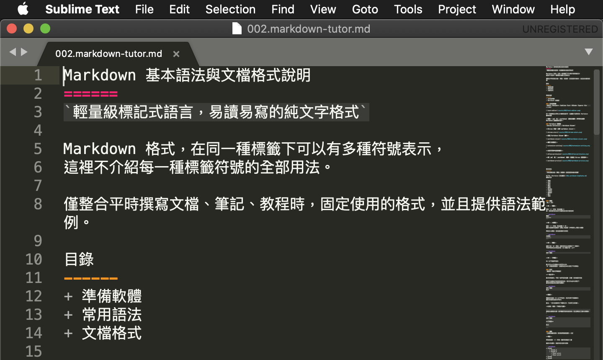
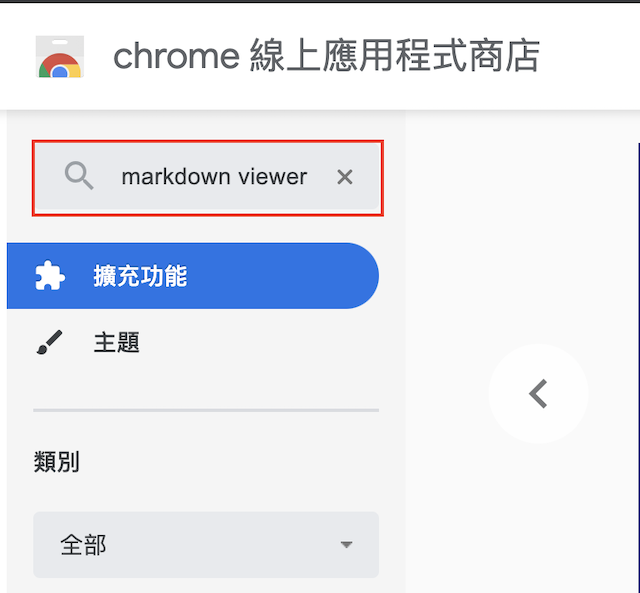
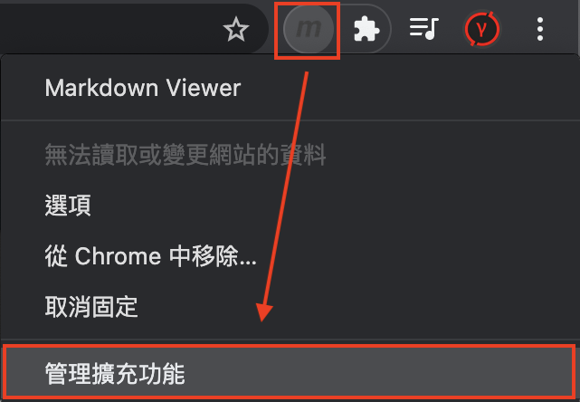
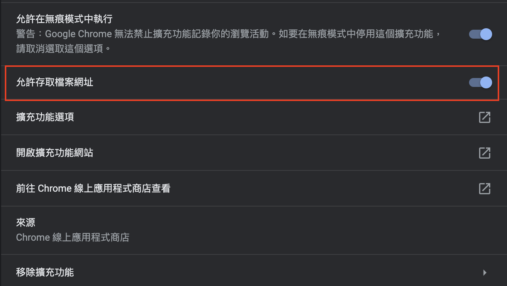
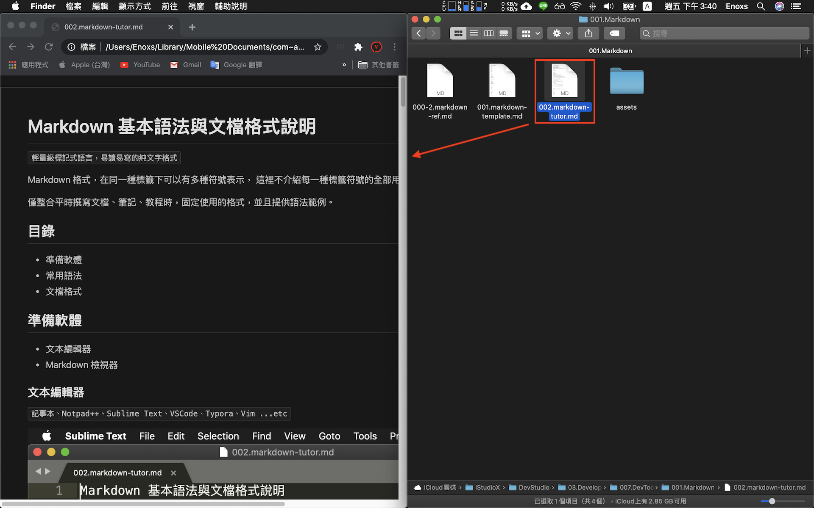
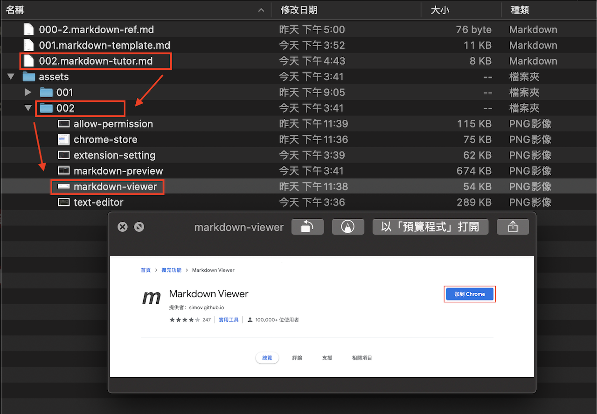

Markdown 快速入門與基本語法
======
`輕量級標記式語言，易讀易寫的純文字格式`

Markdown 格式，在同一種標籤下可以有多種符號表示，
這裡不介紹每一種標籤符號的全部用法。

僅整合平時撰寫文檔、筆記、教程時，固定使用的格式，並且提供語法範例。

目錄
------
+ 準備軟體
+ 常用語法
+ 文檔格式


準備軟體
------
+ 文本編輯器
+ Markdown 檢視器

### 文本編輯器
`記事本、Notpad++、Sublime Text、VSCode、Typora、Vim ...etc`



任一可編輯純文字的文本編輯器皆可，後續會介紹常用的 Markdown 編輯軟體

**創建 `.md` 或 `.markdown` 副檔名檔案，即可開始使用 Markdown 語法撰寫文件**

### Markdown 檢視器
`Chrome Extension : Markdown Viewer`

**Chrome 商店，搜尋 markdown viewer**



**安裝 Markdown Viewer 插件**


**擴充功能設定**



**允許存取本地端的檔案**



**將`.md` 或 `.markdown` 檔案，拖放進 Chrome 瀏覽器中**




常用語法
------
`平時撰寫文檔、筆記、教程時，固定使用的格式範例`

以下為 [Markdown 語法範例](001.markdown-template.md)  精簡內容

+ 標題
+ 內文
+ 清單
+ 標註
+ 區塊
+ 程式碼
+ 分隔線
+ 超連結
+ 圖片
+ 表格


### 標題
`H1 ~ H3`

**H1 - 大標題**

使用 `=` 符號，常駐數量 `6` 個，通常一份文檔只會有一個 H1 大標題

並且會與檔名相同或者是使用檔名的完整名稱

```markdown
H1 大標題
======
```

**H2 - 標題**

使用 `-` 符號，常駐數量 `6` 個 ，
通常文檔會常駐開頭「目錄」與結尾「參考資料」兩個 H2 標題。

其他的 H2 標題，則依據目錄列表而定

```markdown
H2 標題
------
```

**H3 - 子標題**

使用三個 `#` 符號，通常使用在 H2 標題的下一階層中，
不會單獨存在於其他階層，如: 不會單獨的在 H1 大標題之下。

```markdown
### H3 子標題
```

**H4 - 小標題**

`H4 以下的小標題不使用`

除文字大小已經與內文差不多以外，
`#` 符號頻繁出現，也使得純文本的情況下不好辨認。

### 內文
`僅使用一般文字、粗體、斜體、刪除線`

**一般文字**

通常只注意換行的段落是否恰當，若文字太多的情況下，
會使用區塊或程式碼符號標示。

```markdown
### H3 子標題
內文
```

**粗體**

標題部分提到 H4 以下不使用，但若仍有下一階層分段的需求，
通常會使用粗體文字取代。

因此，一份文檔通常除了 H1 大標題以外，只會有三個階層 :

+ H2 標題
+ H3 子標題
+ 粗體 (小標題)

`若超出此階層內容，會再重新安排文檔格式，使之不超出三個階層。`

```markdown
### H3 子標題

**01**

內文

```

**內文中的粗體、斜體、刪除線**

撰寫文檔內文時，視情況使用粗體、斜體、刪除線，原則上還是盡量不使用到 HTML 語法

例如: 底線 `<u>` 或者是 `<font>` 更改文字樣式 

避免造成純文字格式閱讀時的困難


```markdown
內文，**粗體**，*斜體*，~~刪除線~~
```

### 清單
`三種型態皆使用，但項目符號僅使用 + 號`

**項目**

符號僅使用 `+` 符號，縮排階層**最多三層**

最基本的應用，就是每個文檔的目錄

```markdown
+ Item1
    + Item1.1
    + Item1.2
      + Item 1.2.1
      + Item 1.2.2
+ Item2
+ Item3
```

**任務清單**

符號僅使用 `+` 符號，縮排階層**最多兩層**

使用在待辦清單的筆記或文檔上


```markdown
+ [X] To-Do1
  + [X] Detail 1-1
  + [X] Detail 1-2
  + [ ] Detail 1-3
+ [ ] To-Do2
+ [ ] To-Do3
```

**數字**

使用機率不高，清單項目通常優先以 `+` 為主，
有特殊情況需表明順序時，才會使用，縮排**最多一層**。

雖然文本的數字不影響渲染結果，但在純文本的情況下，
仍維持順序排列，避免閱讀純文本時有落差。


有時會與項目符號 `+` 混合使用。

```markdown
1. Item1
2. Item2
3. Item3

+ Item1
    1. Item1.1
    2. Item1.2
+ Item2
    1. Item2.1
    2. Item2.2
+ Item3
```

### 標註
`補充說明與重點高亮`

**標題補充**

通常使用在 H1 大標題 、H2 標題、H3 子標題，下方補充說明

可以是簡介、大綱、副標題，用於幫助讀者更快瞭解章節內容

```markdown
H1 大標題
======
`H1 標題-副標題`

H2 標題
------
`H2 標題-大綱`

### H3 子標題
`H3 子標題-工作流程`
```

**清單補充**

使用在清單列表的後方，補充說明該項目其他的資訊內容

```markdown
+ item `2020-10`
  + item `10/20 done`
  + item `10/25 done`
```

**內文標註**

標註內文中，要特殊注意的文字

```markdown
符號僅使用`+` 符號，縮排階層最多三層
```

### 區塊
`重點文字標示`

區塊文字類似於程式碼區塊，通常用於標示較短的文字描述，
由於，純文字顯示下為四個空格，不太容易辨認。

若文字內容較長，仍使用程式碼區塊符號

```markdown
    Text Block
```

### 程式碼
`程式語法高亮`

程式語法高亮，大量使用在技術教程、開發文件、程式筆記...等文檔上

除了常見的程式語言還會使用 `diff` 比對版本差異功能

若說明的文字太多，也會使用程式碼區塊，前方不加程式語言名稱，
當作一般文字使用，可以避免一般文字的換行問題。


<pre>
<code>
```
Text - 文字說明
```

```java
// Java Code 
System.out.println("Hello Word");
```

```diff
+ System.out.println("Hello Word");
- System.out.println("Hello Word");
```
</code>
</pre>

### 分隔線
`段落章節分隔`

分隔線僅使用 `-` 符號，且數量為三個，僅滿足最小觸發渲染條件。

可以避免多餘的文字符號佔用電腦空間

```markdown
---
```

### 超連結
`參考資料與文檔索引`

超連結的寫法有三種，通常僅會使用 `<url>` 與 `[title](url)` 此兩種方法

**參考資料**

文檔通常會常駐「目錄」與「參考資料」，

「目錄」內容使用**清單**列表呈現，
「參考資料」則使用 `H3 子標題` + `<url>` 呈現資料來源

```markdown
參考資料
------
### Gitlab
<https://gitlab.com/GammaRayStudio>

### Blogger
<https://gamma-ray-studio.blogspot.com/>

### Youtube
<https://www.youtube.com/user/rhxs020>
```

**文檔索引**

程式專案中，通常都會建立一個連接所有文檔的索引目錄，

使用 `[title](url)` 連接所有開發文件，
用於快速尋找特定的開發文件。


```markdown
帳本 , Index
======
`Account Book`

Project
------
+ [000-0.account-book-index](000-0.account-book-index.md)
+ [000-1.account-book-list](000-1.account-book-list.md)
+ [000-2.account-book-ref](000-2.account-book-ref.md)
+ [000-3.account-book-data](000-3.account-book-data.md)
+ [000-4.account-book-issue](000-4.account-book-issue.md)
+ [000-5.account-book-task](000-5.account-book-task.md)
+ [000-6.account-book-flow](000-6.account-book-flow.md)
+ [000-7.account-book-style](000-7.account-book-style.md)
+ [000-8.account-book-guide](000-8.account-book-guide.md)

App
------
### 功能需求
[001-1.account-book-feat](001-1.account-book-feat.md)

### 基礎設施層
+ [002-1.infra-sa](002-1.infra-sa.md)
+ [002-2.infra-spec](002-2.infra-spec.md)

### 領域層
+ [003-1.domain-sa](003-1.domain-sa.md)
+ [003-2.domain-spec](003-2.domain-spec.md)

### 應用層
+ [004-1.application-sa-ux](004-1.application-sa-ux.md)
+ [004-2.application-spec](004-2.application-spec.md)

### 使用者介面層
+ [005-1.view-sa-ui](005-1.view-sa-ui.md)
+ [005-2.view-spec](005-2.view-spec.md)

### 關於專案
[README](README.md)
```
**上述是一個 iOS App 開發的專案文件索引，
每個文件前方都會以一個三位數的編號，
這部分後續的文件教程會再詳細說明。**


### 圖片

Markdown 圖片使用 `` 格式，
url 超連結的路徑為要顯示的圖片，

通常使用相對路徑，在文檔的同級目錄底下 `assets/` 資料夾加上**編號**，
作為圖片來源的資料夾位置。

```markdown

```



**圖片的部分，除常見的 png、jpg 外，通常會建議使用 svg 格式**

**在加入版本控制時，檔案會比較小，也易於版控比對，
這部分後續會有詳細教程介紹。**


### 表格

只使用最**簡單**的 Markdown 表格，**置左對齊**

```markdown
| Markdown             | Simple               | Table           |
| :------------------- | :------------------- |:--------------- |
| left-aligned column  | column               | column          |
| $100                 | $100                 | $100            |
| $10                  | $10                  | $10             |
| $1                   | $1                   | $1              |
```

由於表格要呈現較複雜的格式，如: 合併儲存格等功能，
都必須要使用到 Html 的標籤格式，

為了呈現效果而導致原始的文檔變得不易閱讀，
違背了原本 Markdown 易讀易寫的原則。


```markdown
[Table](assets/002/table.csv)
```

**若仍有複雜表格格式的需求，建議使用超連結的方式連接其他格式檔案，
以外部擴展方式涵蓋表格功能。**


參考資料
------


