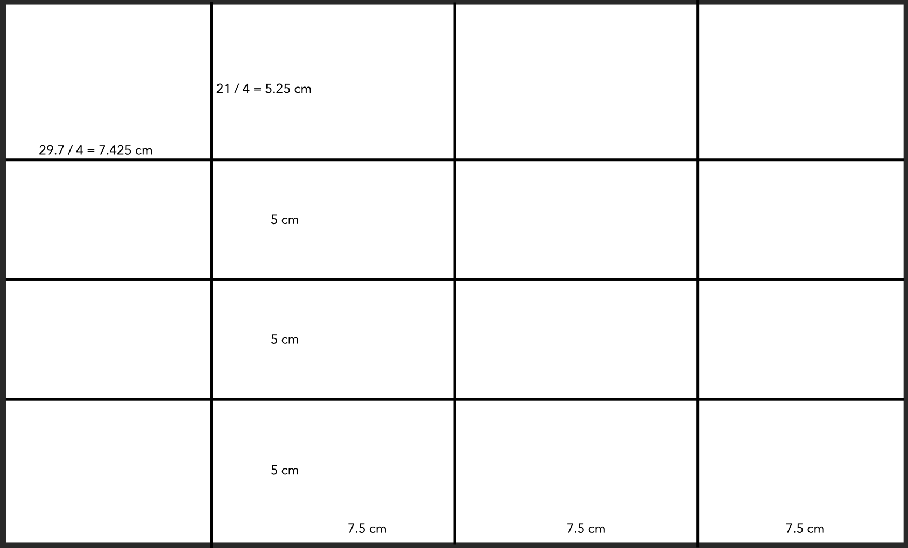
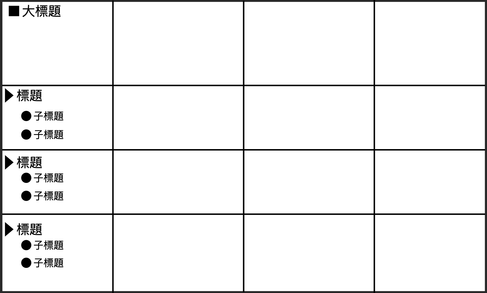
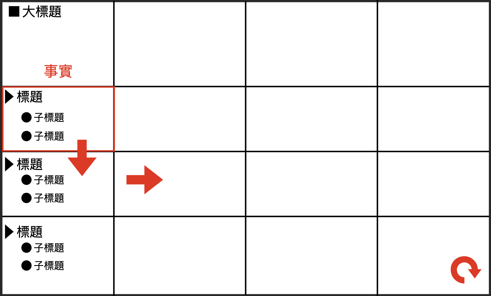
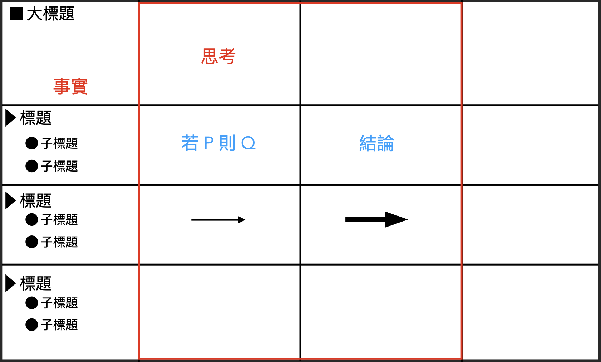
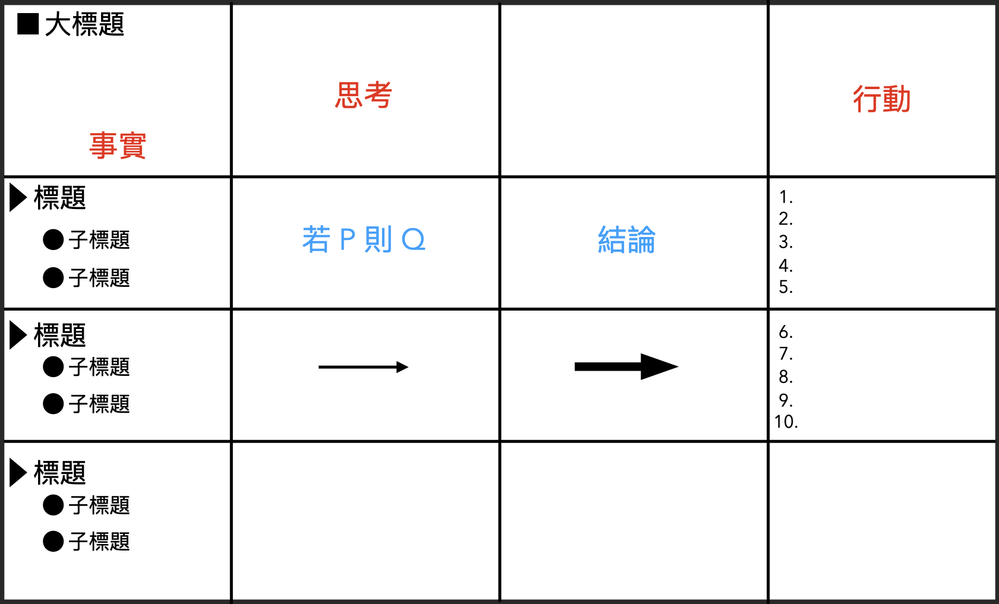

工程師的問題解構流程
======
`方格筆記本 x 思維模型架構 | 要思考還要知道如何思考`

大綱
------
+ 新人的問與不問 !?
+ 方格筆記本之思維架構
+ 黃金三分割法
  + 事實
  + 思考
  + 行動
+ 方格筆記本 A4 紙張應用
+ 客製化解決問題筆記方案
+ 冷靜，你是名工程師 !

 

新人的問與不問 !?
------
職場上的新人，通常會有很多疑問，問與不問之間，很難拿捏

**問少了，做錯**

    會被責問 為什麼不問？

**問多了，覺得煩**

    會覺得，這種問題也要問 ? 問題怎麼這麼多 ?

 

**新人覺得前輩難相處，前輩也覺得新人態度不好**

在這個問題上，我認為，身為經驗較豐富的前人，是有責任，去引導後人的。

你希望新人在問問題之前 可以先**「思考」**一下。

**但你卻沒有告訴他 「如何思考 ?」**

 

方格筆記本之思維架構
------
過去，我也曾是個職場新人，但環境不允許我問題很多

因為當時的公司，只有我一個軟體工程師，會寫 Android

其他的同事，大部分是，電子工程師

跟軟體相關的就一個，也不會寫Android。

一切只能自力更生，自力更生，不是壞事，會幫助你培養「工程師性格」

**工程師性格**

    遇到問題 想研究得非常清楚

    (副作用 : 容易擅作主張)

在自力更生的過程中，我發現，有一本書籍：

**「為什麼聰明人都用方格筆記本?」**

書中有個**「黃金三分割法」**是寫筆記的核心架構

我認為，它也是個**解決問題的思維模式**

 

黃金三分割法之一
------
黃金三分割法，具體來說將筆記分成三大部分 : 

+ **事實**
+ **思考**
+ **行動**

 

### 「事實」
`就是先把所有你知道的事情先寫下來`

**舉例來說:**

我的父親，是個機電工程的老闆，他會要求他的員工，在上衣的口袋中放紙跟筆，

師傅在交待任務時，記不住的話，就要把它寫下來。

**這個道理很簡單:** 

    如果連問題是什麼都不清楚的話，更不要論解決問題了

而在進一步來說，軟體資訊業是個高度腦力密集的產業，

如果產品不正常運作的話，實際上問題發生的原因可能非常複雜

你要紀錄的可能是:

+ 主管說了什麼 ?
+ 維護工程師說了什麼 ?
+ 協力廠商說了什麼 ?
+ 客戶的原話又是什麼 ?
+ 線上程式的版本 ?
+ 程式畫面的截圖 ?
+ 程式運行的日誌紀錄 ?

**所有關於，跟這項任務有關的資訊，都有可能是解決問題的關鍵**

 

### 「思考」
`依據已經發生的事情，分析問題`

問題可能很簡單，也有可能很複雜，但目標就是要簡化問題

**最簡單的簡化方法**

    「二分法」

刪除篤定不可能發生問題的地方，留下模糊不確定的部分 !

如果刪除到最後，無法再切分，那麼通常代表已經找到問題點。

**無法用二分法可以輕易解決**

借助前人的知識，進行頭腦風暴

**經典著作**

+ *孫子兵法*
+ *好策略，壞策略*

`書籍中有很多原則方針 可以很好的幫助思考`

而我最常用來參考的是:

**史蒂芬 柯維的 「與成功有約 - 高效人士的七個習慣」**

+ **第一個習慣 -「專注做好你能控制的事」**

例如:

+ 報修時語焉不詳
+ 開發時規格不明確

**你不能控制的事情，其實你也不用去理他。**

 

### 「行動」
`根據分析的結果，規劃任務`

任務可能的情況:

+ 因為資料不全，請提供資料的人，再補齊資料。
+ 根據現有的資料，查不出問題，要再增加日誌追蹤。

此時，如果不確定要執行的動作，是否正確，
可以將得出來的結論，去詢問主管或者是前輩。

**新人在此時，詢問的動作有兩個含義**

+ 第一個含義:**「授權」- 避免錯誤時，出現為什麼不問的質疑聲** 
+ 第二個含義:**「學習」- 如果在思考中存在誤區 沒有過來人的經驗指點想破頭也不可能導正回正確的軌道上**

而且我相信，已經經過頭腦風暴，思考過的問題，你在這一單點的問題上，

有可能是比你要詢問的人更佳熟悉，反而是你可以點出他思考中的誤區。

### 討論的意義

    透過不同的觀點 消彌個人視野的局限性

 

方格筆記本 A4 紙張應用
------
### 方格筆記本，筆記三大原則:

1. 使用方格筆記本 - 精準定位文字在筆記本的位置
2. 寫上「標題」- 準確定義筆記要呈現的文字內容
3. 使用「三分割法」- 剛才說明過的內容

`知曉了方格筆記本的元素，以及背後的概念含義，方格的筆記本就不在是重點!`

 

### A4 紙張 
`橫放`

+ 從右下角開始，間隔 7.5 公分，在上面畫三條直線
+ 從底部開始，間隔 5 公分，在上面畫三條橫線
+ 一共切分 16 個方格

切分完後，你應該會發現，頂部的方格較大

這是因為 A4 紙張(29.7 x 21)等分的話，間隔長度就不會是整數

+ 29.7 / 4 = 7.425 cm
+ 21 / 4 = 5.25 cm

此空間，可以作為標題的擺放位置

+ 「方塊」的形狀作為大標題的符號
+ 「三角形」的形狀作為一般標題的符號
+ 「圓形」的形狀作為子標題的符號

**「事實」的部分** 

從左側開始向右撰寫，方格空間不夠就直接擴展到下一格，單頁空間不夠就直接擴展到下一頁

**「思考」的部分**

`使用箭頭的方式進行「思維的推導」`

+ 較細的箭頭代表的是推導的流程
+ 較粗的箭頭代表的是得出的結論

`個人只有定義這兩類，可以再依據你的需求客製化`

**「行動」的部分**

+ 撰寫在最右側
+ 由上至下列表出 
+ 十項最重要且立即可以執行的事情

    如果到這時，對於要解決的方案，還有疑問的話，就拿著這張紙，去問主管或前輩，
    相信看到你這麽認真，也會以相對嚴肅的態度為你解惑。

 

客製化解決問題筆記方案
------
方格筆記本的思維架構，可以使用更多種方式呈現:

+ A4 紙張
+ 繪圖板
+ 白板
+ iPad + Apple Pencil
+ Apple 備忘錄

都是紀錄的一種方式，只是在彙整時，我會將文字紀錄到 Markdown

並且依據重要性 進行 git 版本控制。

這部份是要說明，可以照著這個思維架構，去客製化一套，個人解決問題的筆記方案。

 

冷靜，你是名工程師
------
當下次再遇到難解的問題時，除了可以用這個方案標準作業以外

遇到不知所措的新人，你可以跟他說 ：

    「冷靜，你是名工程師」

    (電影 : 決戰中途島 - 航空母艦沉沒，指揮官對慌張的下屬說 : 「冷靜，你是名軍官」)

然後，拿出一張 A4 紙張在上面畫線，跟他說明解決問題的思維架構。

在此刻，你在他心目中的樣子，就高大了起來，因為你不僅是個和善的前輩，還是個具有影響力的前輩。

 

參考資料
------
### 實體書籍
+ 為什麼聰明人都用方格筆記本
+ 與成功有約 - 高效人士的七個習慣

