如何快速學習新技能 ? 
======
`軟技能 x 十步學習法 | 學習「怎樣學習」`


[`Youtube : [ 工程師 x 學習 ] 如何快速學習新技能 ? | 軟技能 x 十步學習法 | 學習「怎樣學習」`](https://youtu.be/Ya7XE47gPBo)

大綱
------
+ 學習能力
+ 軟技能:代碼之外的生存指南
+ 十步學習法「概述」
+ 第一部分:「研究」
    + 第一步: 了解全局
    + 第二步: 確定範圍
    + 第三步: 定義目標
    + 第四步: 尋找資源
    + 第五步: 創建學習計畫
    + 第六步: 篩選資源
+ 第二部分:「學習」
    + 第七步: 開始學習，淺嘗則止
    + 第八步: 動手操作，邊學邊玩
    + 第九步: 全面掌握，學以致用
    + 第十步: 樂為人師，融會貫通
+ 學習是一種類比行為

<br>

學習能力
------
### 「學習能力」
對於軟體工程師來說，是至關重要的。

除了技術的持續演進以外，在面試時，沒有一兩個技能可以展示，還會被懷疑是不是能力不夠。

    現在的職場 : 
        優秀的工程師具備多個「 技能 」 已是常態。


### 學習瓶頸
學習全新的技術時，時常感到 :

+ 力不從心
+ 進度緩慢
+ 成效甚微

 `有時甚至出現乾脆放棄的念頭`

### 問題點

    不是是「意志力」的問題，而是「學習方法」的問題

### 前人經驗
軟體設計有前人的經驗可以借鑑，軟體工程師學習新技能的方法，也是有經驗可循。

<br>

軟技能:代碼之外的生存指南
------
### 學習篇 : 十步學習法
作者自創的「十步學習法」，它有非常好的參考價值，不一定要完全照它的方法實行

但它的思維與邏輯，是合理且有系統的。可以依據個人的習慣，精簡與改良。

### 個人使用的程式技術學習方案

除了，作者提供的「十步學習法」，也分享經過我調整後，個人正在使用的程式技術學習方案。

**這個方案會需要三種技術支援:**
+ Markdown 語法
+ git 版本控制
+ gitlab 代碼託管平台

在說明每一步驟的概念時，會使用我的作法，當作範例。

### 拋磚引玉 
同樣的，也不需要完全依照我的方法實行，這只是個拋磚引玉，

也許可以激發你 創建最符合你習慣的學習框架。

<br>

十步學習法「概述」
------
從字面上來理解，就是將學習這個動作，拆解成十個步驟

### 十步學習法
1. 瞭解全局
2. 確定範圍
3. 定義目標
4. 尋找資源
5. 創建學習計劃
6. 篩選資源
7. 開始學習，淺嘗輒止
8. 動手操作，邊玩邊學
9. 全面掌握，學以致用
10. 樂為人師，融會貫通


具體來說，分成兩大部分:

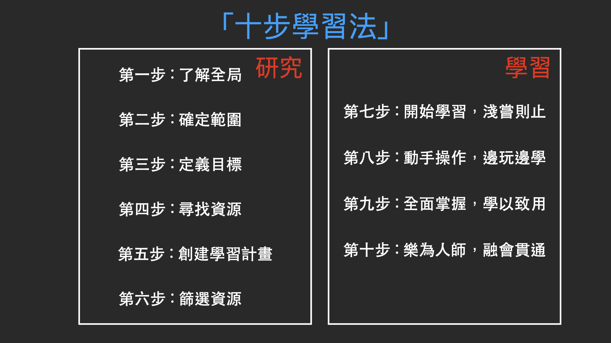

### 第一部分: 「研究」
1. 瞭解全局
2. 確定範圍
3. 定義目標
4. 尋找資源
5. 創建學習計劃
6. 篩選資源

### 第二部分:「學習」
7. 開始學習，淺嘗輒止
8. 動手操作，邊玩邊學
9. 全面掌握，學以致用
10. 樂為人師，融會貫通

<br>

第一部分:「研究」
------
### 先「研究」在「學習」
是因為「自我學習」，並不像是學校或補習班，有完整的教材大綱，可以由淺入深的逐步進展，

為了避免教材的內容，一下子太過深入，導致出現挫折感。


    「研究」就是在設計「教材」

**完全依照個人**
+ 需求
+ 目標

規劃一個最符合自己的課程內容

**在第二部分「學習」時**

    才能從「入門到精通」，而不是「入門到放棄」

<br>

### 第一步: 了解全局
對於，要學習的知識領域，進行一個「概略」的了解。
不需要很清楚的知道，背後的理論 與 實作的方法。
只需要知道 「有這個東西」，大腦中先有個模糊的形狀，就是這一步驟要的目標。

    未知的未知:
        先去知道自己還有什麼不知道，才會知道自己需要知道什麼。

<br>

**我的作法**

+ 打開瀏覽器，使用搜尋引擎，「開始搜尋」

我通常會把搜尋到，看起來可能有價值的網站，記錄在分類的資料夾內 

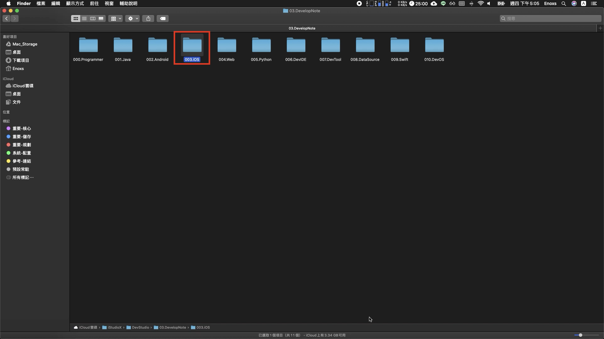

編號 000-2 結尾為 ref 的 Markdown 文件

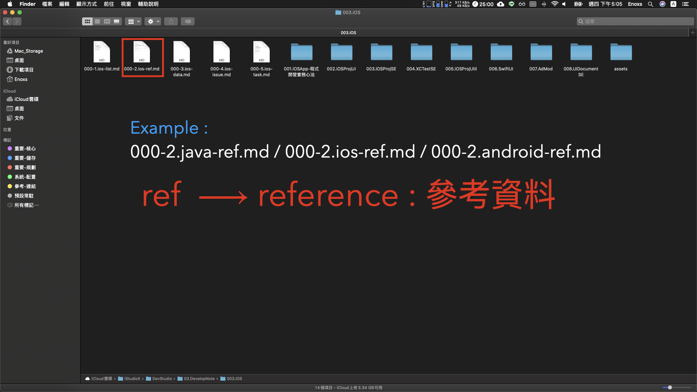

`ref 代表的是 reference 參考資料`

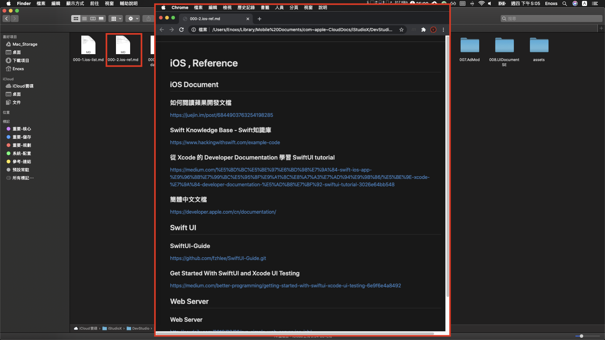

當下次需要使用時 就可以打開檔案 快速訪問

<br>

### 第二步: 確定範圍
第一步的延伸，「概略」了解了整個知識領域的內容後，再來就是要界定學習的「範圍」。

因為，一個主題的背後，通常還會有更多延伸的子項目，如果打算全部學下來

    除了很困難以外 在實務上也沒有必要

**「快速」學習的原因**

    80 / 20 法則 :
        只先學習最重要的 20 %
        就能完成 80 % 要達到的目標

**速度**

    教材少了 80% 速度也會快了 80 % (學習不要從封面到封底)

<br>

**我的作法**


將先前查找資料時，發現看起來是重要的 20 % 關鍵字詞，

記錄在 編號 000-3 結尾為 data 的 Markdown 文件 :

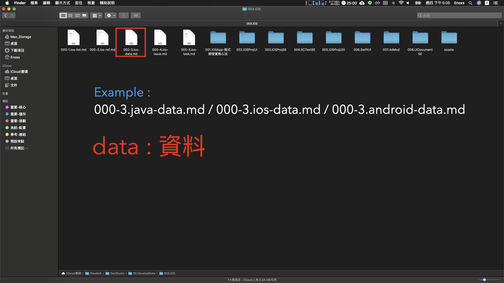

`data 代表的就是資料`

以供後續資料查找時可以快速瀏覽。

<br>

### 第三步: 定義目標
會去學習新的知識或者新的技術，一定是有一個想要達到的目標

這個最終目標，一定還能再拆解成各個小目標:
+ 當任務的目標越小，就越有可能達成；
+ 達成的任務越多，就越有可能成功。


**里程碑的意義**

```
人類是一種...
    需要反饋，才能繼續的生物
如果，遙遙無期 . . .
    沒有反饋，容易放棄
```

<br>

**我的作法**

我會將我要達到的目標，紀錄在 編號 000-5 結尾為 task 的 Markdown 文件

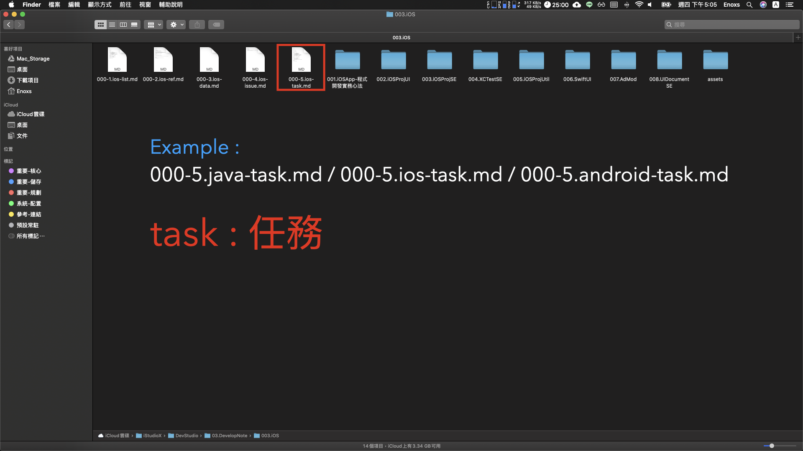

`task 代表的就是任務`

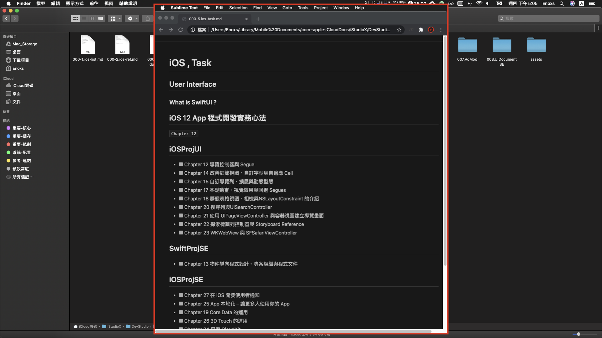

我會用多選框的語法，來追蹤我目前任務的達成率。

<br>

### 第四步: 尋找資源
類似於第一步

+ 第一步驟 - 以「廣度」，了解越多的資料越好。
+ 第四步驟 - 以「深度」，能夠把你界定的範圍與定義的目標，涵蓋的越多越好 。

<br>

**我的作法**

通常在官方網站或者技術教程網站，可以找到想要的資源。

**Example:**

[Tutorialspoint](https://www.tutorialspoint.com/index.htm)
  
    	印度人架設的技術教程網站，裡面涵蓋的技術資源非常廣泛。

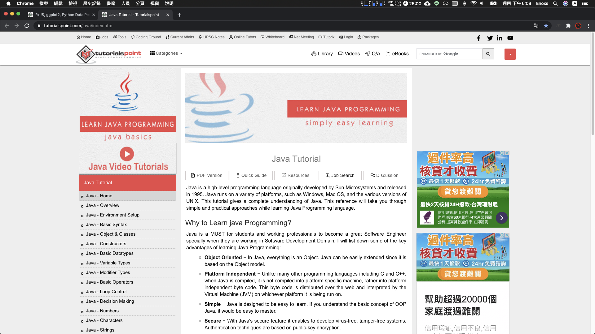

另外一個最常見的，就是買一本有附範例的技術書籍

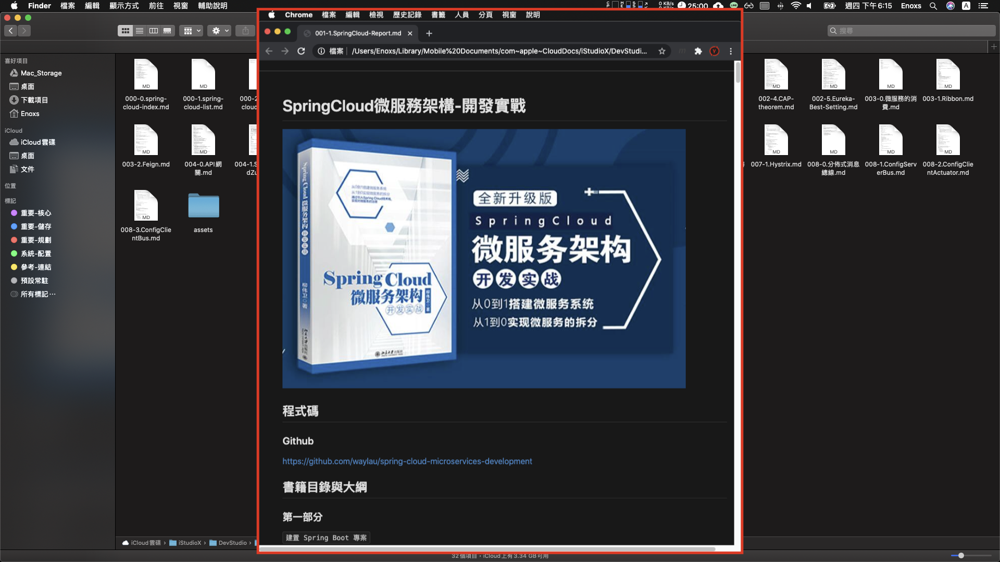

書籍的選購，也是依據第一步的資訊搜集，以及第二步與第三步的分類所決定的。

<br>

### 第五步: 創建學習計畫
安排教材資源的學習「順序」

**「順序」**

不一定要依照網站的大綱或者是書籍的目錄，

可以互相參考，根據需求自行決定。目的是為了將各個章節，碎片化的知識有系統地組合起來。


**支撐**

學習計畫也將會是「學習」部分的重要支撐，每當學習到有些疲累，快要撐不下去的時候。

看到當初花了不少心血制定的計畫，「不甘心」的情緒以及完成計畫後可以達成的「未來」，多少又可以帶來點動力。

<br>

**我的作法**

我會將我的學習計畫，紀錄在 編號 000-1 結尾為 list 的 Markdown 文件

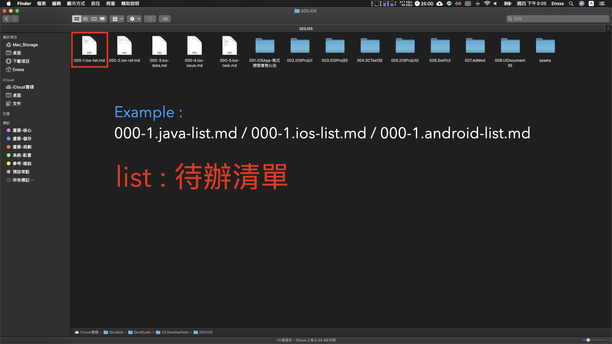

`list 代表的就是「待辦清單」`

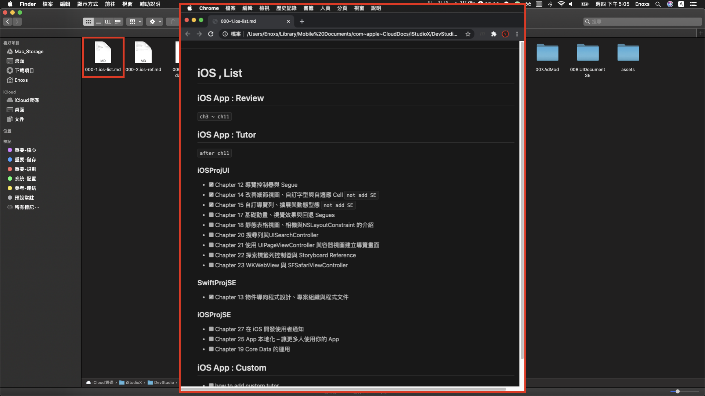

同樣使用多選框的語法，追蹤目前計畫的達成率。

<br>

### 第六步: 篩選資源
第四步的延伸，為了更符合第五步的學習計畫，要再更精簡。

刪除那些已經有重複內容的資源，刪除的標準就是兩者相比較 :
+ 質量比較好的留下
+ 質量比較差的移除

**我的作法**

有時候會省略，因為第四步驟時，有可能就已經完成了。

<br>

第二部分:「學習」
------
「研究」對於一個新的知識領域來說，只會做一次，做完之後，基本上不會再做更大的改動。

**第二部分的「學習」: 第七步到第十步**

7. 開始學習，淺嘗輒止
8. 動手操作，邊玩邊學
9. 全面掌握，學以致用
10. 樂為人師，融會貫通


「第二部分」是一個循環，每一個章節的內容，都會套用這個流程，進行學習。

而且可能不僅進行一次循環，對於特別重要的章節 -> 循環往復

    不斷的「迭代」

直到，融會貫通完全掌握，能夠教導別人為止。

<br>

### 第七步: 開始學習，淺嘗則止

學習中，有兩種容易犯的錯誤 :
+ 盲目開始，太快行動
+ 準備太多，太晚行動

為了在這兩者之間取得平衡，當掌握了最小可以動手操作的知識，就應該馬上進行實際操作。

如果先消化完所知的知識，然後再進行操作，
有些不熟悉的知識，會忘記，然後又回頭察看。

**如此情況**

不如就像玩新的遊戲時一樣，先稍微閱讀下說明書，然後就開始。

當遇到不懂時再回來察看，如此就能在兩者之間達到平衡。

<br>

**我的作法**

我會在 gitlab 的站台上，建立一個全新的專案，以 SE 結尾命名

    SE 代表的是 Sample Example

  
+ 如果是 Java 的專案，會取名叫 JavaProjSE
+ 如果是 Android 的專案，會取名叫作 AndroidProjSE
+ 如果是 iOS 的專案，會取名叫作 iOSProjSE

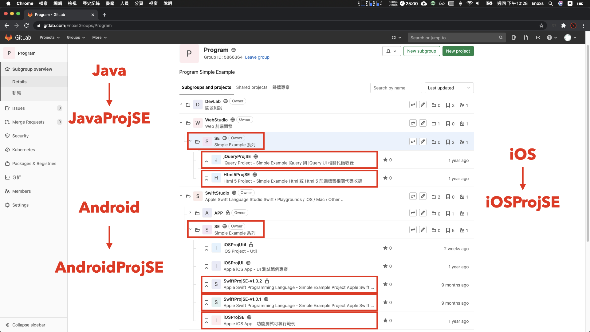

`以此類推`

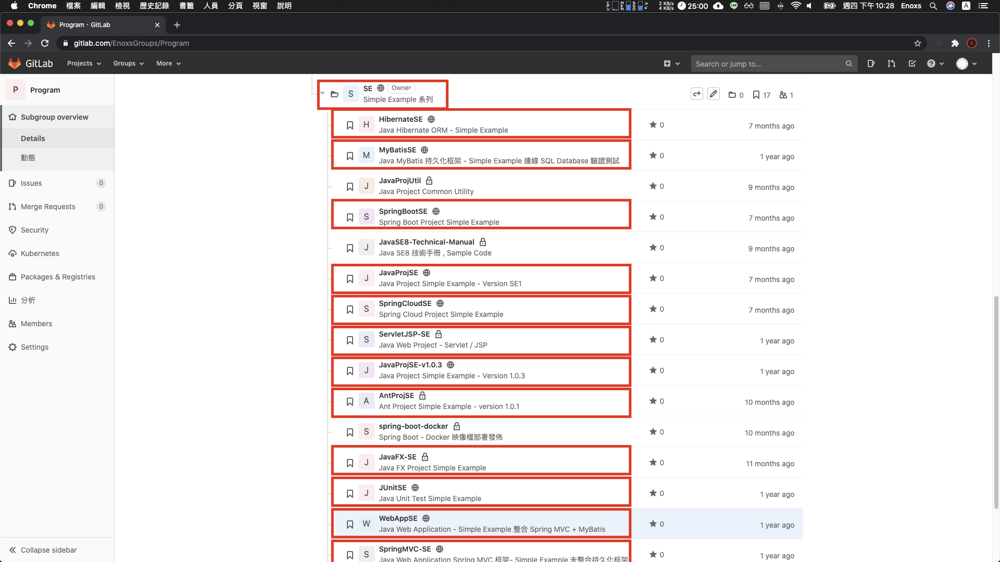

所有初期，類似於 Hello World 的這種基本的語法測試，都會涵蓋在 SE 系列的專案中。

<br>

### 第八步: 動手操作，邊學邊玩

非常相似於第七步
+ 第七步 - 強調的是「開始」
+ 第八步 - 強調的是「動手」

**核心概念**

    在實作中學習

實作時，無須你刻意尋找，很多問題就會自然而然地從腦海中浮現。這些問題會引導你走向正確的方向。

當回頭尋找問題的答案時，除了解決問題本身以外，還會比先看教材在實作的流程，理解的更加深入。

<br>

**我的作法**

我會將我發現的問題，紀錄在 編號 000-4 結尾為 issue 的 Markdown 文件


`issue 代表的就是「議題」`

<br>

### 第九步: 全面掌握，學以致用
解決第八步時，遇到的問題，方法可以是查資料、看影片、問別人...各種方法都可以。

    目的是在你界定的範圍內，沒有模糊且不確定的地方。

<br>

**我的作法**

我的專案名稱，就會擴增到:

+ Util 結尾 
+ UI 結尾 
+ 特殊功能的代稱

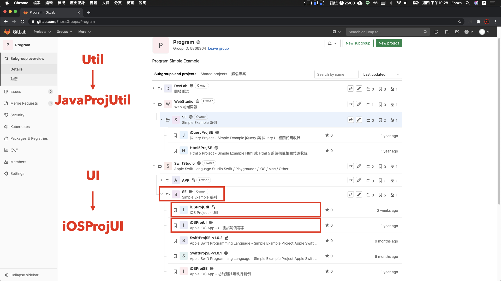

+ JavaProjUtil 收錄 Java 共用的 Util 工具
+ iOSProjUI 收錄 iOS 各種 UI 元件的使用範例

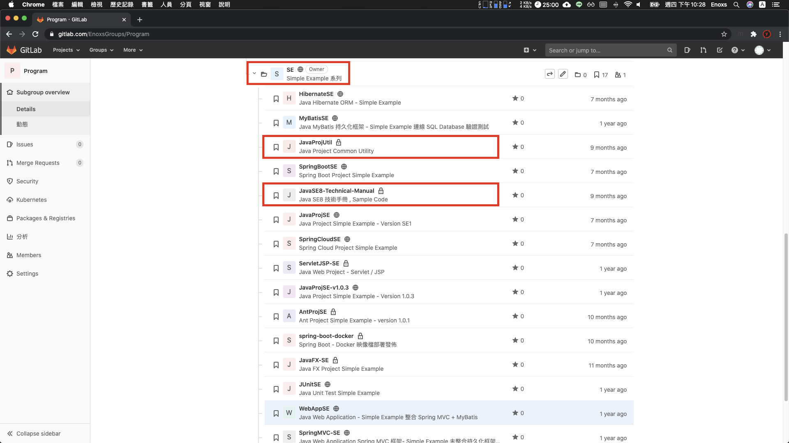

有了這些「工具專案」，要開發新的應用程式時，就不會是從頭開始。

甚至一些簡單的功能，使用複製貼上大法，就可以直接搞定。

<br>

### 第十步: 樂為人師，融會貫通

一般的學習，通常到了第九步驟，就會認為自己已經學會了。

但要檢驗是否真的學會，最好的方法:
 
    將所學到的知識教給別人。

唯有此時，才能發現有些地方: 

    你以為你懂，但其實還沒摸透。

而且，要將理解到的知識，組織成別人能夠聽懂的語言:

    一定是對於這個知識，有了更深刻的理解才能辦到。

 <br>

**我的作法**

除了偶爾 技術簡報 以外，還開始做了 Youtube 影片。

[Gamma Ray 軟體工作室](https://www.youtube.com/user/rhxs020)

`Youtube 影片 確實也是他書中的方案之一`

**其他的還有**
+ 部落格文章
+ 線上論壇討論
+ 朋友或同事對話交流

這些方式，除了能夠收到反饋，也能互惠互利，一起成長。

<br>

學習是一種類比行為
------
上述的「十步學習法」，是一種「快速入門」學習新技能的方法，但並不是一種「快速精通」新技能的方法。

**80 / 20 法則**

剩下 20% 進階的技術，需要去了解 80% 其他的知識。

 
**想要「快速精通」**

    唯有走得「穩」 才能走得「快」

### 關於「學習」

我還有另外一種理解 :

    「學習是一種類比行為」   

### 「道」

    不同種類的事物做到極致，背後的道理都是相通的

**例如**
+ 巴菲特的價值投資:「護城河」的概念，就相似於[孫子兵法的「先勝後戰」]
+ 阿德勒心理學，被討厭的勇氣 : 人世間所有的煩惱都源自於人際關係，就是 人與人之間的「耦合性」問題
+ 組織團隊規模限制 150 人的門檻 : 也是一種 員工與部門的「內聚性」問題

[孫子兵法的「先勝後戰」]:https://youtu.be/TDTFQTRxkK8

### 未來 
要學習的東西肯定是越來越多，如果能夠駕輕就熟的使用這項技能，那麼面對未來的挑戰 肯定是無所畏懼。

    因為 「不會就學」，而且除了「學」 你還知道「怎麼學」!

<br>

語錄
-----
### 工程師雞湯

    信念決定思想，思想決定言語，言語決定行動，
    行動決定習慣，習慣決定價值，價值決定命運。
    						-- 聖雄甘地


參考資料
------
+ 軟技能 - 代碼之外的生存指南
+ 個人程式技術學習方案


