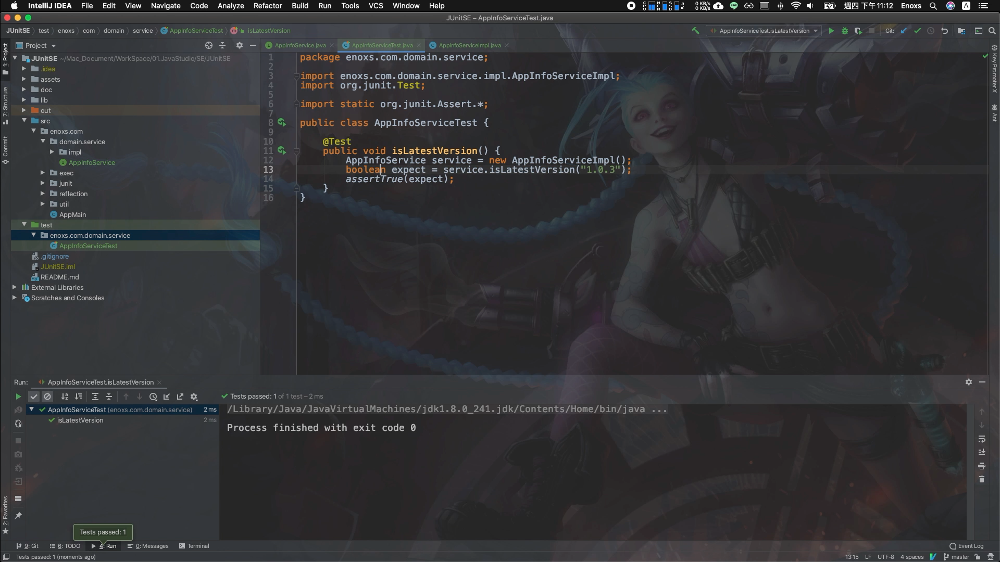

程式如何高效開發 ? | 測試驅動開發 : 3 大法則 + 5 大好處
======
`撰寫單元測試，速度更快 !`


[`Youtube : [ 程式 x 開發 ] 測試驅動開發 | 3 大法則 + 5 大好處 | 撰寫 單元測試 速度更快 !`](https://youtu.be/HFVjTFy42hI)

大綱
------
+ 除錯的日常
+ 測試驅動開發
+ 三大法則
+ 五大好處
+ JUnit 示範
+ 違反直覺的力量

<br>

除錯的日常
------
工程師的日常，是不斷的與程式錯誤(Bug) 進行搏鬥

### 「謹慎」

是工程師的「美德」，也是工程師的痛苦來源 : 

+ 「修正」 只花不到 10 分鐘
+ 「測試」 卻花 10 倍以上時間

### 如此情況，你可以...

撰寫「單元測試」- 使用程式來測試程式，只是要多花了一點時間。

### 你知道嗎? 

如果正確使用「單元測試」的方法 :

    甚至會比不寫測試的開發流程，開發的更加快速 !


<br>

測試驅動開發
------
### 傳統的單元測試流程

傳統開發上的單元測試流程，會先寫產品程式，在寫測試程式。

+ 好處: 都有測過 BUG 比較少
+ 壞處: 比較花時間，相對麻煩

### 大概率會被省略
如果產品程式已經完成了，在 UI 介面上都沒有測出問題來。

    怠惰之心，人皆有之。
    
工程師，可能會直接略過這一段。

即便是團隊要求，當任務時程緊急的時候，還是會有很大的概率，會被省略。

<br>

### 書中的知識
+ Clean Code 無瑕的程式碼 - 敏捷軟體開發技巧守則
+ The Clean Coder 無瑕的程式碼 番外篇 - 專業程式設計師的生存之道

這兩本書籍，相同作者，但不同主題。

**書中都提到 :**

    測試驅動開發 (Test Driven Development , TDD)
    
**藉由先撰寫「測試」的程式碼 ，「驅動」產品程式的「開發」。**

<br>

### 「先寫測試的程式設計方式」

因為有各種的優點，章節的結論就是直接認定 :

    「 TDD 是專業人士的選擇 」

不使用 TDD 的程式設計師，只能代表: 

    可能還「 不夠專業 」
     


<br>

三大法則
------
測試驅動開發，有三大法則 : 


### 第一法則 
`在撰寫一個單元測試前，不可撰寫任何產品程式`

要先從測試程式開始撰寫，絕對不要先撰寫產品程式。

    「順序」非常重要

### 第二法則
`只撰寫剛好無法通過的單元測試，不能編譯也算無法通過`

撰寫的測試程式，結果必須是失敗的，而且是「剛好」失敗的。

    「不要一次完成所有的測試程式」

### 第三法則
`只撰寫剛好能通過當前測試失敗的產品程式`

撰寫的產品程式，結果必須是成功的，而且是「剛好」成功的。

    「先完成一個小目標」

<br>

### 循環動作
然後，依據這個法則，大約 每 30 秒就會執行一次程式碼:

+ 無法通過的單元測試: 會驅動你，完善產品程式
+ 通過的單元測試: 會告訴你，產品程式，沒有問題。可以繼續撰寫 下一個測試程式。

如此就會構成一個循環，不斷重複。測試的程式碼與產品的程式碼就會同步增長並且互相匹配。

**相比於傳統開發上的單元測試流程，割裂的兩個動作就會合而為一 :**

    測試就是開發，開發就是測試。
    
+ 不會有所謂「麻煩」的問題
+ 更不會出現，時程緊急時，省略單元測試的問題 

<br>

### 快速的原因
因為兩個動作，是在同一時間被撰寫出的，速度肯定是比分開兩步驟執行的更快 !

    但為什麼會比不寫單元測試的開發流程，還要更快 ?

**關鍵點在於 :**

    「極短的程式碼執行週期」

「trial and error」 (嘗試錯誤的方法)，在極短的時間內，以極高的頻率，高速運作。


`修正與反饋組合成的節奏，就像鋼琴樂譜一樣 ，優美且流暢的彈奏出來。`


<br>

五大好處
------
依據 TDD 三大法則開發的程式，就會帶來五大好處 : 


+ 確定性
+ 缺陷注入率
+ 勇氣
+ 文件
+ 設計

<br>

### 確定性
依據這個法則，就會撰寫非常多的測試程式，並且測試程式相比於產品程式，只會多不會少。


程式修改後，執行「單元測試」的綠燈，會非常的確定，程式與當初開發的預期結果

     是一致的

<br>

### 缺陷注入率
「缺陷注入率」指的是出現錯誤缺陷的比率，原因相似於「確定性」。


越低的錯誤率，維護程式的成本就會越小，也會是每個開發者追求的目標。

<br>

### 勇氣
「勇氣」指的是面對糟糕程式碼的「勇氣」

面對糟糕的程式碼，你會想要改它，但又怕會把它改壞。

但若這個程式 有遵循 TDD 的法則，你隨時都會有個安全機制 : 

    提醒你程式改壞，還是程式改好


因為你不在害怕，你就會開始動手整理，而不會:

    「放任程式碼劣化而視若無睹」

<br>

### 文件

在使用第三方的框架時，可以使用 TDD 來測試程式的行為


這種用「單元測試」堆砌起來的範例，就會是一種比「使用手冊」，更好的「文件」。


因為，這個「文件」，是用程式碼實際描述的，你會更加清楚，每一個涵式與參數的用途。

**當有新的版本時:**

    執行一次單元測試，能很快地發現不一樣的地方。

<br>

### 設計
由於 TDD 的流程，使得「產品程式」不會制約「測試程式」


但「測試程式」卻能制約「產品程式」


它會逼迫你在撰寫「產品程式」時，必須要將函式與其它函式進行解耦合，才能通過測試的要求。

**無形中，會讓你去思考:**

    「如何設計」


<br>

JUnit 示範
------

### Intellij + JUnit
這邊使用 IntelliJ 加上 Java 單元測試的 JUnit 框架簡單示範


### 需求
現在假定，要開發 Domain 層的一個服務 :

    服務名稱叫 AppInfoService
    
實作的功能 :

    判定應用程式的版本，是不是最新的
    
    
### 第一法則: 在撰寫一個單元測試前，不可撰寫任何產品程式
依據這個法則，稍微變通一下。先創建「服務介面」與「實作類別」: 

**AppInfoService**

`interface`

**AppInfoServiceImpl**

`class`


<br>

### 先命名功能方法

**AppInfoService**


**AppInfoServiceImpl**

`implements`

    只做這些，應該還不會偏離法則太遠

### 創建完類別後，創建單元測試類別


(IntelliJ 快捷鍵 : cmd + shift + T )

### IDE 會自動依據 package 名稱，放置在 test/ 資料夾中


 
### 第二法則: 只撰寫剛好無法通過的單元測試，不能編譯也算無法通過


`單元測試失敗`

(IntelliJ 快捷鍵 : control + shift + R )

### 第三法則: 只撰寫剛好能通過當前測試失敗的產品程式


`撰寫產品程式`

<br>


`單元測試成功`

(IntelliJ 快捷鍵 : control + shift + R )

如此，就完成了一個循環，後續如果還有更複雜的功能。也是透過這種循環快速開發。

<br>

### 測試框架
JUnit 是 Java 的 單元測試框架，其他的程式語言也有各自的測試框架。

例如:
+ 網頁的 JavaScript 有 QUnit
+ iOS 的 Swift 有 XCTest

這三個是我有用過，並且稍微整理成一個專案的:

+ [JUnitSE](https://gitlab.com/GammaRayStudio/Program/JavaStudio/SE/JUnitSE)
+ [XCTestSE](https://gitlab.com/GammaRayStudio/Program/XCodeStudio/iOS/SE/XCTestSE)
+ [jQueryProjSE/Qunit](https://gitlab.com/GammaRayStudio/Program/WebStudio/SE/jQueryProjSE)


<br>

違反直覺的力量
------
測試驅動開發的三大法則，是不是覺得字有點多難以記住。

你可以簡單的精簡為 :

    先測試，後程式
    
+ 順序顛倒 : 第一個重點
+ 頻繁執行 : 快速的原因

### 順序顛倒

這個思維模式，讓我想到 「文件」(開發文件)，也是一個很重要的東西。

那麼，程式開發的流程是不是也可以變成 :

    文件 > 測試 > 程式 

**如此的順序執行呢?** (我還在研究的問題...)

<br>

### 違反直覺
測試驅動開發，只是個簡單的思維轉變，就能夠帶來如此巨大的力量。

**當你的主管發現你，開發的速度超快，錯誤率又超低的時候。**

你可以跟他說 : 

    這個就是「違反直覺」的力量
    
其他還有更多「違反直覺」的事情 : 

```
「休息是為了走更長遠的路」(需要更多的放風時間 !)
```


```
「安靜是種力量」(PM/SA 沒事，不要那麼常跑來找我 | 你說越多，我可能會開發的越慢 !)
```


<br>


語錄
-----
### 工程師經驗

    拆牆容易，砌牆難
    	
         -- Gamma Ray Studio


參考資料
------
+ Clean Code 無瑕的程式碼 - 敏捷軟體開發技巧守則
+ The Clean Coder 無瑕的程式碼 番外篇 - 專業程式設計師的生存之道

