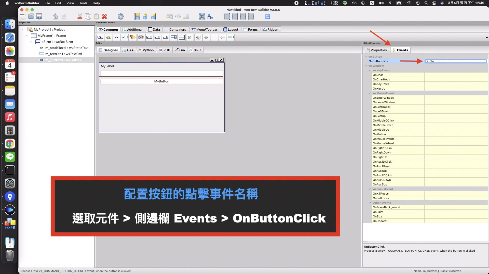

Python GUI 入門指南 : wxPython 實作
======
`從 Hello World 到 執行檔`


[`Youtube: Python GUI 入門指南 : 從 Hello World 到執行檔 | wxPython x wxWidgets | 會寫程式 有圖有真相【Gamma Ray 軟體工作室】`](https://youtu.be/Hjg_qHPZ1-Q)


目錄
------
+ 前言 : 我會寫程式 !
+ 為什麼選擇 wxPython ?
+ 官方 Hello World 
+ GUI Builder 設計工具
+ 實作 Sample 流程
+ PyInstaller 打包封裝
+ 結尾 : 進階與資源


<br>

前言: 我會寫程式 !
------
Python 是當前熱門的程式語言，也是程式初學者常見的入門選擇。

若已經大致熟悉 Python 的語法與邏輯後，該如何大聲的告訴全世界「我寫程式 !」


    使用視窗程式 GUI 呈現，會是一個很好方法。
    
<br>

### 教程範圍 : 從 Hello World 到 執行檔


<br>

### 兩個實作的範例流程 : Sample x 2
除了為作品集加分，還可以了解如果遇到不熟悉的技術時，可以透過哪些線上資源，查找資料。

    只要熟悉了這個流程，你也可以獨立的實現，更多更複雜的功能。

<br>


為什麼選擇 wxPython ?
------
### 三大主流的 GUI 框架
+ 實作的簡單程度 : Tkinter > wxPython > pyQt
+ 功能的豐富程度 : PyQT5 > wxPython > Tkinter 
+ 使用的熱門程度 : Tkinter > PyQT > wxPython

<br>

### 為什麼選擇 wxPython 實作 ?

**Tkinter**

Tkinter 簡單歸簡單，但正因為簡單所以適合寫一些單純的小應用

    當介面佈局比較複雜時 會比較吃力
      
<br>

**PyQT**

PyQT 查到商業授權的部分 : 
+ GPL 協議
+ LGPL 協議

<br>

參考資料 :
+ [如果使用Qt來開發商業軟件，是否需要付費？](https://zh-hant.hotbak.net/key/pyqt%E5%95%86%E6%A5%AD%E6%8E%88%E6%AC%8A.html)
+ [避免無謂的商業授權費，搞懂LGPL與GPL的不同](https://progressbar.tw/posts/97)

```
看完資料後頭有點暈，所以決定先暫時不要碰這一塊。
```

<br>
   
### 項目需求

    一個簡單的工具程式，未來說不定會拓展一些功能

<br>

### 兩者之間的妥協 : wxPython

**免費**且**開源**的 wxPython 框架，同時也擁有像 QT 一樣的介面設計工具


<br>

從維基百科上面來看 wxPython 是包裝 wxWidgets 的 Python 模組

**使用wxWidgets 開發的程式，不少是知名且使用過的軟體 :**


+ 製作影片
    + Aegisub 字幕工具
    + Audacity 聲音編輯器
+ 檔案傳輸
    + FileZilla FTP 工具
    
<br>

**這些都是促成我最後選擇 wxPython，實作 Python 視窗程式的幾個重要因素!**


<br>

官方 Hello World 
------
### 安裝 wxPython 的套件
+ [官方網站 - Downloads](https://www.wxpython.org/pages/downloads/)
+ [PyPi - wxPython](https://pypi.org/project/wxPython/)

**pip 指令**

    pip install wxPython
    
<br>

### Hello World
<https://wxpython.org/pages/overview/#hello-world>

### Hello World , 01
`官方網站 > Hello World > 範例 01`


```python
# First things, first. Import the wxPython package.
import wx

# Next, create an application object.
app = wx.App()

# Then a frame.
frm = wx.Frame(None, title="Hello World")

# Show it.
frm.Show()

# Start the event loop.
app.MainLoop()
```

**GUI 最基本的組成 :**
1. 導入 wx 套件
2. 創建 Application 物件
3. 創建 Frame 物件
4. Show() 的方法，激活 Frame 的視窗
5. MainLoop() 的方法，進入 Application 的主事件循環

<br>

### Hello World , 02
`官方網站 > Hello World > 範例 02`


**畫面細節**
+ 下方多一個歡迎訊息的狀態列
+ 上方則有選單列 File、Help、Windows
    + File 中的 Hello 會開啟訊息的對話視窗

```python
#!/usr/bin/env python
"""
Hello World, but with more meat.
"""

import wx

class HelloFrame(wx.Frame):
    """
    A Frame that says Hello World
    """

    def __init__(self, *args, **kw):
        # ensure the parent's __init__ is called
        super(HelloFrame, self).__init__(*args, **kw)

        # create a panel in the frame
        pnl = wx.Panel(self)

        # put some text with a larger bold font on it
        st = wx.StaticText(pnl, label="Hello World!")
        font = st.GetFont()
        font.PointSize += 10
        font = font.Bold()
        st.SetFont(font)

        # and create a sizer to manage the layout of child widgets
        sizer = wx.BoxSizer(wx.VERTICAL)
        sizer.Add(st, wx.SizerFlags().Border(wx.TOP|wx.LEFT, 25))
        pnl.SetSizer(sizer)

        # create a menu bar
        self.makeMenuBar()

        # and a status bar
        self.CreateStatusBar()
        self.SetStatusText("Welcome to wxPython!")


    def makeMenuBar(self):
        """
        A menu bar is composed of menus, which are composed of menu items.
        This method builds a set of menus and binds handlers to be called
        when the menu item is selected.
        """

        # Make a file menu with Hello and Exit items
        fileMenu = wx.Menu()
        # The "\t..." syntax defines an accelerator key that also triggers
        # the same event
        helloItem = fileMenu.Append(-1, "&Hello...\tCtrl-H",
                "Help string shown in status bar for this menu item")
        fileMenu.AppendSeparator()
        # When using a stock ID we don't need to specify the menu item's
        # label
        exitItem = fileMenu.Append(wx.ID_EXIT)

        # Now a help menu for the about item
        helpMenu = wx.Menu()
        aboutItem = helpMenu.Append(wx.ID_ABOUT)

        # Make the menu bar and add the two menus to it. The '&' defines
        # that the next letter is the "mnemonic" for the menu item. On the
        # platforms that support it those letters are underlined and can be
        # triggered from the keyboard.
        menuBar = wx.MenuBar()
        menuBar.Append(fileMenu, "&File")
        menuBar.Append(helpMenu, "&Help")

        # Give the menu bar to the frame
        self.SetMenuBar(menuBar)

        # Finally, associate a handler function with the EVT_MENU event for
        # each of the menu items. That means that when that menu item is
        # activated then the associated handler function will be called.
        self.Bind(wx.EVT_MENU, self.OnHello, helloItem)
        self.Bind(wx.EVT_MENU, self.OnExit,  exitItem)
        self.Bind(wx.EVT_MENU, self.OnAbout, aboutItem)


    def OnExit(self, event):
        """Close the frame, terminating the application."""
        self.Close(True)


    def OnHello(self, event):
        """Say hello to the user."""
        wx.MessageBox("Hello again from wxPython")


    def OnAbout(self, event):
        """Display an About Dialog"""
        wx.MessageBox("This is a wxPython Hello World sample",
                      "About Hello World 2",
                      wx.OK|wx.ICON_INFORMATION)


if __name__ == '__main__':
    # When this module is run (not imported) then create the app, the
    # frame, show it, and start the event loop.
    app = wx.App()
    frm = HelloFrame(None, title='Hello World 2')
    frm.Show()
    app.MainLoop()
```

**此範例是開發時使用的程式結構**
1. 基本組成在 main 方法中執行 `if __name__ == '__main__':`
2. Frame 的物件，實作了更多 GUI 功能，繼承 Frame 類別後，重新宣告為 HelloFrame 
3. HelloFrame 建構式，建立的 3 個物件
    + Panel : 面板，用於放置各種控制(Control)元件
    + StaticText : 文字框，也就是 Hello World 的文字
    + BoxSizer : 大小測定器，配置元件 在介面中的排列組合，也就是佈局 (Layout) 功能
    
<br>

**由此範例可知完整的視窗元件組成結構**

    wxApp -> wxFrame -> wxPanel -> wxSizer -> wxControl

<br>

### 元件細節 
`可使用下方的教程網站查詢`

<https://www.tutorialspoint.com/wxpython/index.htm>

<br>

**Panel** 

+ Major Classes > wx.Panel


    宣告時要放入 Frame 的物件 (self)，面板才會被定位到視窗中。
    
<br>
    
**wx.StaticText**

+ Major Classes > wx.StaticText


    除了理解建構式的參數分別代表什麼意思，
    還要特別注意放入的上層元件並不是 BoxSizer (sizer) 而是 Panel 物件。

    (這是因為 BoxSizer 是屬於 Panel 的方法配置。)

<br>

**BoxSizer**

+ Layout Management > BoxSizer


BoxSizer 有兩種狀態 :
+ 水平佈局
+ 垂直佈局

Add 方法:

    加入元件以及配置各種位置的細節
    
Panel 物件:

    使用 SetSizer() 方法加入佈局設定

<br>

### Hello World , 02 : MenuBar 部分
`要關注的重點是元件的事件處理，也就是介面上點擊了一個按鈕，程式該如何知道要做些什麼事情 ?`

具體的方法就是在程式碼中，將元件、事件與動作三者綁定再一起。 `Bind 方法`

<br>

**self.Bind 的部分**


    此範例就是將點擊 helloItem 的選單元件與 OnHello 的方法關聯，在 OnHello 的方法中，
    執行動作 wx.MessageBox，也就是剛才點擊 Hello 選單出現訊息對話視窗。


<br>

GUI Builder 設計工具
------
`官方網站 > wxFormBuilder | wxGlade`

### wxFormBuilder 下載
<https://github.com/wxFormBuilder/wxFormBuilder>

### wxGlade 下載
<http://wxglade.sourceforge.net/>

<br>

### wxFormBuilder 示範
**Step 01 : 在右側的面板中 code_generation，從 C++ 調整成 Python**


**Step 02 : 建立一個 包含三個元件的簡單介面**

1. Forms 選單 > 加入 Frame 視窗
2. Layout 選單 > 加入 BoxSizer 佈局
3. Common 選單 > 加入 StaticText 、TextCtrl 與 Button 元件


**Step 03 : 使用上方的 Expand 填滿佈局**


**Step 04 : 添加點擊的事件名稱**

    選取元件 > 側邊欄 Events > OnButtonClick
    


**Step 05 : Python 分頁查看程式碼**


<br>

### 為什麼少了 Panel 步驟 ?
```
因為 Forms 選單 Panel 元件無法直接加入，要加入的話 必須先配置個 BoxSizer ，
然後在 Container 選單，裡面的 Panel 才能加入。
```

**個人猜測開發者可能是覺得，不管是 Frame 還是 Panel 都應該預設佈局**

    如此的介面設計，才會相對嚴謹 !
   
<br>   
   
**動手測試**

    如果沒有在 Frame 或者 Panel 中，加入 Layout 的元素，Common 選單中的任一元件，同樣是無法加入。


<br>

### 產生代碼

存檔後，點擊選單 File > Generate Code

    在同目錄的資料夾內 出現 noname.py，這個檔案內容就是 Python 分頁的程式碼
    只要再加上 Application 的物件，以及執行方法就可以使用。

<br>

**noname.py**

```python
import wx
import wx.xrc
class MyFrame1 ( wx.Frame ):
	def __init__( self, parent ):
		wx.Frame.__init__ ( self, parent, id = wx.ID_ANY, title = wx.EmptyString, pos = wx.DefaultPosition, size = wx.Size( 500,300 ), style = wx.DEFAULT_FRAME_STYLE|wx.TAB_TRAVERSAL )

		self.SetSizeHints( wx.DefaultSize, wx.DefaultSize )

		bSizer1 = wx.BoxSizer( wx.VERTICAL )

		self.m_staticText1 = wx.StaticText( self, wx.ID_ANY, u"MyLabel", wx.DefaultPosition, wx.DefaultSize, 0 )
		self.m_staticText1.Wrap( -1 )

		bSizer1.Add( self.m_staticText1, 0, wx.ALL|wx.EXPAND, 5 )

		self.m_textCtrl1 = wx.TextCtrl( self, wx.ID_ANY, wx.EmptyString, wx.DefaultPosition, wx.DefaultSize, 0 )
		bSizer1.Add( self.m_textCtrl1, 0, wx.ALL|wx.EXPAND, 5 )

		self.m_button1 = wx.Button( self, wx.ID_ANY, u"MyButton", wx.DefaultPosition, wx.DefaultSize, 0 )
		bSizer1.Add( self.m_button1, 0, wx.ALL|wx.EXPAND, 5 )


		self.SetSizer( bSizer1 )
		self.Layout()

		self.Centre( wx.BOTH )

		# Connect Events
		self.m_button1.Bind( wx.EVT_BUTTON, self.OnBtnClick )

	def __del__( self ):
		pass


	# Virtual event handlers, overide them in your derived class
	def OnBtnClick( self, event ):
		event.Skip()

if __name__ == '__main__':
    app = wx.App()
    frm = MyFrame1(None)
    frm.Show()
    app.MainLoop()

```

<br>

### 介面與業務邏輯分離
產生出來的檔案加上 Main 的執行方法，如果 GUI 的介面，每次變更完後都要再重新添加一次，並不一個很好的方案。

**使用另外一種方案: GUIMain.py**
```python
import wx 
import wxGUI 

class GUIFrame(wxGUI.MyFrame1):
    def __init__(self, parent):
        wxGUI.MyFrame1.__init__(self, parent)

    def OnBtnClick(self, event):
        msg = self.m_textCtrl1.GetValue()
        self.m_staticText1.SetLabel(msg)


if __name__ == '__main__':
    # When this module is run (not imported) then create the app, the
    # frame, show it, and start the event loop.
    app = wx.App()
    frm = GUIFrame(None)
    frm.Show()
    app.MainLoop()
```
1. 修改 noname.py 的檔名，重新命名為 wxGUI.py `noname.py > wxGUI.py`
2. 創建一個 python 的檔案，導入 wx 套件 與 wxGUI 檔案
3. 建立新類別繼承剛才設計的 Frame
4. 初始化時，調用父類別的建構式
5. 下方在定義配置的事件方法 OnBtnClick
    + `實作 : 取得 TextCtrl 輸入框的文字，顯示在 StaticText 的文字元件。`
6. 程式的最後，要再加上 main 方法的內容

<br>


**如此就能達成介面與業務邏輯的分離**


    使用這種方法就可以 UI 的部分歸 UI，完全的使用 GUI 設計工具產出;
    應用程式事件與資料的部分，則可以獨立寫在另外一個檔案。


<br>

實作 Sample 流程
------
GUI 設計工具非常方便，不過工具列表上的元件並沒有列出全部，還有更多完成度很高的元件可以使用。

例如: 
+ 開啟檔案的對話視窗
+ 儲存檔案的對話視窗

這些就只能透過程式碼才能實作


<br>

### 那麼...

    在沒有工具的情況下，要如何知道有哪些元件可以使用 ?
    
    以及按鈕事件中 GetValue 與 SetLabel 的方法，又該如何知道這些元件的用法與特性 ?
    

**接下來的兩個範例，會說明如何完成這件事情**
   


<br>

### 準備工具 : 開發文檔 - demo.py
`官方網站 > GitHub Repository`

+ [wxWidgets/Phoenix](https://github.com/wxWidgets/Phoenix/)


+ 用 git 的方式或者下載壓縮都可以取得

<br>

下載完成後，專案中有一個 demo 的資料夾，其中 README.txt 的文件會說明這個 demo 要怎麼使用 。

**README.txt**

```
To run the main demo in this directory, execute demo.py.  In other
words, one of the following commands should do it:

       demo.py
       python demo.py
       pythonw demo.py
```

輸入以下指令到終端機即可:

    python demo.py

不過照著執行會出現錯誤 :

    Main.py 的檔案中，缺少了 version 的模組。


<br>

**此問題是一個 Bug，在 GitHub 的 Issues 中有解決方法:**


+ 使用過去的版本快照
+ 手動修改 Main.py 的程式碼 : 註解 第 75 行 以及 第 2679 ~ 2683 行的程式碼

<br>

**git 版本比對**


<br>

**修改完成後，再運行一次指令就會出現這個畫面**


<br>

**剛才使用過的三個 StaticText TextCtrl 與 Button 元件，在左側 Core Windows/Controls 選單裡面**


<br>

**上方的標籤分頁 :**


+ Overview : 是元件的文字說明
+ Demo Code : 是範例的程式碼
+ Demo : 則可以運行元件範例

<br>

**Demo Code**


+ main 方法基本上不用管
+ overview 的變數，就是左側簡介的文字內容
+ runTest 函式，則是提供給 demo 程式的呼叫

```
所以真正要看的部分，就只有 Panel 裡面的內容。
```

<br>

### 範例一 : 實作剛才 GUI 工具，建置出來的介面與功能
`以第二個 Hello World 的範例進行調整`


<br>

**Step 01 : 複製 StaticText 的元件，修改 Panel 參數**


佈局的 BoxSizer : 

    可以在側邊欄 Windows Layout > Sizer ，選擇一個想要的佈局範例。


    
<br>

**Step 02 : 複製 TextCtrl 元件 ，調整參數內容**


<br>

**Step 03 : Button 元件 除了物件代碼以外 還有綁定事件**


由於程式的寫法不同，Button 事件中，原先的寫法是 self.變數 直接使用 : 

```python
def OnBtnClick(self, event):
    msg = self.m_textCtrl1.GetValue()
    self.m_staticText1.SetLabel(msg)
```

這邊的範例 必須要再做一個，把元件物件放入到 self 物件的動作 : 

```python
def __init__(self, *args, **kw):
    #...
    self.tx = text
    self.tc1 = t1
    #...
    
def OnClick(self, event):
    msg = self.tc1.GetValue()
    self.tx.SetLabel(msg)
#..
```


**完整的範例代碼:**

```python
#!/usr/bin/env python
import wx
class HelloFrame(wx.Frame):
    def __init__(self, *args, **kw):
        super(HelloFrame, self).__init__(*args, **kw)
        pnl = wx.Panel(self)
        
        text = wx.StaticText(pnl, -1, "Sample 01")
        t1 = wx.TextCtrl(pnl, -1, "")

        self.tx = text
        self.tc1 = t1

        b = wx.Button(pnl, 10, "Button")
        
        sizer = wx.BoxSizer(wx.VERTICAL)
        sizer.Add(text, wx.SizerFlags().Border(wx.TOP | wx.LEFT, 25))
        sizer.Add(t1, wx.SizerFlags().Border(wx.TOP | wx.LEFT, 25))
        sizer.Add(b, wx.SizerFlags().Border(wx.TOP | wx.LEFT, 25))
        pnl.SetSizer(sizer)

        self.Bind(wx.EVT_BUTTON, self.OnClick, b)

    def OnClick(self, event):
        msg = self.tc1.GetValue()
        self.tx.SetLabel(msg)

if __name__ == '__main__':
    app = wx.App()
    frm = HelloFrame(None, title='Sample 01')
    frm.Show()
    app.MainLoop()

```

<br>

**執行程式，功能完全一樣**


    只不過這次不用依賴 GUI 工具
    
<br>
    
**介面建置的工作:**

    在這個開發用的文檔程式，選擇視窗元件 : 複製 > 調整 > 測試 就可以完成。


<br>

### 範例二 : 以 Python 常見的數據分析為例
`需求三個動作`

1. 匯入 csv 資料 以表格呈現
2. 匯入資料 以長條圖 圖表呈現
3. 調整過的數據 匯出成另外一個檔案


開啟的 data.csv 資料內容:

```
30,50,80
100,90,95
91.2,75.2,81.5
```

<br>

**Step 01 : Core Windows/Controls 選擇最簡單的 ListCtrl_edit**


1. 匯入 listmix 套件 
2. listctrldata 是表格的數據變數
3. TestListCtrl 則是繼承 ListCtrl 類別
4. TestListCtrl 的宣告在 Panel 中

```
複製到 Hello World 2 的範例調整後，基本上呈現的效果應是會跟 demo 顯示的一樣。
```


<br>

**Step 02 : 側邊欄 Common Dialog > FileDialog 實作匯入檔案的部分**

```python
wildcard = "Python source (*.py)|*.py|"     \
           "Compiled Python (*.pyc)|*.pyc|" \
           "SPAM files (*.spam)|*.spam|"    \
           "Egg file (*.egg)|*.egg|"        \
           "All files (*.*)|*.*"
#...
class HelloFrame(wx.Frame):
    def __init__(self, *args, **kw):
        #...
        lst = TestListCtrl(pnl, 10,
                           style=wx.LC_REPORT
                           | wx.BORDER_NONE
                           # | wx.LC_SORT_ASCENDING            # Content of list as instructions is
                           | wx.LC_HRULES | wx.LC_VRULES      # nonsense with auto-sort enabled
                           )
        self.lsv = lst
        #...
    def OnOpen(self, event):
        dlg = wx.FileDialog(
            self, message="Choose a file",
            defaultDir=os.getcwd(),
            defaultFile="",
            wildcard=wildcard,
            style=wx.FD_OPEN | # wx.FD_MULTIPLE | <- 用不到，移除。
            wx.FD_CHANGE_DIR | wx.FD_FILE_MUST_EXIST |
            wx.FD_PREVIEW
        )
        if dlg.ShowModal() == wx.ID_OK:
            paths = dlg.GetPaths()
            path = paths[0]
            with open(path, 'r') as f:
                rows = csv.reader(f)
                global listctrldata
                listctrldata.clear()
                for idx, val in enumerate(rows):
                    tex = tuple([i for i in val])
                    listctrldata[idx] = tex
                        
                self.lsv.Populate()
                f.close
        dlg.Destroy()

```

1. 全域變數 wildcard，用來決定檔案類型
2. 複製 OnButton 函式的 OpenDialog 元件實作
3. style 變數中 wx.FD_MULTIPLE 參數是元件支援多個檔案的功能，不需要使用同樣移除
4. 在條件式 ShowModal 等於 ID_OK 的地方，還要實作檔案讀取，與轉換成 listctrldata 變數的 Dictionaries 格式
5. 加上表格物件的 Populate 函式 ，重新繪製元件

執行程式，開啟檔案 : 


    有變化，但並不是想要的效果，表格中舊的資料還是存在;
    看起來 Populate 的功能，只負責填充數據並不會主動重置。

<br>

**Step 03 : 官方網站 > API Reference > Modules > wx 方法查找**

此時，就可以到 wxPython 官網，API Reference 中，搜尋 Clear 的文字，看有沒有跟清除相關的函式可以使用。


    ClearAll 的描述看起來最符合需求

<br>

**Step 04 : 增加 ClearAll 方法，再執行一次**

```python
self.lsv.ClearAll()
self.lsv.Populate()
```


    表格的內容，正常顯示。
    
<br>

**Step 05 : 加入直方圖的呈現**

目前 demo 中 只找到圓餅圖的元件，所以藉助 **matplotlib 套件**進行繪製:


安裝 matplotlib:

<https://pypi.org/project/matplotlib/>

    pip install matplotlib

<br>

這邊使用網路上的範例:


chart.py
```python
import matplotlib.pyplot as plt
def showchart():
    name_list = ['lambda=0', 'lambda=0.05', 'lambda=0.1', 'lambda=0.5']
    num_list = [52.4, 57.8, 59.1, 54.6]
    rects = plt.bar(range(len(num_list)), num_list, color='rgby')
    # X軸標題
    index = [0, 1, 2, 3]
    index = [float(c)+0.4 for c in index]
    plt.ylim(ymax=80, ymin=0)
    plt.xticks(index, name_list)
    plt.ylabel("arrucay(%)")  # X軸標籤
    for rect in rects:
        height = rect.get_height()
        plt.text(rect.get_x() + rect.get_width() / 2, height,
                 str(height)+'%', ha='center', va='bottom')
    plt.show()

showchart()

```

<br>

剛才開啟檔案的地方，再調整一下匯入檔案的處理

```python
def OnOpen(self, event):
    #...
    if dlg.ShowModal() == wx.ID_OK:
        paths = dlg.GetPaths()
        path = paths[0]
        with open(path, 'r') as f:
            rows = csv.reader(f)
            global listctrldata
            global num_list # <- 直方圖變數
            listctrldata.clear()
            for idx, val in enumerate(rows):
                tex = tuple([i for i in val])
                listctrldata[idx] = tex
                if idx == 0: # <- 示範，僅取用第一行數據
                    num_list.clear()
                    for n in val:
                        num_list.append(float(n))
                        
            self.lsv.Populate()
            f.close
        dlg.Destroy()
```

<br>

接下來，就可以在 OnChart 的函式中，呼叫 showchart 的方法

```python
def OnChart(self, event):
    showchart()
```

<br>

完成後，執行程式:


    直方圖的呈現，確實就如同導入的數據一樣。
    
<br>

**Step 06 : 添加儲存檔案的部分**

具體的流程是取出表格中的數值，然後以原本的格式進行儲存:


這邊 csv 格式的轉換，可以使用 csv 的套件實作，只是原始的數據要先排列成二維陣列:

```python
import csv
#...
#...
#...
with open(path, 'w', newline='') as f:
    writer = csv.writer(f, delimiter=' ')
    writer.writerows(text)
```

<br>

表格數據轉換成二維陣列的功能，在 demo 中不會有範例，API Reference 搜尋 Get 方法，看起來也沒有類似。

**此時大絕招就是 Google 搜尋引擎 :**

 

    關鍵字 : wxPython listCtrl get all item
   
<br>
    
**經過一番查找與測試後，拼湊出這個方法:**

```python
count = self.lsv.GetItemCount()
cols = self.lsv.GetColumnCount()
text = [[0 for i in range(cols)] for j in range(count)]  # 初始化陣列

for row in range(count):
    for col in range(cols):
    item = self.lsv.GetItem(itemIdx=row, col=col)
    text[row][col] = item.GetText()
        
print(text)
```

透過兩個 for 迴圈 ，將表格元件內的資料，放入到二維陣列之中。

<br>

    之後儲存檔案的功能 ，就可以用 FileDialog 中的 SaveDialog 直接實現

<br>

**完整的範例代碼:**

```python
#!/usr/bin/env python

import wx
import os
import csv

import matplotlib.pyplot as plt
import wx.lib.mixins.listctrl as listmix

# ---------------------------------------------------------------------------
wildcard = "Python source (*.py)|*.py|"     \
           "Compiled Python (*.pyc)|*.pyc|" \
           "SPAM files (*.spam)|*.spam|"    \
           "Egg file (*.egg)|*.egg|"        \
           "All files (*.*)|*.*"

listctrldata = {
    1: ("Hey!", "You can edit", "me!"),
    2: ("Try changing the contents", "by", "clicking"),
    3: ("in", "a", "cell"),
    4: ("See how the length columns", "change", "?"),
    5: ("You can use", "TAB,", "cursor down,"),
    6: ("and cursor up", "to", "navigate"),
}

# ---------------------------------------------------------------------------


name_list = ['lambda=0', 'lambda=0.05', 'lambda=0.1', 'lambda=0.5']
num_list = [52.4, 57.8, 59.1, 54.6]


def showchart():
    rects = plt.bar(range(len(num_list)), num_list, color='rgby')
    # X軸標題
    index = [0, 1, 2, 3]
    index = [float(c)+0.4 for c in index]
    plt.ylim(ymax=80, ymin=0)
    plt.xticks(index, name_list)
    plt.ylabel("arrucay(%)")  # X軸標籤
    for rect in rects:
        height = rect.get_height()
        plt.text(rect.get_x() + rect.get_width() / 2, height,
                 str(height)+'%', ha='center', va='bottom')
    plt.show()


class TestListCtrl(wx.ListCtrl,
                   listmix.ListCtrlAutoWidthMixin,
                   listmix.TextEditMixin):

    def __init__(self, parent, ID, pos=wx.DefaultPosition,
                 size=wx.DefaultSize, style=0):
        wx.ListCtrl.__init__(self, parent, ID, pos, size, style)

        listmix.ListCtrlAutoWidthMixin.__init__(self)
        self.Populate()
        listmix.TextEditMixin.__init__(self)

    def Populate(self):
        # for normal, simple columns, you can add them like this:
        self.InsertColumn(0, "Column 1")
        self.InsertColumn(1, "Column 2")
        self.InsertColumn(2, "Column 3")
        self.InsertColumn(3, "Len 1", wx.LIST_FORMAT_RIGHT)
        self.InsertColumn(4, "Len 2", wx.LIST_FORMAT_RIGHT)
        self.InsertColumn(5, "Len 3", wx.LIST_FORMAT_RIGHT)

        items = listctrldata.items()
        for key, data in items:
            index = self.InsertItem(self.GetItemCount(), data[0])
            self.SetItem(index, 1, data[1])
            self.SetItem(index, 2, data[2])
            self.SetItemData(index, key)

        self.SetColumnWidth(0, wx.LIST_AUTOSIZE)
        self.SetColumnWidth(1, wx.LIST_AUTOSIZE)
        self.SetColumnWidth(2, 100)

        self.currentItem = 0

    def SetStringItem(self, index, col, data):
        if col in range(3):
            wx.ListCtrl.SetItem(self, index, col, data)
            wx.ListCtrl.SetItem(self, index, 3+col, str(len(data)))
        else:
            try:
                datalen = int(data)
            except:
                return

            wx.ListCtrl.SetItem(self, index, col, data)

            data = self.GetItem(index, col-3).GetText()
            wx.ListCtrl.SetItem(self, index, col-3, data[0:datalen])


class HelloFrame(wx.Frame):
    def __init__(self, *args, **kw):
        # ensure the parent's __init__ is called
        super(HelloFrame, self).__init__(*args, **kw)

        # create a panel in the frame
        pnl = wx.Panel(self)
        lst = TestListCtrl(pnl, 10,
                           style=wx.LC_REPORT
                           | wx.BORDER_NONE
                           # | wx.LC_SORT_ASCENDING            # Content of list as instructions is
                           | wx.LC_HRULES | wx.LC_VRULES      # nonsense with auto-sort enabled
                           )
        self.lsv = lst
        b1 = wx.Button(pnl, 11, "Open")
        b2 = wx.Button(pnl, 12, "Chart")
        b3 = wx.Button(pnl, 13, "Save")

        # and create a sizer to manage the layout of child widgets
        sizer = wx.BoxSizer(wx.VERTICAL)
        sizer.Add(lst, 10, wx.EXPAND)
        sizer.Add(b1, 11, wx.EXPAND)
        sizer.Add(b2, 12, wx.EXPAND)
        sizer.Add(b3, 13, wx.EXPAND)
        pnl.SetSizer(sizer)
        # event
        self.Bind(wx.EVT_BUTTON, self.OnOpen, b1)
        self.Bind(wx.EVT_BUTTON, self.OnChart, b2)
        self.Bind(wx.EVT_BUTTON, self.OnSave, b3)

    def OnOpen(self, event):
        dlg = wx.FileDialog(
            self, message="Choose a file",
            defaultDir=os.getcwd(),
            defaultFile="",
            wildcard=wildcard,
            style=wx.FD_OPEN |
            wx.FD_CHANGE_DIR | wx.FD_FILE_MUST_EXIST |
            wx.FD_PREVIEW
        )
        if dlg.ShowModal() == wx.ID_OK:
            paths = dlg.GetPaths()
            path = paths[0]
            with open(path, 'r') as f:
                rows = csv.reader(f)
                global listctrldata
                global num_list
                listctrldata.clear()
                for idx, val in enumerate(rows):
                    tex = tuple([i for i in val])
                    listctrldata[idx] = tex

                    if idx == 0:
                        num_list.clear()
                        for n in val:
                            num_list.append(float(n))
                f.close
            self.lsv.ClearAll()
            self.lsv.Populate()

        dlg.Destroy()

    def OnChart(self, event):
        showchart()

    def OnSave(self, event):
        count = self.lsv.GetItemCount()
        cols = self.lsv.GetColumnCount()
        text = [[0 for i in range(cols)] for j in range(count)]  # 初始化陣列

        for row in range(count):
            for col in range(cols):
                item = self.lsv.GetItem(itemIdx=row, col=col)
                text[row][col] = item.GetText()
        print(text)
        dlg = wx.FileDialog(
            self, message="Save file as ...", defaultDir=os.getcwd(),
            defaultFile="", wildcard=wildcard, style=wx.FD_SAVE | wx.FD_OVERWRITE_PROMPT
        )
        dlg.SetFilterIndex(2)
        if dlg.ShowModal() == wx.ID_OK:
            path = dlg.GetPath()
            with open(path, 'w', newline='') as f:
                writer = csv.writer(f, delimiter=' ')
                writer.writerows(text)

        dlg.Destroy()


if __name__ == '__main__':
    # When this module is run (not imported) then create the app, the
    # frame, show it, and start the event loop.
    app = wx.App()
    frm = HelloFrame(None, title='Sample 02')
    frm.Show()
    app.MainLoop()

```


<br>

PyInstaller 打包封裝
------
當完成 GUI 的視窗程式想要將這個應用分享給其他人，可以使用 **PyInstaller** 將寫好的程式進行打包封裝。

### 安裝 PyInstaller
<https://pypi.org/project/pyinstaller/>

    pip install pyinstaller

<br>

### 打包封裝

使用終端機，進入到打包的檔案目錄，輸入: 

    pyinstaller -F sample.py --noconsole
    

+ -F 參數 : 是僅建立一個執行檔，不產生其他檔案
+ --noconsole 參數 : 是在啟動執行檔時，不需要顯示控制台的窗口
    + 這個參數在 Mac 平台一定要加，不然會發生螢幕沒辦法訪問的錯誤

 

而其他 pyinstaller 的參數不逐一細講，可以參考 [PyInstallerSE] 專案中的 README.md

[PyInstallerSE]: https://gitlab.com/GammaRayStudio/Program/PythonStudio/SE/PyInstallerSE

這個工具目前已知，只能打包當前平台使用的執行檔格式。也就是 :
+ Windows 平台 只能打包 EXE
+ Mac 平台 只能打包 UNIX 

```
若要跨平台使用的話，只能換電腦或者虛擬機器才能達成。
```

<br>

結尾: 進階與資源
------
上述的 PythonGUI 入門指南，所有參考到的網站資料，都有列在最底部的連結。

雖然沒有一個元件接一個元件的說明，但透過兩個使用 demo 程式與 API Reference 文檔的實作範例:

    應該已經知道，如何運用這些資源，進行應用程式的創建 !
    
<br>

### Advanced Generic Widgets

如果有想要自行打造接近商業等級的軟體，demo 中還有個 Advanced Generic Widgets ;

裡面有更多已經完善的進階元件可以使用，像是其中的 AUI 元件，已經是一個佈局完整的 IDE 面版 :

 


<br>

### Sample 資料夾
GitHub 專案中，另外一個 Sample 資料夾 :

 

<br>

裡面的範例細節 跟 demo 的有些差異，例如 :

WebView 的範例，除了線上的網站，還有示範訪問本地端的檔案。

<br>

**個人就透過這個範例，將以前寫的網頁小工具快速的改造成視窗程式**

 

    想要了解 wxPython 更多功能的話，這裡值得再查找一番 !

<br>


語錄
-----
### 無關好壞只是需求

    任何決策的背後，都是決策者的個人需求
    	
                -- 華杉講透《孫子兵法》
                
                
<br>                

GitLab 專案
------
### PythonGUI : 
https://gitlab.com/GammaRayStudio/Program/PythonStudio/SE/PythonGUI

### PyInstallerSE : 
https://gitlab.com/GammaRayStudio/Program/PythonStudio/SE/PyInstallerSE

<br>

參考資料
------
+ wxPython (維基百科) : https://zh.wikipedia.org/zh-tw/WxPython
+ wxWidgets (維基百科) : https://zh.wikipedia.org/wiki/WxWidgets
+ wxPython (官方網站) : https://www.wxpython.org/
+ Tutorialspoint/wxPython : https://www.tutorialspoint.com/wxpython/index.htm

### GitHub
+ Phoenix : https://github.com/wxWidgets/Phoenix/
+ wxFormBuilder : https://github.com/wxFormBuilder/wxFormBuilder

### PyPI
+ wxPython : https://pypi.org/project/wxPython/
+ Matplotlib : https://pypi.org/project/matplotlib/
+ PyInstaller : https://pypi.org/project/pyinstaller/


